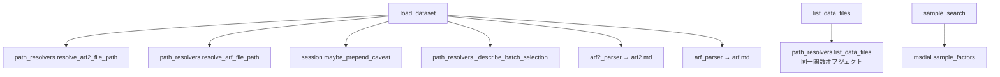
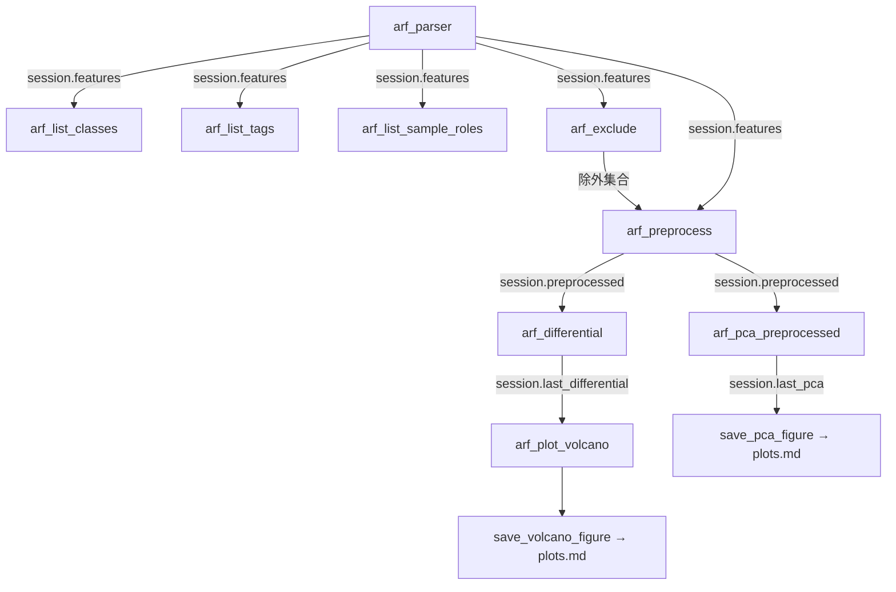
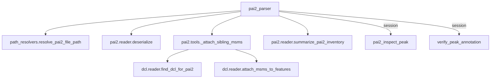
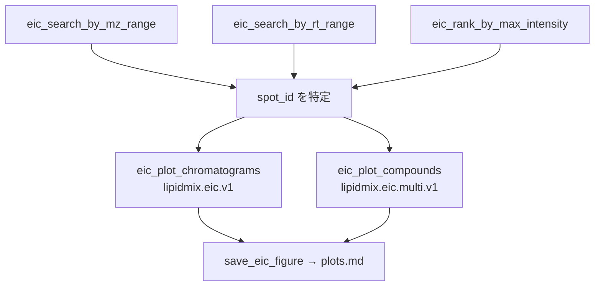

# パーサ/プロットのワークフロー文書化とパッケージ再編 実装計画

> **For agentic workers:** REQUIRED SUB-SKILL: Use superpowers:subagent-driven-development (recommended) or superpowers:executing-plans to implement this plan task-by-task. Steps use checkbox (`- [ ]`) syntax for tracking.

**Goal:** ルート直下フラットな 35 モジュールを `lipidmix/` 配下へ入力形式別に再編し、パーサ/プロット系 28 の MCP ツールについて呼び出し連鎖を `docs/workflow/` に明文化する。

**Architecture:** 移動は依存の浅い層から順に行い、各タスクの終わりで必ずテストスイート全件が緑になる状態でコミットする。import は「束縛名を保存する」形（`from lipidmix.arf import reader as arf_reader`）に統一し、呼び出し側の本文と既存のモンキーパッチを無変更に保つ。文書は行番号を持たない代わりに、参照の実在を AST で検証する自動テストで腐敗を防ぐ。

**Tech Stack:** Python 3.14 / FastMCP (`mcp.server.fastmcp`) / unittest / msgpack + lz4 / numpy + pandas + scikit-learn / matplotlib

**設計書:** `docs/superpowers/specs/2026-08-20-parser-workflow-docs-and-package-layout-design.md`

## Global Constraints

- **ロジックは一切変更しない。** 本計画で許されるのはファイル移動、import 文の書き換え、`__file__` 起点のパス解決式の修正、新規テストの追加、新規/既存ドキュメントの編集だけ。関数の分割・リネーム・シグネチャ変更・挙動変更は禁止。
- **ベースライン:** 作業開始時点のテストは **535 件 OK / skip 3**。各タスクの完了時に、失敗・エラーがゼロで、skip が 3 件で、実行件数が `535 + そのタスクまでに追加した新規テスト件数` に一致すること。既存 535 件が 1 件でも減っていたら（import 失敗による収集漏れ）不合格。
- **テスト実行コマンド:** `.venv-1/Scripts/python.exe -m unittest discover -s tests -t .`（必ずリポジトリルートを CWD として実行する。`lipid_identity.load_reference_tables` が CWD 相対で `reference/` を読むため）
- **すべての `__init__.py` は空にする。** 再エクスポートを書くと `lipidmix.eic.tools` → `lipidmix.plots.eic` → `lipidmix.eic.identity_map` の経路で循環 import になる。
- **`server.py` はルートに据え置く。** `.mcp.json` と `.vscode/mcp.json` が絶対パスで指しているため。中身の import 先だけ差し替える。`.mcp.json` / `.vscode/mcp.json` / `DEPLOY.md` は本計画を通して無変更。
- **ファイル移動は必ず `git mv` を使う。** 差分がリネームとして記録され、レビュー可能になる。
- **import 書き換えの原則（束縛名の保存）:**

  | 現在の形 | 書き換え後 |
  |---|---|
  | `import mcp_core` | `from lipidmix.core import mcp_core` |
  | `from mcp_core import mcp` | `from lipidmix.core.mcp_core import mcp` |
  | `import arf_reader`（名前が変わる場合） | `from lipidmix.arf import reader as arf_reader` |
  | `from arf_reader import build_pca_matrix` | `from lipidmix.arf.reader import build_pca_matrix` |

  束縛名を変えないので、`session_state.session`（テスト内 235 箇所）や `patch.object(server.arf_reader, ...)` はすべて無変更で通る。

---

## File Structure

### 新規作成

| ファイル | 責務 |
|---|---|
| `lipidmix/__init__.py` ほか計 11 個の `__init__.py` | 名前空間のみ（すべて空） |
| `tests/test_package_layout.py` | `__file__` 起点のパス解決がリポジトリルートを指し続けることを縛る特性テスト |
| `tests/test_workflow_docs.py` | ワークフロー文書の参照実在と対象範囲を AST で検証する腐敗防止テスト |
| `docs/workflow/index.md` | 層構成・読み方・目次 |
| `docs/workflow/dataset.md` | 入口 3 ツール |
| `docs/workflow/arf.md` | ARF 系 9 ツール |
| `docs/workflow/arf2.md` | ARF2 系 2 ツール |
| `docs/workflow/pai2.md` | PAI2 系 3 ツール |
| `docs/workflow/dcl.md` | DCL 系 2 ツール |
| `docs/workflow/eic.md` | EIC 系 6 ツール |
| `docs/workflow/plots.md` | 図の保存 3 ツールと payload 契約の比較 |

### 移動（35 件）

設計書 §2 の移動表と完全に一致する。タスク単位の内訳は各タスクに記載。

### 修正

| ファイル | 内容 |
|---|---|
| `lipidmix/core/mcp_core.py` | `BASE_DIR` を `parents[2]` へ |
| `lipidmix/core/data_config.py` | `DEFAULT_DATA_DIR` を `parents[2] / "data"` へ |
| `server.py` | import 先を `lipidmix.*` へ |
| `README.md` | ファイル一覧を新パスへ、CLI 起動法を `python -m ...` へ、詳細を `docs/workflow/` へリンク |
| `USAGE.md` | 「39ツール」→「40ツール」、ワークフロー文書への導線追加 |

---

## Task 1: パッケージ骨格と特性テスト

移動を始める前に、「移動しても壊れてはいけないこと」をテストで固定する。`BASE_DIR` 系は
壊れても例外を出さず空ディレクトリを新規作成するだけなので、この特性テストがないと
既存 535 件が全部緑のまま蓄積ノートだけ見えなくなる事故が起きうる。

**Files:**
- Create: `lipidmix/__init__.py`, `lipidmix/core/__init__.py`, `lipidmix/msdial/__init__.py`, `lipidmix/arf/__init__.py`, `lipidmix/arf2/__init__.py`, `lipidmix/pai2/__init__.py`, `lipidmix/dcl/__init__.py`, `lipidmix/eic/__init__.py`, `lipidmix/analysis/__init__.py`, `lipidmix/plots/__init__.py`, `lipidmix/corpus/__init__.py`, `lipidmix/tools/__init__.py`
- Create: `tests/test_package_layout.py`

**Interfaces:**
- Consumes: なし（最初のタスク）
- Produces: `lipidmix` 名前空間パッケージ群。`tests/test_package_layout.py` が以降の全タスクの安全網になる。

- [ ] **Step 1: 空パッケージを作る**

```bash
cd /c/Users/yuu18/Lipidmix_with_LLM
for d in "" core msdial arf arf2 pai2 dcl eic analysis plots corpus tools; do
  mkdir -p "lipidmix/$d"
  : > "lipidmix/$d/__init__.py"
done
ls lipidmix
```

`lipidmix/__init__.py` を含めて 12 個の空ファイルができる（`for` の最初の空文字列がルート）。

- [ ] **Step 2: 特性テストを書く（この時点では旧パスを参照する）**

`tests/test_package_layout.py` を作る。**まだ `lipidmix.core` は存在しないので、旧パスで書いて緑にし、Task 2 で import 行だけ差し替える。**

```python
"""再編で静かに壊れる箇所を縛る特性テスト。

BASE_DIR 系は解決先を間違えても例外を出さず、空のディレクトリを新規作成して
黙って動く。既存テストは全部緑のまま蓄積ノートだけ見えなくなるため、
リポジトリルートを指し続けることをここで固定する。
"""
import unittest
from pathlib import Path

# Task 2 で `from lipidmix.core import data_config, mcp_core, tool_helpers` に差し替える
import data_config
import mcp_core
import tool_helpers

REPO_ROOT = Path(__file__).resolve().parents[1]


class TestBaseDirResolution(unittest.TestCase):
    def test_base_dir_is_repo_root(self):
        self.assertEqual(mcp_core.BASE_DIR.resolve(), REPO_ROOT)

    def test_base_dir_has_repo_markers(self):
        # lipidmix/core/ を指してしまった場合をここで落とす
        for marker in ("docs", "playbook", "reference"):
            with self.subTest(marker=marker):
                self.assertTrue(
                    (mcp_core.BASE_DIR / marker).is_dir(),
                    f"{marker}/ が見つからない: BASE_DIR={mcp_core.BASE_DIR}",
                )
        self.assertTrue((mcp_core.BASE_DIR / "server.py").is_file())

    def test_output_format_doc_resolves(self):
        self.assertTrue(mcp_core.OUTPUT_FORMAT_DOC.is_file())

    def test_data_config_root_matches_mcp_core(self):
        # 循環回避のため両者は独立に root を計算する。一致することをここで縛る。
        self.assertEqual(
            data_config.DEFAULT_DATA_DIR.resolve(),
            (mcp_core.BASE_DIR / "data").resolve(),
        )


class TestStateDirsOutsidePackage(unittest.TestCase):
    def test_state_dirs_are_not_inside_lipidmix(self):
        package_dir = (REPO_ROOT / "lipidmix").resolve()
        for name in ("KNOWLEDGE_DIR", "PLAYBOOK_DIR", "ANALYSES_DIR"):
            with self.subTest(name=name):
                resolved = getattr(mcp_core, name).resolve()
                self.assertNotIn(
                    package_dir,
                    resolved.parents,
                    f"{name} がパッケージ内を指している: {resolved}",
                )


class TestReferenceTables(unittest.TestCase):
    """`lipid_identity.load_reference_tables` は CWD 相対で reference/ を読む。

    移動では壊れないが、テストを常にリポジトリルートから実行する前提を固定する。
    表が空でも例外にならないので、行数で縛る。
    """

    def test_identity_tables_load_rows(self):
        tables = tool_helpers._identity_tables()
        self.assertEqual(len(tables["lipidmaps"]), 16)
        self.assertEqual(len(tables["refmet"]), 16)
```

- [ ] **Step 3: 特性テストが今の構造で通ることを確認する**

Run: `.venv-1/Scripts/python.exe -m unittest tests.test_package_layout -v`
Expected: 7 tests, OK

ここで落ちる場合は、テストが現状を正しく写していないということ。**先にテストを直す。**
現状を写せていないテストは再編の安全網にならない。

- [ ] **Step 4: 全体スイートでベースラインを再確認する**

Run: `.venv-1/Scripts/python.exe -m unittest discover -s tests -t .`
Expected: `Ran 542 tests` / `OK (skipped=3)`（535 + 新規 7）

- [ ] **Step 5: コミット**

```bash
git add lipidmix tests/test_package_layout.py
git commit -m "test: 再編前にパス解決の不変条件を特性テストで固定

BASE_DIR と DEFAULT_DATA_DIR は解決先を誤っても例外を出さず空ディレクトリを
作って黙って動くため、既存 535 件が緑のまま蓄積ノートだけ失う事故が起きうる。
移動を始める前にリポジトリルートを指すことを縛る。

Co-Authored-By: Claude Opus 5 <noreply@anthropic.com>"
```

---

## Task 2: `core/` 層の移動

依存グラフの底から動かす。`mcp_core` は `tools_*` を import してはならないという既存の
絶対ルール（`mcp_core.py` の docstring）は移動後も維持される。

**Files:**
- Move: `data_config.py` → `lipidmix/core/data_config.py`
- Move: `mcp_errors.py` → `lipidmix/core/mcp_errors.py`
- Move: `mcp_core.py` → `lipidmix/core/mcp_core.py`
- Move: `session_state.py` → `lipidmix/core/session_state.py`
- Move: `path_resolvers.py` → `lipidmix/core/path_resolvers.py`
- Move: `tool_helpers.py` → `lipidmix/core/tool_helpers.py`
- Modify: `lipidmix/core/mcp_core.py`（`BASE_DIR`）, `lipidmix/core/data_config.py`（`DEFAULT_DATA_DIR`）
- Modify: `server.py`, `arf_reader.py`, `arf2_reader.py`, `dcl_reader.py`, `eic_aef_reader.py`, `tools_arf.py`, `tools_arf2.py`, `tools_dataset.py`, `tools_dcl.py`, `tools_eic.py`, `tools_objective.py`, `tools_pai2.py`, `tools_reports.py`, `tools_resources.py`, `tools_samples.py`
- Modify: `tests/test_package_layout.py`, `tests/test_dcl_tools.py`, `tests/test_eic_multi_plot.py`, `tests/test_eic_plot.py`, `tests/test_ingest_tools.py`, `tests/test_load_dataset.py`, `tests/test_objective_tools.py`, `tests/test_output_format_sections.py`, `tests/test_peak_verification.py`, `tests/test_report_tools.py`, `tests/test_tools_samples.py`, `tests/test_mcp_errors.py`, `tests/test_arf_exclude.py`, `tests/test_differential_tools.py`, `tests/test_exclude_wiring.py`, `tests/test_exclusions_session.py`, `tests/test_factor_tools.py`, `tests/test_lipid_identity_tools.py`, `tests/test_missing_state_contract.py`, `tests/test_preprocess_tools.py`, `tests/test_semantics_caveat.py`, `tests/test_server_class_filter.py`, `tests/test_session_namespaces.py`, `tests/test_volcano_plot.py`

**Interfaces:**
- Consumes: Task 1 の `lipidmix/core/__init__.py`
- Produces:
  - `lipidmix.core.mcp_core` — `mcp`, `BASE_DIR`, `DATA_DIR`, `OUTPUT_FORMAT_DOC`, `OUTPUT_FORMAT_SECTIONS`, `MCP_INSTRUCTIONS`, `KNOWLEDGE_DIR`, `PLAYBOOK_DIR`, `ANALYSES_DIR`, `output_format_section_path(topic: str) -> Path`, `_build_report_meta(...)`, `_resolve_report_dir()`, `_report_dir_candidates()`, `_dir_is_writable(Path) -> bool`, `_first_writable_dir(list[Path]) -> Path`
  - `lipidmix.core.data_config` — `get_data_dir() -> Path`, `DEFAULT_DATA_DIR`, `ENV_VAR`
  - `lipidmix.core.session_state` — `AnalysisSession`, `session`, `_build_sample_meta`
  - `lipidmix.core.path_resolvers` — `list_data_files`, `resolve_arf_file_path`, `resolve_arf2_file_path`, `resolve_dcl_file_path`, `resolve_eicaef_file_path`, `resolve_pai2_file_path`, `_select_latest_batch`, `_describe_batch_selection`, `_filter_arf_spots`
  - `lipidmix.core.tool_helpers` — `_identity_tables`, `_build_verification_dossier`, `_pca_scatter_arrays`, `_remember_arf_pca_plot`, `_format_pca_plot_block`, `_format_pca_loadings_md`, `_format_arf_tag_summary`, `_format_arf_class_summary`, `_format_arf_parse_summary`, `_format_arf_class_filter`, `_format_arf_tag_filter`, `_class_factors_by_position`, `_pp_build_matrix`, `_pp_has_preprocessed`
  - `lipidmix.core.mcp_errors` — `missing_state(...)`

- [ ] **Step 1: 6 モジュールを移動する**

```bash
cd /c/Users/yuu18/Lipidmix_with_LLM
git mv data_config.py    lipidmix/core/data_config.py
git mv mcp_errors.py     lipidmix/core/mcp_errors.py
git mv mcp_core.py       lipidmix/core/mcp_core.py
git mv session_state.py  lipidmix/core/session_state.py
git mv path_resolvers.py lipidmix/core/path_resolvers.py
git mv tool_helpers.py   lipidmix/core/tool_helpers.py
```

- [ ] **Step 2: `BASE_DIR` と `DEFAULT_DATA_DIR` を修正する**

`lipidmix/core/mcp_core.py`:

```python
# 変更前
BASE_DIR = Path(__file__).parent

# 変更後
# このファイルは <root>/lipidmix/core/ にある。docs/ knowledge/ playbook/ analyses/
# reports/ はすべてリポジトリルート基準で解決するため 2 階層上る。
BASE_DIR = Path(__file__).resolve().parents[2]
```

`lipidmix/core/data_config.py`:

```python
# 変更前
DEFAULT_DATA_DIR = Path(__file__).resolve().parent / "data"

# 変更後
# mcp_core は data_config を import する側なので、mcp_core.BASE_DIR は参照できない
# （循環する）。独立に同じ値を計算し、一致は tests/test_package_layout.py で縛る。
DEFAULT_DATA_DIR = Path(__file__).resolve().parents[2] / "data"
```

- [ ] **Step 3: import 文を書き換える**

以下の置換をリポジトリ全体（`.venv*` と `archives/` を除く）に適用する。左辺は行全体ではなく
import 文の先頭部分として一致させること。

| 変更前 | 変更後 |
|---|---|
| `import data_config` | `from lipidmix.core import data_config` |
| `from data_config import` | `from lipidmix.core.data_config import` |
| `import mcp_errors` | `from lipidmix.core import mcp_errors` |
| `import mcp_core` | `from lipidmix.core import mcp_core` |
| `from mcp_core import` | `from lipidmix.core.mcp_core import` |
| `import session_state` | `from lipidmix.core import session_state` |
| `from session_state import` | `from lipidmix.core.session_state import` |
| `import path_resolvers` | `from lipidmix.core import path_resolvers` |
| `from path_resolvers import` | `from lipidmix.core.path_resolvers import` |
| `import tool_helpers` | `from lipidmix.core import tool_helpers` |
| `from tool_helpers import` | `from lipidmix.core.tool_helpers import` |

一括適用のコマンド（Git Bash）:

```bash
cd /c/Users/yuu18/Lipidmix_with_LLM
FILES=$(git ls-files '*.py' | grep -v '^archives/')
for m in data_config mcp_errors mcp_core session_state path_resolvers tool_helpers; do
  sed -i -E "s/^(\s*)import ${m}$/\1from lipidmix.core import ${m}/" $FILES
  sed -i -E "s/^(\s*)from ${m} import/\1from lipidmix.core.${m} import/" $FILES
done
```

**注意すべき箇所（sed では拾えない/拾いすぎる）:**
- `eic_aef_reader.py:352` の `from data_config import get_data_dir` は関数内の遅延 import（インデントあり）。上の `sed` は `^(\s*)` でインデントを保存するので拾えるが、目視で確認する。
- `tests/test_dcl_tools.py:77` の `from path_resolvers import resolve_dcl_file_path` も関数内。同上。
- `lipidmix/core/` 配下の 6 モジュールが**互いを** import している箇所（例 `tool_helpers.py` の `import session_state`）も同じ規則で書き換わる。パッケージ内でも絶対 import に統一する（相対 import は使わない）。
- `server.py` の `from mcp_core import (` は複数行 import。`from lipidmix.core.mcp_core import (` になるだけで中身は無変更。

- [ ] **Step 4: 特性テストの import を新パスへ差し替える**

`tests/test_package_layout.py` の冒頭が Step 3 の sed で以下になっているはず。なっていなければ手で直す。

```python
from lipidmix.core import data_config
from lipidmix.core import mcp_core
from lipidmix.core import tool_helpers
```

Task 1 で書いた「Task 2 で差し替える」というコメント行は削除する。

- [ ] **Step 5: 特性テストを走らせる**

Run: `.venv-1/Scripts/python.exe -m unittest tests.test_package_layout -v`
Expected: 7 tests, OK

**ここが落ちたら先に進まない。** 特に `test_base_dir_is_repo_root` が落ちる場合は Step 2 の
`parents[2]` を数え直す（`lipidmix/core/mcp_core.py` → `parents[0]`=`core`, `parents[1]`=`lipidmix`, `parents[2]`=root）。

- [ ] **Step 6: 全体スイートを走らせる**

Run: `.venv-1/Scripts/python.exe -m unittest discover -s tests -t .`
Expected: `Ran 542 tests` / `OK (skipped=3)`

- [ ] **Step 7: サーバが起動しツール数が保たれることを確認する**

```bash
.venv-1/Scripts/python.exe -c "
import asyncio, server
print('TOOLS', len(asyncio.run(server.mcp.list_tools())))
print('RESOURCES', len(asyncio.run(server.mcp.list_resources())))
print('TEMPLATES', len(asyncio.run(server.mcp.list_resource_templates())))
"
```

Expected: `TOOLS 40` / `RESOURCES 4` / `TEMPLATES 3`

- [ ] **Step 8: コミット**

```bash
git add -A
git commit -m "refactor: core 層を lipidmix/core/ へ移動

mcp_core.BASE_DIR と data_config.DEFAULT_DATA_DIR は __file__ 起点なので
移動と同時に parents[2] へ修正する。両者は循環回避のため独立に root を
計算し、一致は test_package_layout で縛っている。

Co-Authored-By: Claude Opus 5 <noreply@anthropic.com>"
```

---

## Task 3: `msdial/` 層の移動

MS-DIAL 固有のサイドカー解析と同定・検証ロジック。`core/` の次に浅い層。

**Files:**
- Move: `msdial_tags.py` → `lipidmix/msdial/tags.py`
- Move: `msdial_classes.py` → `lipidmix/msdial/classes.py`
- Move: `sample_factors.py` → `lipidmix/msdial/sample_factors.py`
- Move: `peak_verification.py` → `lipidmix/msdial/peak_verification.py`
- Move: `lipid_identity.py` → `lipidmix/msdial/lipid_identity.py`
- Modify: `arf_reader.py`, `eic_plot.py`, `lipidmix/core/tool_helpers.py`, `tools_arf.py`, `tools_arf2.py`, `tools_samples.py`
- Modify: `tests/test_msdial_classes.py`, `tests/test_msdial_tags.py`, `tests/test_sample_factors.py`, `tests/test_peak_verification.py`, `tests/test_lipid_identity.py`

**Interfaces:**
- Consumes: Task 2 の `lipidmix.core.*`
- Produces:
  - `lipidmix.msdial.tags` — `normalize_sample_name`, `get_sample_peak_tag_info`, `filter_arf_by_tags`
  - `lipidmix.msdial.classes` — `get_sample_class_id`, `assign_sample_groups`, `filter_arf_by_class_ids`, `discover_arf_class_index`, `parse_analysis_file_classes`, `resolve_mddata_path`
  - `lipidmix.msdial.sample_factors` — `token_vocabulary`, `arf_sample_names`, `build_sample_facets`, `expand_sample_specs`
  - `lipidmix.msdial.peak_verification` — 既存の公開関数（変更なし）
  - `lipidmix.msdial.lipid_identity` — `build_identity_block`, `load_reference_tables`, `map_to_reference`

- [ ] **Step 1: 5 モジュールを移動する**

```bash
cd /c/Users/yuu18/Lipidmix_with_LLM
git mv msdial_tags.py       lipidmix/msdial/tags.py
git mv msdial_classes.py    lipidmix/msdial/classes.py
git mv sample_factors.py    lipidmix/msdial/sample_factors.py
git mv peak_verification.py lipidmix/msdial/peak_verification.py
git mv lipid_identity.py    lipidmix/msdial/lipid_identity.py
```

- [ ] **Step 2: import 文を書き換える**

モジュール名が変わる 2 件（`msdial_tags` → `tags`、`msdial_classes` → `classes`）は
**束縛名を保存するため `as` を付ける**。`classes` / `tags` という短い名前をそのまま
グローバルに晒すと読み手が混乱するため、束縛名は旧名のままにする。

| 変更前 | 変更後 |
|---|---|
| `import msdial_tags` | `from lipidmix.msdial import tags as msdial_tags` |
| `from msdial_tags import` | `from lipidmix.msdial.tags import` |
| `import msdial_classes` | `from lipidmix.msdial import classes as msdial_classes` |
| `from msdial_classes import` | `from lipidmix.msdial.classes import` |
| `import sample_factors` | `from lipidmix.msdial import sample_factors` |
| `from sample_factors import` | `from lipidmix.msdial.sample_factors import` |
| `import peak_verification as pv` | `from lipidmix.msdial import peak_verification as pv` |
| `import lipid_identity` | `from lipidmix.msdial import lipid_identity` |
| `import lipid_identity as li` | `from lipidmix.msdial import lipid_identity as li` |

```bash
cd /c/Users/yuu18/Lipidmix_with_LLM
FILES=$(git ls-files '*.py' | grep -v '^archives/')
sed -i -E "s/^(\s*)import msdial_tags$/\1from lipidmix.msdial import tags as msdial_tags/" $FILES
sed -i -E "s/^(\s*)from msdial_tags import/\1from lipidmix.msdial.tags import/" $FILES
sed -i -E "s/^(\s*)import msdial_classes$/\1from lipidmix.msdial import classes as msdial_classes/" $FILES
sed -i -E "s/^(\s*)from msdial_classes import/\1from lipidmix.msdial.classes import/" $FILES
for m in sample_factors peak_verification lipid_identity; do
  sed -i -E "s/^(\s*)import ${m}$/\1from lipidmix.msdial import ${m}/" $FILES
  sed -i -E "s/^(\s*)import ${m} as ([A-Za-z_]+)$/\1from lipidmix.msdial import ${m} as \2/" $FILES
  sed -i -E "s/^(\s*)from ${m} import/\1from lipidmix.msdial.${m} import/" $FILES
done
```

- [ ] **Step 3: 移動したモジュール同士の import を確認する**

`lipidmix/msdial/classes.py` は `tags` と `sample_factors` を、`sample_factors.py` は
`tags` と `preprocessing` を import している。Step 2 の sed で前者 2 つは書き換わるが、
`sample_factors.py:16` の `import preprocessing` は **Task 4 まで旧パスのまま**でよい
（`preprocessing.py` はまだルートにある）。書き換えてはならない。

Run: `grep -n "^import\|^from" lipidmix/msdial/*.py`
Expected: `preprocessing` だけが素の `import preprocessing` として残っている

- [ ] **Step 4: 全体スイートを走らせる**

Run: `.venv-1/Scripts/python.exe -m unittest discover -s tests -t .`
Expected: `Ran 542 tests` / `OK (skipped=3)`

- [ ] **Step 5: コミット**

```bash
git add -A
git commit -m "refactor: MS-DIAL 固有ロジックを lipidmix/msdial/ へ移動

msdial_tags / msdial_classes は tags.py / classes.py へ改名するが、
import 側の束縛名は as で旧名を保つ。素の classes / tags をグローバルに
晒すと読み手が何のクラスか判断できないため。

Co-Authored-By: Claude Opus 5 <noreply@anthropic.com>"
```

---

## Task 4: `analysis/` と `plots/` の移動

入力形式に依存しない数値処理と、レンダラ中立の payload 組み立てを別軸として切り出す。

**Files:**
- Move: `preprocessing.py` → `lipidmix/analysis/preprocessing.py`
- Move: `differential.py` → `lipidmix/analysis/differential.py`
- Move: `volcano_plot.py` → `lipidmix/plots/volcano.py`
- Move: `eic_plot.py` → `lipidmix/plots/eic.py`
- Modify: `lipidmix/msdial/sample_factors.py`, `lipidmix/core/session_state.py`, `tools_arf.py`, `tools_eic.py`, `tools_reports.py`
- Modify: `tests/test_preprocessing.py`, `tests/test_differential.py`, `tests/test_volcano_plot.py`, `tests/test_eic_plot.py`, `tests/test_eic_multi_plot.py`

**Interfaces:**
- Consumes: Task 2 の `lipidmix.core.*`、Task 3 の `lipidmix.msdial.*`
- Produces:
  - `lipidmix.analysis.preprocessing` — `preprocess`, `detect_qc_strata`, `drop_samples_by_role`
  - `lipidmix.analysis.differential` — `two_group_test`, `add_fdr`, `summarize_two_group`, `check_confounding`, `volcano_data`
  - `lipidmix.plots.volcano` — `build_volcano_plot_payload`, `VolcanoPlotPayload`
  - `lipidmix.plots.eic` — `build_eic_plot_payload`, `build_multi_compound_plot_payload`, `render_eic_plot`, および TypedDict `EICPlotPayload` / `EICMultiPlotPayload`
    （`read_eic_spot_css1` / `read_eic_spots_css1` はここではなく `lipidmix.eic.reader` 側。Task 6 参照）

- [ ] **Step 1: 4 モジュールを移動する**

```bash
cd /c/Users/yuu18/Lipidmix_with_LLM
git mv preprocessing.py lipidmix/analysis/preprocessing.py
git mv differential.py  lipidmix/analysis/differential.py
git mv volcano_plot.py  lipidmix/plots/volcano.py
git mv eic_plot.py      lipidmix/plots/eic.py
```

- [ ] **Step 2: import 文を書き換える**

`volcano_plot` → `volcano`、`eic_plot` → `eic` と名前が変わるので `as` で束縛名を保存する。
特に `eic` は `lipidmix.eic` パッケージと紛らわしいので、束縛名 `eic_plot` の維持は必須。

| 変更前 | 変更後 |
|---|---|
| `import preprocessing` | `from lipidmix.analysis import preprocessing` |
| `import preprocessing as pp` | `from lipidmix.analysis import preprocessing as pp` |
| `import differential` | `from lipidmix.analysis import differential` |
| `import differential as diff` | `from lipidmix.analysis import differential as diff` |
| `import volcano_plot` | `from lipidmix.plots import volcano as volcano_plot` |
| `from volcano_plot import` | `from lipidmix.plots.volcano import` |
| `from eic_plot import` | `from lipidmix.plots.eic import` |

```bash
cd /c/Users/yuu18/Lipidmix_with_LLM
FILES=$(git ls-files '*.py' | grep -v '^archives/')
for m in preprocessing differential; do
  sed -i -E "s/^(\s*)import ${m}$/\1from lipidmix.analysis import ${m}/" $FILES
  sed -i -E "s/^(\s*)import ${m} as ([A-Za-z_]+)$/\1from lipidmix.analysis import ${m} as \2/" $FILES
  sed -i -E "s/^(\s*)from ${m} import/\1from lipidmix.analysis.${m} import/" $FILES
done
sed -i -E "s/^(\s*)import volcano_plot$/\1from lipidmix.plots import volcano as volcano_plot/" $FILES
sed -i -E "s/^(\s*)from volcano_plot import/\1from lipidmix.plots.volcano import/" $FILES
sed -i -E "s/^(\s*)from eic_plot import/\1from lipidmix.plots.eic import/" $FILES
```

- [ ] **Step 3: `tests/test_volcano_plot.py` の遅延 import を確認する**

`tests/test_volcano_plot.py:10` は `import volcano_plot`、行 130 前後は関数内で `import server`
している。前者が Step 2 で書き換わり、`volcano_plot.build_volcano_plot_payload(...)` という
本文の呼び出しが無変更で通ることを確認する。

Run: `.venv-1/Scripts/python.exe -m unittest tests.test_volcano_plot -v`
Expected: OK

- [ ] **Step 4: プロット系テストを個別に走らせる**

Run: `.venv-1/Scripts/python.exe -m unittest tests.test_eic_plot tests.test_eic_multi_plot tests.test_preprocessing tests.test_differential -v`
Expected: OK

- [ ] **Step 5: 全体スイートを走らせる**

Run: `.venv-1/Scripts/python.exe -m unittest discover -s tests -t .`
Expected: `Ran 542 tests` / `OK (skipped=3)`

- [ ] **Step 6: コミット**

```bash
git add -A
git commit -m "refactor: 解析層と描画層を lipidmix/{analysis,plots}/ へ分離

形式パッケージの責務を「バイナリを読む / MCP に公開する」に限定するため、
統計処理と payload 組み立てを別軸へ抜く。eic_plot は plots/eic.py になるが
lipidmix.eic パッケージと紛らわしいので束縛名 eic_plot を as で維持する。

Co-Authored-By: Claude Opus 5 <noreply@anthropic.com>"
```

---

## Task 5: `arf2/` `pai2/` `dcl/` の移動

形式パッケージのうち、依存が浅い 3 つをまとめて動かす。

**Files:**
- Move: `arf2_reader.py` → `lipidmix/arf2/reader.py`
- Move: `tools_arf2.py` → `lipidmix/arf2/tools.py`
- Move: `pai2_reader.py` → `lipidmix/pai2/reader.py`
- Move: `tools_pai2.py` → `lipidmix/pai2/tools.py`
- Move: `dcl_reader.py` → `lipidmix/dcl/reader.py`
- Move: `tools_dcl.py` → `lipidmix/dcl/tools.py`
- Modify: `server.py`, `tools_arf.py`, `tools_eic.py`, `eic_identity_map.py`, `lipidmix/core/session_state.py`, `lipidmix/core/tool_helpers.py`
- Modify: `tests/test_dcl_reader.py`, `tests/test_dcl_tools.py`, `tests/test_peak_verification.py`, `tests/test_session_namespaces.py`

**Interfaces:**
- Consumes: Task 2〜4 の全パッケージ
- Produces:
  - `lipidmix.arf2.reader` — `deserialize`, `extract_arf2_data`, `summarize_arf2_data`, `generate_text_summary`, `format_spots_as_table`
  - `lipidmix.arf2.tools` — `arf2_parser`, `arf2_annotate_identities`
  - `lipidmix.pai2.reader` — `deserialize`, `filter_features_by_params`, `inspect_peak_details`, `summarize_pai2_inventory`, `get_signal_to_noise`, `IonMode`
  - `lipidmix.pai2.tools` — `pai2_parser`, `pai2_inspect_peak`, `verify_peak_annotation`, `_attach_sibling_msms`
  - `lipidmix.dcl.reader` — `deserialize_dcl`, `summarize_dcl`, `get_msms_by_precursor`, `find_dcl_for_pai2`, `attach_msms_to_features`
  - `lipidmix.dcl.tools` — `dcl_parser`, `dcl_find_msms`

- [ ] **Step 1: 6 モジュールを移動する**

```bash
cd /c/Users/yuu18/Lipidmix_with_LLM
git mv arf2_reader.py lipidmix/arf2/reader.py
git mv tools_arf2.py  lipidmix/arf2/tools.py
git mv pai2_reader.py lipidmix/pai2/reader.py
git mv tools_pai2.py  lipidmix/pai2/tools.py
git mv dcl_reader.py  lipidmix/dcl/reader.py
git mv tools_dcl.py   lipidmix/dcl/tools.py
```

- [ ] **Step 2: import 文を書き換える**

| 変更前 | 変更後 |
|---|---|
| `import arf2_reader` | `from lipidmix.arf2 import reader as arf2_reader` |
| `from arf2_reader import` | `from lipidmix.arf2.reader import` |
| `import tools_arf2` | `from lipidmix.arf2 import tools as tools_arf2` |
| `from tools_arf2 import` | `from lipidmix.arf2.tools import` |
| `import pai2_reader` | `from lipidmix.pai2 import reader as pai2_reader` |
| `from pai2_reader import` | `from lipidmix.pai2.reader import` |
| `import tools_pai2` | `from lipidmix.pai2 import tools as tools_pai2` |
| `from tools_pai2 import` | `from lipidmix.pai2.tools import` |
| `import dcl_reader` | `from lipidmix.dcl import reader as dcl_reader` |
| `from dcl_reader import` | `from lipidmix.dcl.reader import` |
| `from tools_dcl import` | `from lipidmix.dcl.tools import` |

```bash
cd /c/Users/yuu18/Lipidmix_with_LLM
FILES=$(git ls-files '*.py' | grep -v '^archives/')
rewrite() {  # $1=旧モジュール名 $2=パッケージ $3=新モジュール名
  sed -i -E "s/^(\s*)import $1$/\1from lipidmix.$2 import $3 as $1/" $FILES
  sed -i -E "s/^(\s*)from $1 import/\1from lipidmix.$2.$3 import/" $FILES
}
rewrite arf2_reader arf2 reader
rewrite tools_arf2  arf2 tools
rewrite pai2_reader pai2 reader
rewrite tools_pai2  pai2 tools
rewrite dcl_reader  dcl  reader
rewrite tools_dcl   dcl  tools
```

- [ ] **Step 3: `server.py` の star import を確認する**

`server.py` の `from tools_pai2 import *` / `from tools_dcl import *` / `from tools_arf2 import *`
が `from lipidmix.pai2.tools import *` などに書き換わっていること。`__all__` は各モジュールに
残っているので取り込まれる名前は変わらない。

Run: `grep -n "import \*" server.py`
Expected: `lipidmix.*` を指す行だけが並ぶ（まだ移動していない `tools_arf` / `tools_eic` / `tools_samples` / `tools_dataset` / `tools_objective` / `tools_reports` は素のまま）

- [ ] **Step 4: 関数内の遅延 import を確認する**

`grep` で拾えたか目視確認する。以下は関数内にある:
- `lipidmix/pai2/tools.py` の `from lipidmix.dcl.reader import attach_msms_to_features, deserialize_dcl, find_dcl_for_pai2`
- `lipidmix/pai2/tools.py` の `from lipidmix.pai2.reader import deserialize`
- `lipidmix/arf2/tools.py` の `from lipidmix.arf2.reader import deserialize, generate_text_summary, summarize_arf2_data`
- `tools_arf.py` の `from lipidmix.arf2.reader import deserialize as _arf2_deserialize`
- `eic_identity_map.py` の `from lipidmix.arf2.reader import deserialize`
- `tests/test_session_namespaces.py` の `from lipidmix.arf2 import reader as arf2_reader` / `from lipidmix.arf2 import tools as tools_arf2`

Run: `grep -rn "arf2_reader\|pai2_reader\|dcl_reader\|tools_arf2\|tools_pai2\|tools_dcl" --include=*.py . | grep -v '^\./archives' | grep -v '^\./\.venv' | grep -v 'lipidmix\.'`
Expected: 出力なし（旧名の import が残っていない。属性アクセスとしての `arf2_reader.foo` は `as` で束縛されているので `lipidmix.` を含む import 行とセットで残る）

- [ ] **Step 5: 全体スイートを走らせる**

Run: `.venv-1/Scripts/python.exe -m unittest discover -s tests -t .`
Expected: `Ran 542 tests` / `OK (skipped=3)`

- [ ] **Step 6: コミット**

```bash
git add -A
git commit -m "refactor: arf2/pai2/dcl を形式別パッケージへ移動

パッケージ名が接頭辞を担うので reader.py / tools.py に短縮する。
import 側は as で旧束縛名を保つため、呼び出し本文とモンキーパッチは無変更。

Co-Authored-By: Claude Opus 5 <noreply@anthropic.com>"
```

---

## Task 6: `eic/` の移動

`eic/tools.py` は `lipidmix.plots.eic` を import する。`__init__.py` が空であることが
循環回避の前提なので、ここで実際に確かめる。

**Files:**
- Move: `eic_aef_reader.py` → `lipidmix/eic/reader.py`
- Move: `eic_identity_map.py` → `lipidmix/eic/identity_map.py`
- Move: `tools_eic.py` → `lipidmix/eic/tools.py`
- Modify: `server.py`, `lipidmix/core/session_state.py`, `lipidmix/plots/eic.py`
- Modify: `tests/test_eic_identity_map.py`, `tests/test_eic_multi_plot.py`, `tests/test_eic_plot.py`

**Interfaces:**
- Consumes: Task 2〜5 の全パッケージ
- Produces:
  - `lipidmix.eic.reader` — `parse_eic_aef_css1`, `read_eic_spot_css1`, `read_eic_spots_css1`, `summarize_eic_data`, `search_eic_by_mz_range`, `search_eic_by_rt_range`, `top_eic_spots_by_max_intensity`
  - `lipidmix.eic.identity_map` — `load_arf2_records`, `select_identity_candidates`, `verify_spot_match`, `IdentityCandidate`
  - `lipidmix.eic.tools` — `eic_parser`, `eic_search_by_mz_range`, `eic_search_by_rt_range`, `eic_rank_by_max_intensity`, `eic_plot_chromatograms`, `eic_plot_compounds`

- [ ] **Step 1: 3 モジュールを移動する**

```bash
cd /c/Users/yuu18/Lipidmix_with_LLM
git mv eic_aef_reader.py   lipidmix/eic/reader.py
git mv eic_identity_map.py lipidmix/eic/identity_map.py
git mv tools_eic.py        lipidmix/eic/tools.py
```

- [ ] **Step 2: import 文を書き換える**

| 変更前 | 変更後 |
|---|---|
| `import eic_aef_reader` | `from lipidmix.eic import reader as eic_aef_reader` |
| `from eic_aef_reader import` | `from lipidmix.eic.reader import` |
| `import eic_identity_map` | `from lipidmix.eic import identity_map as eic_identity_map` |
| `from eic_identity_map import` | `from lipidmix.eic.identity_map import` |
| `import tools_eic` | `from lipidmix.eic import tools as tools_eic` |
| `from tools_eic import` | `from lipidmix.eic.tools import` |

```bash
cd /c/Users/yuu18/Lipidmix_with_LLM
FILES=$(git ls-files '*.py' | grep -v '^archives/')
rewrite() {
  sed -i -E "s/^(\s*)import $1$/\1from lipidmix.$2 import $3 as $1/" $FILES
  sed -i -E "s/^(\s*)from $1 import/\1from lipidmix.$2.$3 import/" $FILES
}
rewrite eic_aef_reader   eic reader
rewrite eic_identity_map eic identity_map
rewrite tools_eic        eic tools
```

- [ ] **Step 3: 循環 import が起きていないことを確認する**

`lipidmix/eic/tools.py` → `lipidmix/plots/eic.py` → `lipidmix/eic/identity_map.py` という
経路がある。`__init__.py` がすべて空なら循環しない。

```bash
.venv-1/Scripts/python.exe -c "
import lipidmix.eic.tools
import lipidmix.plots.eic
import lipidmix.eic.identity_map
print('no cycle')
"
```

Expected: `no cycle`

`ImportError: cannot import name ... (most likely due to a circular import)` が出たら、
どこかの `__init__.py` に再エクスポートを書いてしまっている。空に戻す。

- [ ] **Step 4: EIC 系テストを個別に走らせる**

Run: `.venv-1/Scripts/python.exe -m unittest tests.test_eic_identity_map tests.test_eic_plot tests.test_eic_multi_plot -v`
Expected: OK

- [ ] **Step 5: 全体スイートを走らせる**

Run: `.venv-1/Scripts/python.exe -m unittest discover -s tests -t .`
Expected: `Ran 542 tests` / `OK (skipped=3)`

- [ ] **Step 6: コミット**

```bash
git add -A
git commit -m "refactor: EIC 系を lipidmix/eic/ へ移動

eic/tools.py -> plots/eic.py -> eic/identity_map.py の経路があるため、
全 __init__.py が空であることが循環回避の前提になる。import 可能性を
明示的に確認した。

Co-Authored-By: Claude Opus 5 <noreply@anthropic.com>"
```

---

## Task 7: `arf/` の移動

最大のモジュール 2 つ（`arf_reader.py` 1014 行、`tools_arf.py` 973 行）を含む。
`server.py` が `import arf_reader` を module オブジェクトとして公開しており、
`patch.object(server.arf_reader, ...)` がこれに依存している点に注意する。

**Files:**
- Move: `arf_reader.py` → `lipidmix/arf/reader.py`
- Move: `exclusions.py` → `lipidmix/arf/exclusions.py`
- Move: `tools_arf.py` → `lipidmix/arf/tools.py`
- Modify: `server.py`, `tools_dataset.py`, `lipidmix/core/session_state.py`, `lipidmix/core/tool_helpers.py`
- Modify: `tests/test_arf_multiblock.py`, `tests/test_arf_exclude.py`, `tests/test_exclusions.py`, `tests/test_exclusions_session.py`, `tests/test_semantics_caveat.py`, `tests/test_differential_tools.py`

**Interfaces:**
- Consumes: Task 2〜6 の全パッケージ
- Produces:
  - `lipidmix.arf.reader` — `deserialize`, `extract_peak_properties`, `build_pca_matrix`, `run_pca`, `get_pca_loading_features`, `extract_top_loading_features`, `summarize_arf_data`, `find_input_file`, `_convert_to_alignment_feature`
  - `lipidmix.arf.exclusions` — `roster`, `prune_spots`
  - `lipidmix.arf.tools` — `arf_parser`, `arf_list_classes`, `arf_list_tags`, `arf_list_sample_roles`, `arf_exclude`, `arf_preprocess`, `arf_pca_preprocessed`, `arf_differential`, `arf_plot_volcano`

- [ ] **Step 1: 3 モジュールを移動する**

```bash
cd /c/Users/yuu18/Lipidmix_with_LLM
git mv arf_reader.py lipidmix/arf/reader.py
git mv exclusions.py lipidmix/arf/exclusions.py
git mv tools_arf.py  lipidmix/arf/tools.py
```

- [ ] **Step 2: import 文を書き換える**

| 変更前 | 変更後 |
|---|---|
| `import arf_reader` | `from lipidmix.arf import reader as arf_reader` |
| `from arf_reader import` | `from lipidmix.arf.reader import` |
| `import exclusions` | `from lipidmix.arf import exclusions` |
| `from tools_arf import` | `from lipidmix.arf.tools import` |
| `import tools_arf` | `from lipidmix.arf import tools as tools_arf` |

```bash
cd /c/Users/yuu18/Lipidmix_with_LLM
FILES=$(git ls-files '*.py' | grep -v '^archives/')
sed -i -E "s/^(\s*)import arf_reader$/\1from lipidmix.arf import reader as arf_reader/" $FILES
sed -i -E "s/^(\s*)from arf_reader import/\1from lipidmix.arf.reader import/" $FILES
sed -i -E "s/^(\s*)import exclusions$/\1from lipidmix.arf import exclusions/" $FILES
sed -i -E "s/^(\s*)import tools_arf$/\1from lipidmix.arf import tools as tools_arf/" $FILES
sed -i -E "s/^(\s*)from tools_arf import/\1from lipidmix.arf.tools import/" $FILES
```

- [ ] **Step 3: `exclusions.py` の TYPE_CHECKING import を直す**

`lipidmix/arf/exclusions.py:13` は型注釈用の遅延 import:

```python
    from arf_reader import _convert_to_alignment_feature
```

Step 2 の sed が `from lipidmix.arf.reader import _convert_to_alignment_feature` に
書き換えているはず。確認する。

Run: `grep -n "import" lipidmix/arf/exclusions.py`
Expected: `from lipidmix.arf.reader import _convert_to_alignment_feature`

- [ ] **Step 4: モンキーパッチが生きていることを確認する**

`server.arf_reader` が module オブジェクトとして公開され続けているかを直接確かめる。

```bash
.venv-1/Scripts/python.exe -c "
import server, lipidmix.arf.reader as r
assert server.arf_reader is r, 'server.arf_reader が同一 module を指していない'
print('monkeypatch target OK')
"
```

Expected: `monkeypatch target OK`

- [ ] **Step 5: ARF 系テストを個別に走らせる**

Run: `.venv-1/Scripts/python.exe -m unittest tests.test_arf_multiblock tests.test_arf_exclude tests.test_exclusions tests.test_exclusions_session tests.test_semantics_caveat tests.test_differential_tools -v`
Expected: OK

- [ ] **Step 6: 全体スイートを走らせる**

Run: `.venv-1/Scripts/python.exe -m unittest discover -s tests -t .`
Expected: `Ran 542 tests` / `OK (skipped=3)`

- [ ] **Step 7: コミット**

```bash
git add -A
git commit -m "refactor: ARF 系を lipidmix/arf/ へ移動

server.arf_reader は patch.object の対象なので、as で束縛名を保ったうえで
同一 module オブジェクトを指し続けることを明示的に確認した。

Co-Authored-By: Claude Opus 5 <noreply@anthropic.com>"
```

---

## Task 8: `corpus/` と `lipidmix/tools/` の移動、`measure_payloads` の退避

残る 7 モジュールを動かし、ルート直下から `server.py` と `check.py` 以外の `.py` を消す。

**Files:**
- Move: `knowledge_store.py` → `lipidmix/corpus/knowledge_store.py`
- Move: `paper_ingest.py` → `lipidmix/corpus/paper_ingest.py`
- Move: `tools_dataset.py` → `lipidmix/tools/dataset.py`
- Move: `tools_samples.py` → `lipidmix/tools/samples.py`
- Move: `tools_objective.py` → `lipidmix/tools/objective.py`
- Move: `tools_reports.py` → `lipidmix/tools/reports.py`
- Move: `tools_resources.py` → `lipidmix/tools/resources.py`
- Move: `tools/measure_payloads.py` → `archives/tools/measure_payloads.py`
- Modify: `server.py`, `lipidmix/core/tool_helpers.py`, `lipidmix/pai2/tools.py`
- Modify: `tests/test_knowledge_store.py`, `tests/test_paper_ingest.py`, `tests/test_objective_tools.py`, `tests/test_report_tools.py`, `tests/test_output_format_sections.py`, `tests/test_playbook_tools_consistency.py`

**Interfaces:**
- Consumes: Task 2〜7 の全パッケージ
- Produces:
  - `lipidmix.corpus.knowledge_store` — `load_vocab`, `make_slug`, ほか既存の公開関数
  - `lipidmix.corpus.paper_ingest` — 既存の公開関数
  - `lipidmix.tools.dataset` — `list_data_files`, `load_dataset`
  - `lipidmix.tools.samples` — `sample_search`
  - `lipidmix.tools.objective` — `record_objective`, `update_objective`, `log_search`, `knowledge_coverage`, `paper_search`, `ingest_stage`, `ingest_review_queue`, `ingest_promote`, `ingest_reject`
  - `lipidmix.tools.reports` — `write_report`, `read_report`, `list_reports`, `save_pca_figure`, `save_volcano_figure`, `save_eic_figure`
  - `lipidmix.tools.resources` — `@mcp.resource` 4 件 + テンプレート 3 件（`__all__` なし）

- [ ] **Step 1: 7 モジュールを移動する**

```bash
cd /c/Users/yuu18/Lipidmix_with_LLM
git mv knowledge_store.py lipidmix/corpus/knowledge_store.py
git mv paper_ingest.py    lipidmix/corpus/paper_ingest.py
git mv tools_dataset.py   lipidmix/tools/dataset.py
git mv tools_samples.py   lipidmix/tools/samples.py
git mv tools_objective.py lipidmix/tools/objective.py
git mv tools_reports.py   lipidmix/tools/reports.py
git mv tools_resources.py lipidmix/tools/resources.py
```

- [ ] **Step 2: import 文を書き換える**

| 変更前 | 変更後 |
|---|---|
| `import knowledge_store` | `from lipidmix.corpus import knowledge_store` |
| `import knowledge_store as ks` | `from lipidmix.corpus import knowledge_store as ks` |
| `from knowledge_store import` | `from lipidmix.corpus.knowledge_store import` |
| `import paper_ingest` | `from lipidmix.corpus import paper_ingest` |
| `from tools_dataset import` | `from lipidmix.tools.dataset import` |
| `from tools_samples import` | `from lipidmix.tools.samples import` |
| `from tools_objective import` | `from lipidmix.tools.objective import` |
| `from tools_reports import` | `from lipidmix.tools.reports import` |
| `import tools_resources` | `from lipidmix.tools import resources as tools_resources` |

```bash
cd /c/Users/yuu18/Lipidmix_with_LLM
FILES=$(git ls-files '*.py' | grep -v '^archives/')
for m in knowledge_store paper_ingest; do
  sed -i -E "s/^(\s*)import ${m}$/\1from lipidmix.corpus import ${m}/" $FILES
  sed -i -E "s/^(\s*)import ${m} as ([A-Za-z_]+)$/\1from lipidmix.corpus import ${m} as \2/" $FILES
  sed -i -E "s/^(\s*)from ${m} import/\1from lipidmix.corpus.${m} import/" $FILES
done
for pair in "tools_dataset:dataset" "tools_samples:samples" "tools_objective:objective" "tools_reports:reports" "tools_resources:resources"; do
  old="${pair%%:*}"; new="${pair##*:}"
  sed -i -E "s/^(\s*)import ${old}$/\1from lipidmix.tools import ${new} as ${old}/" $FILES
  sed -i -E "s/^(\s*)from ${old} import/\1from lipidmix.tools.${new} import/" $FILES
done
```

- [ ] **Step 3: 壊れている `measure_payloads.py` を退避する**

`agent_core` と `interp_eval_cases` を import しているが両者は `archives/` へ退避済みで、
現状 import できない。新設の `lipidmix/tools/` と並立させる理由がない。

```bash
cd /c/Users/yuu18/Lipidmix_with_LLM
mkdir -p archives/tools
git mv tools/measure_payloads.py archives/tools/measure_payloads.py
rmdir tools 2>/dev/null || true
ls -d tools 2>/dev/null && echo "WARN: tools/ が残っている" || echo "tools/ 削除済み"
```

`archives/` は `.gitignore` に載っているが、追跡済みファイルには影響しない。`git mv` で
移動したファイルは追跡が継続する。

- [ ] **Step 4: ルート直下に残る `.py` を確認する**

Run: `ls *.py`
Expected: `check.py` と `server.py` の 2 つだけ

- [ ] **Step 5: 全体スイートを走らせる**

Run: `.venv-1/Scripts/python.exe -m unittest discover -s tests -t .`
Expected: `Ran 542 tests` / `OK (skipped=3)`

- [ ] **Step 6: コミット**

```bash
git add -A
git commit -m "refactor: 蓄積層と形式非依存ツールを lipidmix/{corpus,tools}/ へ移動

これでルート直下の .py は server.py と check.py だけになる。
tools/measure_payloads.py は import 先が archives/ 送りで既に壊れており、
新設の lipidmix/tools/ と紛らわしいので archives/ へ退避する。

Co-Authored-By: Claude Opus 5 <noreply@anthropic.com>"
```

---

## Task 9: `server.py` の整理と再編の最終確認

ファサードの docstring は分割前のモジュール構成を説明している。実際の構造に合わせて
書き直し、再編全体の受け入れ確認を行う。

**Files:**
- Modify: `server.py`

**Interfaces:**
- Consumes: Task 2〜8 の全パッケージ
- Produces: 再編完了状態。`server.mcp` に 40 ツール / 4 リソース / 3 テンプレートが登録される。

- [ ] **Step 1: `server.py` の docstring を実構造に合わせる**

冒頭 docstring のモジュール一覧を以下に差し替える。可変状態の正準に関する既存の警告
（`mcp_core.DATA_DIR` / `session_state.session` を直接差し替えること）は**必ず残す**。

```python
"""ms-data-parser MCP サーバのファサード。

実体は lipidmix/ 配下へ機能別に分割されている（依存の浅い順）:
    lipidmix.core     … FastMCP インスタンス・設定・セッション状態・パス解決・共通ヘルパ
    lipidmix.msdial   … MS-DIAL 固有のサイドカー解析（tags.xml / .mddata）・同定・検証
    lipidmix.analysis … 入力形式に依存しない数値処理（前処理・差次的解析）
    lipidmix.plots    … レンダラ中立の payload 組み立て（volcano / eic）
    lipidmix.arf / arf2 / pai2 / dcl / eic
                      … 形式ごとのバイナリパーサ（reader）と MCP ツール（tools）
    lipidmix.corpus   … 蓄積ノートの純ロジック（knowledge_store / paper_ingest）
    lipidmix.tools    … 形式に紐づかない MCP 公開層（入口・サンプル検索・目的・レポート・リソース）

呼び出し連鎖の詳細は docs/workflow/ を参照。

このファイルは薄い層に徹する:
  (1) 各モジュールを import して mcp にツール/リソースを登録する
  (2) テスト・外部が参照する公開面（server.<tool> / server.<helper> / server.mcp /
      server.arf_reader / server.AnalysisSession / server.KNOWLEDGE_DIR 等）を再エクスポートする
  (3) __main__ で mcp.run() する

`.mcp.json` / `.vscode/mcp.json` がこのファイルを絶対パスで指しているため、
ルートから動かしてはならない。

可変状態（DATA_DIR / KNOWLEDGE_DIR / ANALYSES_DIR / session）の**正準**は
lipidmix.core.mcp_core / lipidmix.core.session_state 側にある。ここでの再エクスポートは
読み取り用の束縛にすぎないため、差し替えは必ず正準モジュール
（mcp_core.DATA_DIR / mcp_core.KNOWLEDGE_DIR / mcp_core.ANALYSES_DIR /
session_state.session）に対して行うこと。
"""
```

`import tools_resources  # 6 リソース` のコメントは実測と食い違うので
`# リソース 4 + テンプレート 3` に直す。

- [ ] **Step 2: `mcp_core.py` の docstring を新構成に合わせる**

`lipidmix/core/mcp_core.py` の冒頭 docstring 1〜2 行目を差し替える。「循環回避の絶対
ルール」と「`DATA_DIR` は module 修飾で参照する」という 2 つの警告は**必ず残す**。

```python
"""MCP コア: FastMCP インスタンス・共通設定・状態ディレクトリ・レポート先解決。

このモジュールは依存グラフの **leaf**（stdlib / FastMCP / lipidmix.core.data_config のみ）。
lipidmix.<形式>.tools や lipidmix.tools.* を import してはならない（循環回避の絶対ルール）。

`BASE_DIR` はリポジトリルート（このファイルの 2 階層上）。docs/ knowledge/ playbook/
analyses/ reports/ はすべてこれを起点に解決する。

`DATA_DIR` は load_dataset により実行時に差し替えられる可変状態。参照は必ず
`mcp_core.DATA_DIR`（module 修飾・動的）で行い、
`from lipidmix.core.mcp_core import DATA_DIR` のようなスナップショット束縛を
作らないこと（差し替えが伝播しなくなる）。
"""
```

- [ ] **Step 3: 登録面の確認**

```bash
.venv-1/Scripts/python.exe -c "
import asyncio, server
t = asyncio.run(server.mcp.list_tools())
print('TOOLS', len(t))
print('RESOURCES', len(asyncio.run(server.mcp.list_resources())))
print('TEMPLATES', len(asyncio.run(server.mcp.list_resource_templates())))
"
```

Expected: `TOOLS 40` / `RESOURCES 4` / `TEMPLATES 3`

- [ ] **Step 4: `.mcp.json` の設定のまま stdio で起動することを確認する**

```bash
cd /c/Users/yuu18/Lipidmix_with_LLM
echo '{"jsonrpc":"2.0","id":1,"method":"initialize","params":{"protocolVersion":"2024-11-05","capabilities":{},"clientInfo":{"name":"smoke","version":"0"}}}' \
  | timeout 20 .venv-1/Scripts/python.exe server.py 2>/dev/null | head -c 400
```

Expected: `"serverInfo":{"name":"ms-data-parser"` を含む JSON-RPC 応答が返る

- [ ] **Step 5: 設定ファイルが無変更であることを確認する**

Run: `git diff --stat f7f33b6 -- .mcp.json .vscode/mcp.json DEPLOY.md`
Expected: 出力なし（3 ファイルとも一度も変更していない）

`f7f33b6` は本作業の起点コミット（計画のコミット）。`HEAD~N` で数えると、途中の
タスクがコミットを 2 つ作った瞬間にずれるので使わない。

- [ ] **Step 6: 全体スイートを走らせる**

Run: `.venv-1/Scripts/python.exe -m unittest discover -s tests -t .`
Expected: `Ran 542 tests` / `OK (skipped=3)`

- [ ] **Step 7: コミット**

```bash
git add -A
git commit -m "docs(server): ファサードの docstring を lipidmix/ 構成に更新

リソース数のコメントも実測値（4 + テンプレート 3）に訂正する。

Co-Authored-By: Claude Opus 5 <noreply@anthropic.com>"
```

---

## Task 10: 腐敗防止テストと `index.md` / `dataset.md`

文書より先にテストを書く。文書が 1 つもない状態でテストが失敗することを確認してから
書き始めることで、テストが本当に検査しているという保証が得られる。

**Files:**
- Create: `tests/test_workflow_docs.py`
- Create: `docs/workflow/index.md`
- Create: `docs/workflow/dataset.md`

**Interfaces:**
- Consumes: Task 9 完了後のパッケージ構造
- Produces:
  - `tests/test_workflow_docs.py` の定数 `IN_SCOPE: dict[str, tuple[str, ...]]`（文書名 → ツール名）と `OUT_OF_SCOPE: tuple[str, ...]`。Task 11〜13 はこの定数を変更しない。
  - `docs/workflow/` の節書式。Task 11〜13 はこの書式に従う。

- [ ] **Step 1: 腐敗防止テストを書く**

`tests/test_workflow_docs.py`:

```python
"""docs/workflow/ の呼び出し連鎖が実装と一致していることを検証する。

文書には行番号を書かない代わりに、参照された関数が本当に存在することを
AST で確かめる。実装をリファクタして文書が取り残されたらここが落ちる。
"""
import ast
import re
import unittest
from pathlib import Path

REPO_ROOT = Path(__file__).resolve().parents[1]
WORKFLOW_DIR = REPO_ROOT / "docs" / "workflow"

# 呼び出し連鎖行の書式:  `1. └─ lipidmix/arf/reader.py  run_pca()`
CHAIN_RE = re.compile(
    r"^\s*\d+\.\s*(?:└─\s*)*(?P<path>[\w/]+\.py)\s+(?P<func>[\w.]+)\(\)"
)
# 節見出し: `## arf_parser`
HEADING_RE = re.compile(r"^##\s+(?P<tool>[a-z][a-z0-9_]*)\s*$", re.MULTILINE)

# 設計書 §4 の対象範囲表と一対一で対応する。増減させる場合は設計書も直すこと。
IN_SCOPE: dict[str, tuple[str, ...]] = {
    "dataset.md": ("list_data_files", "load_dataset", "sample_search"),
    "arf.md": (
        "arf_parser", "arf_list_classes", "arf_list_tags", "arf_list_sample_roles",
        "arf_exclude", "arf_preprocess", "arf_pca_preprocessed", "arf_differential",
        "arf_plot_volcano",
    ),
    "arf2.md": ("arf2_parser", "arf2_annotate_identities"),
    "pai2.md": ("pai2_parser", "pai2_inspect_peak", "verify_peak_annotation"),
    "dcl.md": ("dcl_parser", "dcl_find_msms"),
    "eic.md": (
        "eic_parser", "eic_search_by_mz_range", "eic_search_by_rt_range",
        "eic_rank_by_max_intensity", "eic_plot_chromatograms", "eic_plot_compounds",
    ),
    "plots.md": ("save_pca_figure", "save_volcano_figure", "save_eic_figure"),
}

# 今回の範囲外。文書に混入したら落とす（線引きを固定するため）。
OUT_OF_SCOPE: tuple[str, ...] = (
    "record_objective", "update_objective", "log_search", "knowledge_coverage",
    "paper_search", "ingest_stage", "ingest_review_queue", "ingest_promote",
    "ingest_reject", "write_report", "read_report", "list_reports",
)


def _defined_names(py_path: Path) -> set[str]:
    """モジュール内で参照可能な名前を集める。

    トップレベルの def / async def / class に加え、`ClassName.method` 形式と、
    `list_data_files = mcp.tool(...)(path_resolvers.list_data_files)` のような
    モジュールレベル代入も拾う。
    """
    tree = ast.parse(py_path.read_text(encoding="utf-8"))
    names: set[str] = set()
    for node in tree.body:
        if isinstance(node, (ast.FunctionDef, ast.AsyncFunctionDef)):
            names.add(node.name)
        elif isinstance(node, ast.ClassDef):
            names.add(node.name)
            for sub in node.body:
                if isinstance(sub, (ast.FunctionDef, ast.AsyncFunctionDef)):
                    names.add(f"{node.name}.{sub.name}")
        elif isinstance(node, ast.Assign):
            for target in node.targets:
                if isinstance(target, ast.Name):
                    names.add(target.id)
    return names


def _iter_chain_refs():
    """全文書の呼び出し連鎖行を (文書名, 行番号, パス, 関数名) で返す。"""
    for md in sorted(WORKFLOW_DIR.glob("*.md")):
        for lineno, line in enumerate(md.read_text(encoding="utf-8").splitlines(), 1):
            m = CHAIN_RE.match(line)
            if m:
                yield md.name, lineno, m.group("path"), m.group("func")


class TestWorkflowDocsExist(unittest.TestCase):
    def test_all_expected_documents_exist(self):
        self.assertTrue(WORKFLOW_DIR.is_dir(), f"{WORKFLOW_DIR} がない")
        expected = {"index.md", *IN_SCOPE}
        actual = {p.name for p in WORKFLOW_DIR.glob("*.md")}
        self.assertEqual(expected, actual)


class TestChainReferencesResolve(unittest.TestCase):
    def test_every_reference_points_at_an_existing_file(self):
        for doc, lineno, path, _func in _iter_chain_refs():
            with self.subTest(doc=doc, lineno=lineno, path=path):
                self.assertTrue(
                    (REPO_ROOT / path).is_file(),
                    f"{doc}:{lineno} が存在しないファイルを参照: {path}",
                )

    def test_every_reference_points_at_a_defined_name(self):
        cache: dict[str, set[str]] = {}
        for doc, lineno, path, func in _iter_chain_refs():
            with self.subTest(doc=doc, lineno=lineno, ref=f"{path}:{func}"):
                target = REPO_ROOT / path
                if not target.is_file():
                    self.skipTest("ファイル不在は別テストで報告済み")
                if path not in cache:
                    cache[path] = _defined_names(target)
                self.assertIn(
                    func,
                    cache[path],
                    f"{doc}:{lineno} の {func}() が {path} に定義されていない",
                )

    def test_documents_contain_at_least_one_chain(self):
        counts: dict[str, int] = {name: 0 for name in IN_SCOPE}
        for doc, _lineno, _path, _func in _iter_chain_refs():
            if doc in counts:
                counts[doc] += 1
        for doc, n in counts.items():
            if not (WORKFLOW_DIR / doc).is_file():
                continue  # 不在は test_all_expected_documents_exist が報告する
            with self.subTest(doc=doc):
                self.assertGreater(n, 0, f"{doc} に呼び出し連鎖が 1 行もない")


class TestScopeBoundary(unittest.TestCase):
    def test_every_in_scope_tool_has_a_section(self):
        for doc, tools in IN_SCOPE.items():
            path = WORKFLOW_DIR / doc
            if not path.is_file():
                continue  # 不在は test_all_expected_documents_exist が報告する
            headings = set(HEADING_RE.findall(path.read_text(encoding="utf-8")))
            for tool in tools:
                with self.subTest(doc=doc, tool=tool):
                    self.assertIn(tool, headings, f"{doc} に `## {tool}` 節がない")

    def test_out_of_scope_tools_have_no_section(self):
        for md in sorted(WORKFLOW_DIR.glob("*.md")):
            headings = set(HEADING_RE.findall(md.read_text(encoding="utf-8")))
            for tool in OUT_OF_SCOPE:
                with self.subTest(doc=md.name, tool=tool):
                    self.assertNotIn(
                        tool, headings,
                        f"{md.name} に範囲外ツール `## {tool}` の節がある",
                    )

    def test_scope_totals_match_registered_tool_count(self):
        in_scope_total = sum(len(v) for v in IN_SCOPE.values())
        self.assertEqual(in_scope_total, 28)
        self.assertEqual(in_scope_total + len(OUT_OF_SCOPE), 40)
```

- [ ] **Step 2: テストが失敗することを確認する**

Run: `.venv-1/Scripts/python.exe -m unittest tests.test_workflow_docs -v`
Expected: FAIL — `test_all_expected_documents_exist` が `docs/workflow` 不在で落ちる

**ここで通ってしまったら、テストが何も検査していない。** 先にテストを直す。

- [ ] **Step 3: `docs/workflow/index.md` を書く**

```markdown
# ワークフロー: MCP ツールの呼び出し連鎖

各 MCP ツールが、どのファイルのどの関数を、どの順に呼ぶかを記録する。
出力フィールドの**意味**は `docs/output_format/` に、ツールの**外形**（引数・用途）は
`USAGE.md` にある。ここに書くのは**内部の呼び出し順**だけ。

## 読み方

各節は 3 要素からなる。

- **前提** — 呼ぶ前に成立していなければならないセッション状態。満たされない場合に
  どの手順で `MissingState` を返すかを書く。
- **状態変更** — そのツールが `session` に書き込む内容。次のツールの前提になる。
- **呼び出し連鎖** — 番号付きリスト。`└─` の深さがコールスタックの深さに対応する。

呼び出し連鎖には**行番号を書かない**。リファクタで静かに嘘になるため。パスと関数名は
`tests/test_workflow_docs.py` が AST で実在を検証しており、実装から乖離すると
テストが落ちる。

メソッドは `ClassName.method()` と書く。特に `session` の状態は形式ごとに別クラス
（`ArfState` / `Arf2State` / `Pai2State` / `EicState`）が持っており、`AnalysisSession`
自身のメソッドは `maybe_prepend_caveat()` / `section_hint()` だけである点に注意。

## 層の構成

- `lipidmix/core/` — FastMCP インスタンス、セッション状態、パス解決、共通ヘルパ
- `lipidmix/msdial/` — MS-DIAL 固有のサイドカー（`*_tags.xml` / `.mddata`）と同定・検証
- `lipidmix/arf/` `arf2/` `pai2/` `dcl/` `eic/` — 形式ごとのパーサと MCP ツール
- `lipidmix/analysis/` — 入力形式に依存しない数値処理
- `lipidmix/plots/` — レンダラ中立の payload 組み立て
- `lipidmix/corpus/` — 蓄積ノートの純ロジック
- `lipidmix/tools/` — 形式に紐づかない MCP 公開層

## 目次

| 文書 | 対象 | ツール数 |
|---|---|---|
| [dataset.md](dataset.md) | データセット投入の入口 | 3 |
| [arf.md](arf.md) | `.arf` — サンプル別強度・PCA・差次的解析 | 9 |
| [arf2.md](arf2.md) | `.arf2` — スポット代表カタログ | 2 |
| [pai2.md](pai2.md) | `.pai2` — 単一測定のピークと MS/MS 検証 | 3 |
| [dcl.md](dcl.md) | `.dcl` — デコンボリューション済み MS/MS | 2 |
| [eic.md](eic.md) | `.EIC.aef` — クロマトグラムの検索と描画 | 6 |
| [plots.md](plots.md) | 図の PNG 保存と payload 契約の比較 | 3 |

合計 28 ツール。文献探索・レポート記録系の 12 ツール
（`record_objective` `knowledge_coverage` `paper_search` `ingest_*` `write_report` など）は
本文書群の対象外。登録ツール総数は 40。
```

- [ ] **Step 4: `docs/workflow/dataset.md` を書く**

以下をそのまま作成する。呼び出し連鎖は `lipidmix/tools/dataset.py` と
`lipidmix/tools/samples.py` の実装から取ったもの。

```markdown
# ワークフロー: データセット投入の入口

`load_dataset` はユーザーがフォルダを渡したときの唯一の入口で、arf2 概観 → arf PCA を
一括実行するオーケストレータ。`arf2_parser` / `arf_parser` を**そのまま呼ぶ**ので、
連鎖の続きは [arf2.md](arf2.md) / [arf.md](arf.md) を参照。



## list_data_files

前提: なし
状態変更: なし

`lipidmix/tools/dataset.py` で純関数を MCP ツールとして登録しているだけで、専用の
ラッパ関数は存在しない。`resolve_*_file_path` から呼ばれる関数と同一オブジェクト。

1. lipidmix/core/path_resolvers.py  list_data_files()

## load_dataset

前提: なし（`directory` 省略時は `mcp_core.DATA_DIR` を使う）
状態変更: `directory` 指定時に `mcp_core.DATA_DIR` を差し替える。以降 `arf2_parser` /
`arf_parser` がそれぞれ `session` を更新する。

意味論ダイジェストは入口の先頭で 1 回だけ前置する。ここで発火させると、後段の
`arf2_parser` / `arf_parser` 内の同じガードは `caveat_emitted` により no-op になる。

1. lipidmix/tools/dataset.py  load_dataset()
2. └─ lipidmix/core/path_resolvers.py  resolve_arf2_file_path()
3. └─ lipidmix/core/path_resolvers.py  resolve_arf_file_path()
4. └─ lipidmix/core/session_state.py  AnalysisSession.maybe_prepend_caveat()
5. └─ lipidmix/core/path_resolvers.py  _describe_batch_selection()
6. └─ lipidmix/arf2/tools.py  arf2_parser()
7. └─ lipidmix/arf/tools.py  arf_parser()

## sample_search

前提: なし（ARF ロード前でも動く）
状態変更: なし

1. lipidmix/tools/samples.py  sample_search()
2. └─ lipidmix/msdial/sample_factors.py  token_vocabulary()
3. └─ lipidmix/msdial/sample_factors.py  expand_sample_specs()
4. └─ lipidmix/tools/samples.py  _collect_facets()
5. └─ lipidmix/tools/samples.py  _apply_role_filter()
6. └─ lipidmix/tools/samples.py  _describe()
```

- [ ] **Step 5: 文書を書いた分だけテストが進むことを確認する**

Run: `.venv-1/Scripts/python.exe -m unittest tests.test_workflow_docs -v`
Expected: FAIL — ただし `test_all_expected_documents_exist` が `arf.md` などの不在を
報告する形に変わっている（`index.md` / `dataset.md` の参照検証は通っている）

`dataset.md` の連鎖参照が落ちる場合は、実装側の関数名を `grep` で確認して文書を直す。
**実装を文書に合わせて変えてはならない**（Global Constraints: ロジック変更禁止）。

- [ ] **Step 6: コミット**

```bash
git add tests/test_workflow_docs.py docs/workflow/index.md docs/workflow/dataset.md
git commit -m "docs(workflow): 腐敗防止テストと入口ツールの呼び出し連鎖

行番号を書かない代わりに、パスと関数名の実在を AST で検証する。
対象範囲 28 / 範囲外 12 の線引きもテストで固定する。

Co-Authored-By: Claude Opus 5 <noreply@anthropic.com>"
```

---

## Task 11: `docs/workflow/arf.md`

対象 9 ツールで最大の文書。`arf_preprocess` → `arf_pca_preprocessed` → `arf_differential`
→ `arf_plot_volcano` という状態の受け渡しが本体。

**Files:**
- Create: `docs/workflow/arf.md`

**Interfaces:**
- Consumes: Task 10 の `tests/test_workflow_docs.py`（`IN_SCOPE["arf.md"]` の 9 ツール）
- Produces: なし（後続タスクは参照しない）

- [ ] **Step 1: 実装から連鎖を確認する**

書き始める前に、各ツールの実際の呼び出しを確認する。

```bash
cd /c/Users/yuu18/Lipidmix_with_LLM
grep -nE '^(async )?def (arf_|_)' lipidmix/arf/tools.py
grep -nE '^def ' lipidmix/core/tool_helpers.py
grep -nE '^def ' lipidmix/arf/reader.py
grep -nE '^def ' lipidmix/analysis/preprocessing.py lipidmix/analysis/differential.py
grep -nE '^def ' lipidmix/arf/exclusions.py lipidmix/plots/volcano.py
```

- [ ] **Step 2: `docs/workflow/arf.md` を書く**

以下をそのまま作成する。連鎖は実装から抽出済み。

```markdown
# ワークフロー: `.arf`（サンプル別ピーク）

`.arf` は 1 スポット = 全サンプル分の検出ピーク行を持つ、サンプル間比較の主データ源。
ARF 系ツールは `session` を介して状態を受け渡す。生行列の PCA（`arf_parser`）と
前処理済み行列の PCA（`arf_pca_preprocessed`）は**独立した経路**で、混同しないこと。



## arf_parser

前提: なし（`file_path` 省略時は最新バッチの PeakProperties.arf を自動選択）
状態変更: `session` に features / props / sample 群を格納。以降の ARF 系ツールの土台。

フィルタ条件を変えた再 PCA は本ツールを引数違いで再呼び出しする。再パースは走らない。

1. lipidmix/arf/tools.py  arf_parser()
2. └─ lipidmix/core/path_resolvers.py  resolve_arf_file_path()
3. └─ lipidmix/core/session_state.py  ArfState.load_data()
4. └─ lipidmix/msdial/tags.py  filter_arf_by_tags()
5. └─ lipidmix/msdial/classes.py  filter_arf_by_class_ids()
6. └─ lipidmix/core/path_resolvers.py  _filter_arf_spots()
7. └─ lipidmix/arf/exclusions.py  prune_spots()
8. └─ lipidmix/arf/reader.py  extract_peak_properties()
9. └─ lipidmix/arf/reader.py  build_pca_matrix()
10. └─ lipidmix/arf/reader.py  run_pca()
11. └─ lipidmix/msdial/classes.py  assign_sample_groups()
12. └─ lipidmix/core/tool_helpers.py  _format_pca_plot_block()
13. └─ lipidmix/core/tool_helpers.py  _remember_arf_pca_plot()
14. └─ lipidmix/arf/reader.py  get_pca_loading_features()
15. └─ lipidmix/core/tool_helpers.py  _format_pca_loadings_md()
16. └─ lipidmix/core/session_state.py  AnalysisSession.maybe_prepend_caveat()

## arf_list_classes

前提: `arf_parser` または `load_dataset` 実行済み（未実行なら手順 2 で `MissingState`）
状態変更: なし

1. lipidmix/arf/tools.py  arf_list_classes()
2. └─ lipidmix/core/mcp_errors.py  missing_state()
3. └─ lipidmix/msdial/sample_factors.py  arf_sample_names()
4. └─ lipidmix/msdial/sample_factors.py  build_sample_facets()
5. └─ lipidmix/msdial/sample_factors.py  token_vocabulary()
6. └─ lipidmix/core/tool_helpers.py  _class_factors_by_position()

## arf_list_tags

前提: `arf_parser` または `load_dataset` 実行済み（未実行なら手順 2 で `MissingState`）
状態変更: なし

1. lipidmix/arf/tools.py  arf_list_tags()
2. └─ lipidmix/core/mcp_errors.py  missing_state()

## arf_list_sample_roles

前提: `arf_parser` または `load_dataset` 実行済み（未実行なら手順 2 で `MissingState`）
状態変更: なし。前処理を**適用せず**に sample/qc/blank の分類だけを返す。

1. lipidmix/arf/tools.py  arf_list_sample_roles()
2. └─ lipidmix/core/mcp_errors.py  missing_state()
3. └─ lipidmix/core/tool_helpers.py  _pp_build_matrix()
4. └─ lipidmix/core/session_state.py  _build_sample_meta()

## arf_exclude

前提: `arf_parser` または `load_dataset` 実行済み（未実行なら手順 2 で `MissingState`）
状態変更: `session` の除外サンプル集合／除外スポット集合を更新。可逆・非破壊。

1. lipidmix/arf/tools.py  arf_exclude()
2. └─ lipidmix/core/mcp_errors.py  missing_state()
3. └─ lipidmix/arf/exclusions.py  roster()
4. └─ lipidmix/arf/tools.py  _resolve_exclude_specs()
5. └─ lipidmix/arf/exclusions.py  prune_spots()

## arf_preprocess

前提: `arf_parser` または `load_dataset` 実行済み（未実行なら手順 2 で `MissingState`）
状態変更: `session.preprocessed` に前処理済み行列とレシピを格納。`arf_pca_preprocessed`
と `arf_differential` の前提になる。

1. lipidmix/arf/tools.py  arf_preprocess()
2. └─ lipidmix/core/mcp_errors.py  missing_state()
3. └─ lipidmix/arf/exclusions.py  prune_spots()
4. └─ lipidmix/core/tool_helpers.py  _pp_build_matrix()
5. └─ lipidmix/core/session_state.py  _build_sample_meta()
6. └─ lipidmix/analysis/preprocessing.py  detect_qc_strata()
7. └─ lipidmix/analysis/preprocessing.py  drop_samples_by_role()
8. └─ lipidmix/analysis/preprocessing.py  preprocess()
9. └─ lipidmix/arf/tools.py  _manual_exclusion_caveat()

## arf_pca_preprocessed

前提: `arf_preprocess` 実行済み（未実行なら手順 2 で `MissingState`）
状態変更: `session.last_pca` を更新。`save_pca_figure` の入力になる。

`arf_parser` の生行列 PCA とは**独立した経路**。同じ図に見えても前処理の有無が違う。

1. lipidmix/arf/tools.py  arf_pca_preprocessed()
2. └─ lipidmix/core/tool_helpers.py  _pp_has_preprocessed()
3. └─ lipidmix/core/mcp_errors.py  missing_state()
4. └─ lipidmix/arf/reader.py  run_pca()
5. └─ lipidmix/msdial/classes.py  assign_sample_groups()
6. └─ lipidmix/core/tool_helpers.py  _format_pca_plot_block()
7. └─ lipidmix/core/tool_helpers.py  _remember_arf_pca_plot()
8. └─ lipidmix/arf/reader.py  get_pca_loading_features()
9. └─ lipidmix/core/tool_helpers.py  _format_pca_loadings_md()

## arf_differential

前提: `arf_preprocess` 実行済み（未実行なら手順 2 で `MissingState`）
状態変更: `session.last_differential` を更新。`arf_plot_volcano` の入力になる。

群⊥バッチ交絡・小 n・正規化状態の caveat は第一級の所見として必ず出力に出る。
多群 ANOVA は MCP 非公開で、関心の 2 群を因子トークンで切り出す設計。

1. lipidmix/arf/tools.py  arf_differential()
2. └─ lipidmix/core/tool_helpers.py  _pp_has_preprocessed()
3. └─ lipidmix/core/mcp_errors.py  missing_state()
4. └─ lipidmix/arf/tools.py  _pool_group_labels()
5. └─ lipidmix/analysis/differential.py  check_confounding()
6. └─ lipidmix/analysis/differential.py  two_group_test()
7. └─ lipidmix/analysis/differential.py  add_fdr()
8. └─ lipidmix/analysis/differential.py  summarize_two_group()
9. └─ lipidmix/arf/tools.py  _annotate_with_names()
10.    └─ lipidmix/arf/tools.py  _sibling_arf2_path()
11.    └─ lipidmix/arf2/reader.py  deserialize()
12.    └─ lipidmix/arf/tools.py  _spot_id_of()
13. └─ lipidmix/analysis/differential.py  volcano_data()
14. └─ lipidmix/arf/tools.py  _manual_exclusion_caveat()

## arf_plot_volcano

前提: `arf_differential` 実行済み（未実行なら手順 2 で `MissingState`）
状態変更: `session` に `lipidmix.volcano.v1` payload を記録。画像は生成しない。

`up` / `down` の点は全件残し、`ns` の点だけ間引く。PNG が必要なときは
`save_volcano_figure`（[plots.md](plots.md)）を明示的に呼ぶ。

1. lipidmix/arf/tools.py  arf_plot_volcano()
2. └─ lipidmix/core/mcp_errors.py  missing_state()
3. └─ lipidmix/plots/volcano.py  build_volcano_plot_payload()
```

- [ ] **Step 3: テストで参照の実在を検証する**

Run: `.venv-1/Scripts/python.exe -m unittest tests.test_workflow_docs -v`
Expected: `arf.md` に関する `test_every_reference_points_at_a_defined_name` と
`test_every_in_scope_tool_has_a_section` が通る。残る失敗は未作成の
`arf2.md` / `pai2.md` / `dcl.md` / `eic.md` / `plots.md` の不在のみ。

参照が落ちた場合は、その関数名を実装で確認して**文書を直す**。

- [ ] **Step 4: コミット**

```bash
git add docs/workflow/arf.md
git commit -m "docs(workflow): ARF 系 9 ツールの呼び出し連鎖

生行列 PCA (arf_parser) と前処理済み PCA (arf_pca_preprocessed) が
独立した経路であることを明記する。

Co-Authored-By: Claude Opus 5 <noreply@anthropic.com>"
```

---

## Task 12: `arf2.md` / `pai2.md` / `dcl.md`

3 文書合わせて 7 ツール。MS/MS の実体が `.dcl` にあり `.pai2` にはないという契約が
このグループの要点。

**Files:**
- Create: `docs/workflow/arf2.md`
- Create: `docs/workflow/pai2.md`
- Create: `docs/workflow/dcl.md`

**Interfaces:**
- Consumes: Task 10 の `tests/test_workflow_docs.py`
- Produces: なし

- [ ] **Step 1: `docs/workflow/arf2.md` を書く**

```markdown
# ワークフロー: `.arf2`（スポット代表カタログ）

サンプル別の生データを持たない軽量なメタ層。PCA はできない。

## arf2_parser

前提: なし（`file_path` 省略時は最新バッチを自動選択）
状態変更: `session` に arf2 スポットを格納。

1. lipidmix/arf2/tools.py  arf2_parser()
2. └─ lipidmix/core/path_resolvers.py  resolve_arf2_file_path()
3. └─ lipidmix/arf2/reader.py  deserialize()
4. └─ lipidmix/core/session_state.py  Arf2State.load()
5. └─ lipidmix/arf2/reader.py  generate_text_summary()
6. └─ lipidmix/core/session_state.py  AnalysisSession.maybe_prepend_caveat()

## arf2_annotate_identities

前提: なし（`.arf2` を直接読む）
状態変更: なし

GOSLIN 正規化・RefMet / LIPID MAPS ID・MSI レベルをオフラインで付与する。
MSI レベルはクラス上限の保守評価であり、MS/MS 実測の裏付けとは別物。

1. lipidmix/arf2/tools.py  arf2_annotate_identities()
2. └─ lipidmix/core/path_resolvers.py  resolve_arf2_file_path()
3. └─ lipidmix/core/tool_helpers.py  _identity_tables()
4.    └─ lipidmix/msdial/lipid_identity.py  load_reference_tables()
5. └─ lipidmix/arf2/reader.py  deserialize()
6. └─ lipidmix/msdial/lipid_identity.py  build_identity_block()
```

- [ ] **Step 2: `docs/workflow/pai2.md` を書く**

```markdown
# ワークフロー: `.pai2`（単一測定の検出ピーク）

1 ファイル = 1 サンプルの全検出ピーク（アライン前）。**MS/MS スペクトルの実体は
`.pai2` にはない。** `has_msms` は取得参照が存在することしか記録していない。
`pai2_parser` は兄弟の `.dcl` を自動で探して実フラグメントを充填する。



## pai2_parser

前提: なし（`file_path` 省略時は最新バッチを自動選択）
状態変更: `session` に pai2 features を格納。`.dcl` が見つかれば MS/MS も充填済み。

1. lipidmix/pai2/tools.py  pai2_parser()
2. └─ lipidmix/core/path_resolvers.py  resolve_pai2_file_path()
3. └─ lipidmix/pai2/reader.py  deserialize()
4. └─ lipidmix/pai2/tools.py  _attach_sibling_msms()
5.    └─ lipidmix/dcl/reader.py  find_dcl_for_pai2()
6.    └─ lipidmix/dcl/reader.py  deserialize_dcl()
7.    └─ lipidmix/dcl/reader.py  attach_msms_to_features()
8. └─ lipidmix/core/session_state.py  Pai2State.load()
9. └─ lipidmix/pai2/reader.py  summarize_pai2_inventory()
10. └─ lipidmix/core/session_state.py  AnalysisSession.maybe_prepend_caveat()

## pai2_inspect_peak

前提: `pai2_parser` 実行済み（未実行なら手順 2 で `MissingState`）
状態変更: なし

1. lipidmix/pai2/tools.py  pai2_inspect_peak()
2. └─ lipidmix/core/mcp_errors.py  missing_state()
3. └─ lipidmix/pai2/reader.py  inspect_peak_details()

## verify_peak_annotation

前提: `pai2_parser` 実行済み（未実行なら手順 2 で `MissingState`）
状態変更: なし

MSI Level 2 を主張する前に、返り値の `analytical_checks.msms.band` を見ること。
`PASS` は実スペクトルを見たという意味、`FLAG_ONLY` はフラグが立っていただけという意味で、
両者を同一視してはならない。

1. lipidmix/pai2/tools.py  verify_peak_annotation()
2. └─ lipidmix/core/mcp_errors.py  missing_state()
3. └─ lipidmix/corpus/knowledge_store.py  load_vocab()
4. └─ lipidmix/core/tool_helpers.py  _build_verification_dossier()
5.    └─ lipidmix/pai2/reader.py  get_signal_to_noise()
```

- [ ] **Step 3: `docs/workflow/dcl.md` を書く**

```markdown
# ワークフロー: `.dcl`（デコンボリューション済み MS/MS）

MS/MS スペクトルの実体。msgpack/lz4 ではない独自バイナリで、`.pai2` とインデックスが
完全一致する。`dcl_find_msms` の `not_found` は「そのプリカーサで MS/MS が取得されて
いない」という意味であって、「期待したフラグメントが無い」ではない。

## dcl_parser

前提: なし（`file_path` 省略時は最新バッチを自動選択）
状態変更: なし

1. lipidmix/dcl/tools.py  dcl_parser()
2. └─ lipidmix/core/path_resolvers.py  resolve_dcl_file_path()
3. └─ lipidmix/dcl/reader.py  deserialize_dcl()
4. └─ lipidmix/dcl/reader.py  summarize_dcl()
5. └─ lipidmix/core/session_state.py  AnalysisSession.maybe_prepend_caveat()

## dcl_find_msms

前提: なし
状態変更: なし

1. lipidmix/dcl/tools.py  dcl_find_msms()
2. └─ lipidmix/core/path_resolvers.py  resolve_dcl_file_path()
3. └─ lipidmix/dcl/reader.py  deserialize_dcl()
4. └─ lipidmix/dcl/reader.py  get_msms_by_precursor()
```

- [ ] **Step 4: テストで検証する**

Run: `.venv-1/Scripts/python.exe -m unittest tests.test_workflow_docs -v`
Expected: 残る失敗は `eic.md` / `plots.md` の不在のみ

- [ ] **Step 5: コミット**

```bash
git add docs/workflow/arf2.md docs/workflow/pai2.md docs/workflow/dcl.md
git commit -m "docs(workflow): arf2/pai2/dcl の呼び出し連鎖

MS/MS の実体が .dcl 側にあり、pai2_parser が兄弟 .dcl を自動で
充填するという契約を連鎖として明示する。

Co-Authored-By: Claude Opus 5 <noreply@anthropic.com>"
```

---

## Task 13: `eic.md` / `plots.md`

**Files:**
- Create: `docs/workflow/eic.md`
- Create: `docs/workflow/plots.md`

**Interfaces:**
- Consumes: Task 10 の `tests/test_workflow_docs.py`
- Produces: なし

- [ ] **Step 1: `docs/workflow/eic.md` を書く**

```markdown
# ワークフロー: `.EIC.aef`（抽出イオンクロマトグラム）

描画系 2 ツールは**画像を作らない**。レンダラ中立の構造化 payload を返すだけで、
描画方法はクライアント（Use-LLLM は Plotly、Claude Desktop は各 UI の方式）に委ねる。
PNG が要るときだけ `save_eic_figure`（[plots.md](plots.md)）を明示的に呼ぶ。

`peak_top` は座標であって強度ではない。混同しないこと。



## eic_parser

前提: なし
状態変更: `session` に EIC スポットを格納。

1. lipidmix/eic/tools.py  eic_parser()
2. └─ lipidmix/core/path_resolvers.py  resolve_eicaef_file_path()
3. └─ lipidmix/core/session_state.py  EicState.load_data()
4. └─ lipidmix/eic/reader.py  summarize_eic_data()
5. └─ lipidmix/core/session_state.py  AnalysisSession.maybe_prepend_caveat()

## eic_search_by_mz_range

前提: なし
状態変更: `session` に EIC スポットを格納（未ロードなら読み込む）。

1. lipidmix/eic/tools.py  eic_search_by_mz_range()
2. └─ lipidmix/core/path_resolvers.py  resolve_eicaef_file_path()
3. └─ lipidmix/core/session_state.py  EicState.load_data()
4. └─ lipidmix/eic/reader.py  search_eic_by_mz_range()

## eic_search_by_rt_range

前提: なし
状態変更: `session` に EIC スポットを格納（未ロードなら読み込む）。

1. lipidmix/eic/tools.py  eic_search_by_rt_range()
2. └─ lipidmix/core/path_resolvers.py  resolve_eicaef_file_path()
3. └─ lipidmix/core/session_state.py  EicState.load_data()
4. └─ lipidmix/eic/reader.py  search_eic_by_rt_range()

## eic_rank_by_max_intensity

前提: なし
状態変更: `session` に EIC スポットを格納（未ロードなら読み込む）。

各試料のクロマトグラム最大強度の、そのまた最大値で降順に並べる。

1. lipidmix/eic/tools.py  eic_rank_by_max_intensity()
2. └─ lipidmix/core/path_resolvers.py  resolve_eicaef_file_path()
3. └─ lipidmix/core/session_state.py  EicState.load_data()
4. └─ lipidmix/eic/reader.py  top_eic_spots_by_max_intensity()

## eic_plot_chromatograms

前提: 描画対象の `spot_id`（検索系ツールで特定する）
状態変更: `session` に `lipidmix.eic.v1` payload を記録。画像は作らない。

`file_ids` で最大 12 試料まで選べる。

1. lipidmix/eic/tools.py  eic_plot_chromatograms()
2. └─ lipidmix/core/path_resolvers.py  resolve_eicaef_file_path()
3. └─ lipidmix/eic/reader.py  read_eic_spot_css1()
4. └─ lipidmix/plots/eic.py  build_eic_plot_payload()

## eic_plot_compounds

前提: 描画対象の脂質名/オントロジーと `file_id`（**1 試料分だけ**を重ねる）
状態変更: `session` に `lipidmix.eic.multi.v1` payload を記録。画像は作らない。

ARF2 の同定を rt/mz で検証し、除外した物質は `selection.dropped` に理由付きで残る。

1. lipidmix/eic/tools.py  eic_plot_compounds()
2. └─ lipidmix/core/path_resolvers.py  resolve_eicaef_file_path()
3. └─ lipidmix/core/path_resolvers.py  resolve_arf2_file_path()
4. └─ lipidmix/eic/identity_map.py  load_arf2_records()
5.    └─ lipidmix/arf2/reader.py  deserialize()
6. └─ lipidmix/eic/identity_map.py  select_identity_candidates()
7.    └─ lipidmix/eic/identity_map.py  verify_spot_match()
8. └─ lipidmix/eic/reader.py  read_eic_spots_css1()
9. └─ lipidmix/plots/eic.py  build_multi_compound_plot_payload()
```

- [ ] **Step 2: `docs/workflow/plots.md` を書く**

```markdown
# ワークフロー: 図の保存と payload 契約

通常の対話では PNG を作らない。ユーザーが明示的に保存を求めたときだけ `save_*_figure`
を呼ぶ。3 ツールは同じ骨格を持つ ——「`session` に記録済みの payload を取り出し、
レポート先ディレクトリを解決し、matplotlib で描いて保存する」。

## payload 契約の比較

| payload | 生成元 | 保存 | 特徴 |
|---|---|---|---|
| PCA スコア（`session.last_pca`） | `arf_parser` / `arf_pca_preprocessed` | `save_pca_figure` | 散布図。`_pca_scatter_arrays` で座標配列に展開 |
| `lipidmix.volcano.v1` | `arf_plot_volcano` | `save_volcano_figure` | `up`/`down` は全点保持、`ns` のみ間引く |
| `lipidmix.eic.v1` / `.multi.v1` | `eic_plot_chromatograms` / `eic_plot_compounds` | `save_eic_figure` | 線グラフ。描画は `plots/eic.py` に委譲 |

`save_eic_figure` だけが描画を `render_eic_plot()` に委譲している。他の 2 つは
`tools/reports.py` 内で直接 matplotlib を呼ぶ。

保存先は `_resolve_report_dir()` が解決する。解析フォルダ配下の `reports/` を優先し、
書き込めなければ `LIPIDMIX_REPORTS_DIR` またはリポジトリ内の `reports/` に退避する。

## save_pca_figure

前提: `arf_parser` / `arf_pca_preprocessed` / `load_dataset` のいずれか実行済み
（未実行なら手順 2 で `MissingState`）
状態変更: PNG ファイルを書き出す。

1. lipidmix/tools/reports.py  save_pca_figure()
2. └─ lipidmix/core/mcp_errors.py  missing_state()
3. └─ lipidmix/corpus/knowledge_store.py  make_slug()
4. └─ lipidmix/core/mcp_core.py  _resolve_report_dir()
5.    └─ lipidmix/core/mcp_core.py  _report_dir_candidates()
6.    └─ lipidmix/core/mcp_core.py  _first_writable_dir()
7. └─ lipidmix/core/tool_helpers.py  _pca_scatter_arrays()

## save_volcano_figure

前提: `arf_differential` 実行済み（未実行なら手順 2 で `MissingState`）
状態変更: PNG ファイルを書き出す。

1. lipidmix/tools/reports.py  save_volcano_figure()
2. └─ lipidmix/core/mcp_errors.py  missing_state()
3. └─ lipidmix/corpus/knowledge_store.py  make_slug()
4. └─ lipidmix/core/mcp_core.py  _resolve_report_dir()
5.    └─ lipidmix/core/mcp_core.py  _report_dir_candidates()
6.    └─ lipidmix/core/mcp_core.py  _first_writable_dir()

## save_eic_figure

前提: `eic_plot_chromatograms` または `eic_plot_compounds` 実行済み
（未実行なら手順 2 で `MissingState`）
状態変更: PNG ファイルを書き出す。

1. lipidmix/tools/reports.py  save_eic_figure()
2. └─ lipidmix/core/mcp_errors.py  missing_state()
3. └─ lipidmix/corpus/knowledge_store.py  make_slug()
4. └─ lipidmix/core/mcp_core.py  _resolve_report_dir()
5.    └─ lipidmix/core/mcp_core.py  _report_dir_candidates()
6.    └─ lipidmix/core/mcp_core.py  _first_writable_dir()
7. └─ lipidmix/plots/eic.py  render_eic_plot()
```

- [ ] **Step 3: 腐敗防止テストが全部通ることを確認する**

Run: `.venv-1/Scripts/python.exe -m unittest tests.test_workflow_docs -v`
Expected: **全テスト OK**（8 文書すべてが揃い、全参照が実在し、28 ツールに節がある）

- [ ] **Step 4: 全体スイートを走らせる**

Run: `.venv-1/Scripts/python.exe -m unittest discover -s tests -t .`
Expected: 失敗・エラーなし / `skipped=3` / 実行件数は `535 + 7（layout）+ workflow_docs の件数`

- [ ] **Step 5: コミット**

```bash
git add docs/workflow/eic.md docs/workflow/plots.md
git commit -m "docs(workflow): EIC 系と図保存系の呼び出し連鎖

描画系は payload を返すだけで画像を作らないという契約と、
save_*_figure の共通骨格を対比表で示す。

Co-Authored-By: Claude Opus 5 <noreply@anthropic.com>"
```

---

## Task 14: `README.md` と `USAGE.md` の更新

新パスへの追従と、実測と食い違っている記述の訂正。

**Files:**
- Modify: `README.md`
- Modify: `USAGE.md`

**Interfaces:**
- Consumes: Task 1〜13 の全成果
- Produces: なし（最終タスク）

- [ ] **Step 1: `README.md` のファイル一覧を新パスへ更新する**

「What is included」節の各項目のパスを差し替える。対応は以下。

| 旧 | 新 |
|---|---|
| `server.py` | `server.py`（変更なし。ルート据え置きの理由を 1 文添える） |
| `knowledge_store.py` | `lipidmix/corpus/knowledge_store.py` |
| `arf_reader.py` | `lipidmix/arf/reader.py` |
| `msdial_tags.py` | `lipidmix/msdial/tags.py` |
| `msdial_classes.py` | `lipidmix/msdial/classes.py` |
| `arf2_reader.py` | `lipidmix/arf2/reader.py` |
| `eic_aef_reader.py` | `lipidmix/eic/reader.py` |
| `eic_plot.py` | `lipidmix/plots/eic.py` |
| `volcano_plot.py` | `lipidmix/plots/volcano.py` |
| `pai2_reader.py` | `lipidmix/pai2/reader.py` |
| `dcl_reader.py` | `lipidmix/dcl/reader.py` |
| `data_config.py` | `lipidmix/core/data_config.py` |

最後の項目「`tests/` - Unit tests」の直後に、パッケージ構成の一覧と
`docs/workflow/` への導線を追加する。

```markdown
- `lipidmix/` - 実装本体。入力形式ごと（`arf/` `arf2/` `pai2/` `dcl/` `eic/`）に
  パーサ（`reader.py`）と MCP ツール（`tools.py`）を置き、形式に依存しない数値処理を
  `analysis/`、レンダラ中立の描画 payload を `plots/`、FastMCP インスタンスと
  セッション状態を `core/` に分けている。各ツールがどのファイルのどの関数を
  どの順に呼ぶかは `docs/workflow/` を参照。
- `docs/workflow/*.md` - パーサ系・プロット系 28 ツールの呼び出し連鎖。
  行番号は持たず、参照の実在は `tests/test_workflow_docs.py` が AST で検証している。
```

- [ ] **Step 2: `README.md` の CLI 起動方法を直す**

「`arf_reader.py` — `.arf`」節の末尾に以下の記述がある。

```
- CLI（`python arf_reader.py --pca`）でデシリアライズ結果と PCA 結果を表示。
```

移動により `python arf_reader.py` は動かなくなった。`__main__` ブロックを持つ 4 モジュール
（`arf_reader` / `arf2_reader` / `dcl_reader` / `eic_aef_reader`）の起動方法を書き換える。

```
- CLI（`python -m lipidmix.arf.reader --pca`）でデシリアライズ結果と PCA 結果を表示。
```

同様に他の 3 つも `python -m lipidmix.arf2.reader` / `python -m lipidmix.dcl.reader` /
`python -m lipidmix.eic.reader` に直す。README 内を `python <名前>_reader.py` で
grep して残りがないことを確認する。

- [ ] **Step 3: `README.md` の各パーサ節にワークフロー文書へのリンクを足す**

「各パーサが取得できる情報（日本語・網羅）」節の各見出しの直下に 1 行足す。
節そのものは残す（README だけ見ていた人の動線を壊さないため）。

```markdown
### `lipidmix/arf/reader.py` — `.arf`（アライン後・サンプル別ピーク / `AlignmentChromPeakFeature`）

> 呼び出し順は [docs/workflow/arf.md](docs/workflow/arf.md) を参照。
```

残り 4 節にも同じ形式で 1 行足す。見出しと差し込むリンクの対応は以下。

| README の見出し（新パスへ更新後） | 差し込む 1 行 |
|---|---|
| `### lipidmix/arf2/reader.py — .arf2（…）` | `> 呼び出し順は [docs/workflow/arf2.md](docs/workflow/arf2.md) を参照。` |
| `### lipidmix/pai2/reader.py — .pai2（…）` | `> 呼び出し順は [docs/workflow/pai2.md](docs/workflow/pai2.md) を参照。` |
| `### lipidmix/dcl/reader.py — .dcl（…）` | `> 呼び出し順は [docs/workflow/dcl.md](docs/workflow/dcl.md) を参照。` |
| `### lipidmix/eic/reader.py — .EIC.aef（…）` | `> 呼び出し順は [docs/workflow/eic.md](docs/workflow/eic.md) を参照。` |

- [ ] **Step 4: `USAGE.md` のツール数を訂正しワークフロー文書へ誘導する**

1 行目を直す。

```markdown
# USAGE — ms-data-parser MCP ツール一覧(全40ツール)
```

冒頭の標準フロー図の直後に 1 段落足す。

```markdown
この文書は各ツールの**外形**（引数と用途）を扱います。内部でどのファイルのどの関数を
どの順に呼ぶかは [docs/workflow/](docs/workflow/index.md) を、出力フィールドの意味は
[docs/output_format/](docs/output_format/core.md) を参照してください。
```

- [ ] **Step 5: ツール数の記述が実測と一致することを確認する**

```bash
cd /c/Users/yuu18/Lipidmix_with_LLM
.venv-1/Scripts/python.exe -c "
import asyncio, server
print('registered:', len(asyncio.run(server.mcp.list_tools())))
"
grep -n "全40ツール" USAGE.md
grep -rn "39ツール\|39 ツール" README.md USAGE.md docs/ || echo "旧記述なし"
```

Expected: `registered: 40` / `全40ツール` が 1 件 / 旧記述なし

- [ ] **Step 6: README の旧パス残存がないことを確認する**

```bash
cd /c/Users/yuu18/Lipidmix_with_LLM
grep -nE '`(arf_reader|arf2_reader|pai2_reader|dcl_reader|eic_aef_reader|eic_plot|volcano_plot|preprocessing|differential|exclusions|msdial_classes|msdial_tags|sample_factors|lipid_identity|peak_verification|knowledge_store|paper_ingest|mcp_core|mcp_errors|session_state|path_resolvers|tool_helpers|data_config|tools_[a-z0-9]+)\.py`' README.md USAGE.md || echo "旧パス残存なし"
```

Expected: `旧パス残存なし`

- [ ] **Step 7: 全体スイートを最終確認する**

Run: `.venv-1/Scripts/python.exe -m unittest discover -s tests -t .`
Expected: 失敗・エラーなし / `skipped=3`

- [ ] **Step 8: コミット**

```bash
git add README.md USAGE.md
git commit -m "docs: README/USAGE を lipidmix/ 構成へ追従

CLI 起動は python -m lipidmix.<pkg>.reader に変わった。
ツール数は実測の 40 に訂正し、ワークフロー文書への導線を追加する。

Co-Authored-By: Claude Opus 5 <noreply@anthropic.com>"
```

---

## 完了確認

全タスク終了後、以下がすべて満たされていること。

- [ ] `ls *.py` が `check.py` と `server.py` だけを返す
- [ ] `.venv-1/Scripts/python.exe -m unittest discover -s tests -t .` が失敗・エラーゼロ、`skipped=3`
- [ ] 既存 535 件が 1 件も欠けていない（import 失敗による収集漏れがない）
- [ ] `server.mcp` にツール 40 / リソース 4 / テンプレート 3 が登録される
- [ ] `git diff --stat f7f33b6 -- .mcp.json .vscode/mcp.json DEPLOY.md` が空（`f7f33b6` は本作業の起点コミット）
- [ ] `tests/test_package_layout.py` と `tests/test_workflow_docs.py` が単独でも通る
- [ ] `docs/workflow/` に 8 文書があり、28 ツールすべてに節がある
