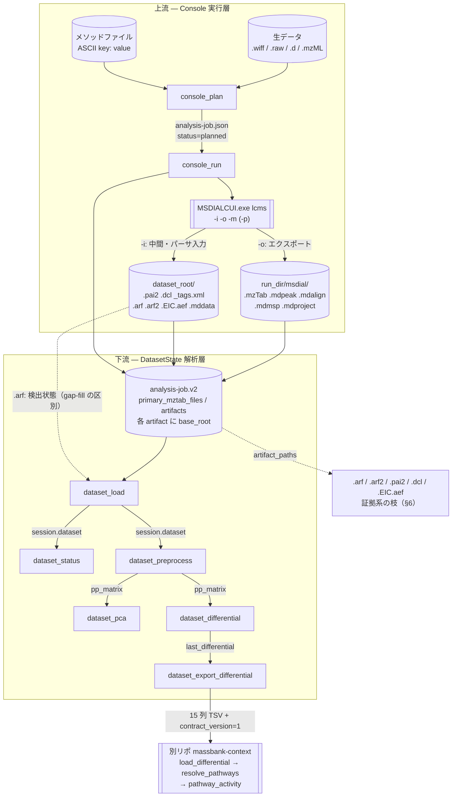

# 一気通貫パイプライン設計: 生データ → MS-DIAL Console → mzTab-M → 差次的解析 → パスウェイ

作成日: 2026-09-03
状態: **目標状態の記述**。本文は `docs/task.md`「Console 適合の是正」ほか 13 項目が入った後の姿で書いてある。2026-09-04 時点で 13 項目はすべて着地し、本文と実装は一致している（`.qa.tsv` の解釈だけが保留）。実装状況のスナップショットは §9。
昇格先: 実装完了後に `docs/workflow/Lipidmix/` へ移す

---

## §0 読み方

### この文書が答える問い

「リピドミクスの一連のワークフローは、**どの順で、どのファイルのどの関数を呼び、各関数は何を引数に何を返すのか**」。

既存文書との切り分け:

| 知りたいこと | 見る場所 |
|---|---|
| ツールの外形（引数・用途・LLM 向け docstring） | `USAGE.md` |
| 出力フィールドの**意味**（行の粒度・脂質名文法・注意） | `docs/output_format/` |
| ツール単体の内部呼び出し順 | `docs/workflow/*.md` |
| **一気通貫の順序と、内部関数のシグネチャ** | 本文書 |

### 記述の 3 要素 ＋ 1

`docs/workflow/` の規約（**前提** / **状態変更** / **呼び出し連鎖**）をそのまま踏襲し、そこに**シグネチャ表**を 1 枚足す。呼び出し連鎖に**行番号は書かない**（リファクタで静かに嘘になるため）。メソッドは `ClassName.method()` と書く。

`docs/workflow/index.md` は「ここに書くのは内部の呼び出し順**だけ**」と宣言しており、引数・戻り値は意図的に `USAGE.md` へ委譲している。**本文書はその規約をあえて破る**。理由は、上流と下流が `analysis-job.json` というファイル 1 つで結合しており、「誰が何を書き、誰がそれを何として読むか」を型で示さないと結合部の契約が読めないため。

昇格時に規約と衝突するので、そのときどちらかを選ぶ:

- (a) シグネチャ表は本文書（specs 側）に残し、`docs/workflow/Lipidmix/` へは連鎖だけを移す。
- (b) `docs/workflow/index.md` の「読み方」に例外条項を足し、`Lipidmix/` 配下だけシグネチャ表を許す。

また `tests/test_workflow_docs.py` の `WORKFLOW_DIR.glob("*.md")` は**非再帰**なので、`docs/workflow/Lipidmix/` 配下は現状の AST 検証・文書集合検証のどちらにも掛からない。昇格時に `rglob` へ変えて検証対象に含めるか、サブディレクトリを検証外の扱いにするかを決める必要がある（**含める**ことを推奨。腐敗防止が効かない棚を作ると、行番号を書かない前提が崩れる）。

### 印

本文は**修正後の目標状態**で書いてある。13 項目のどれかに由来する記述には項目番号の印を付けた。

| 印 | 意味 |
|---|---|
| 【A-n】【B-n】 | この記述は 13 項目のうち A-n / B-n に対応する。**実装済みかどうかは書いていない**——§8 が「どの関数のシグネチャが変わるか」、§9 が「今どこまで入っているか」を持つ |
| 【B-12 条件付き】 | ラボの MS-DIAL を master へ更新するまで実現しない（コード側の判断だけでは動かせない） |

印に実装状況を書かないのは意図的。この文書と実装は並行して進んでおり、行ごとに「未実装」と断定すると数時間で嘘になる。**状況を知りたいときは §9 の表を 1 か所だけ見る。**

印の無い記述は、2026-09-03(6) の実データ実走（`.wiff` 4 サンプル、NEG）またはコード実読で裏取り済みの事実。

---

## §1 全体図

上流と下流の境界は **`analysis-job.json`（`analysis-job.v2`）** 1 点だけ。上流はベンダ生データを MS-DIAL に処理させて成果物を同定し、下流はそれを読んで数値解析する。両者はプロセス内で状態を共有しない。



### 順序の要約（正準スパイン）

| # | 呼ぶもの | 入力 | 生む状態 |
|---|---|---|---|
| 1 | `console_plan` | 生データフォルダ、メソッドファイル、極性、定量種別 | `analysis-job.json`（`status=planned`）、`session.current_job_path` |
| 2 | `console_run` | `job_path`（省略時はセッション） | MS-DIAL 実行、成果物の role 付けとハッシュ、`status=completed`/`partial`/`failed` |
| 3 | `console_status` / `job_list` | 同上 / `dataset_root` | （読むだけ） |
| 4 | `dataset_load` | `job_path` または `mztab_path` | `session.dataset`（`DatasetState`）。隣接する `.arf` が接合できれば `detected_mask` も |
| 5 | `dataset_status` | — | （読むだけ。**群指定に使うサンプル名はここで得る**） |
| 6 | `dataset_preprocess` | 前処理レシピ（＋検出率の足切り） | `pp_matrix` / `roles` / `sample_meta` / `preprocessing_recipe` |
| 7 | `dataset_pca` | 主成分数、log 変換 | `last_pca`（`save_pca_figure` で図に落とせる） |
| 8 | `dataset_differential` | 2 群のサンプル名リスト | `last_differential` |
| 9 | `dataset_export_differential` | 出力パス | 15 列 TSV ファイル |
| 10 | （別リポ）`load_differential` → `pathway_activity` | 上の TSV | パスウェイ濃縮 |

**この順序は飛ばせない。** 前提が無いツールは例外を投げず、`{"error": {"code": "missing_state", "state": ..., "required_tools": [...]}}` の機械可読な封筒を返す（§7）。クライアントはそれを読んでリプレイする契約。

---

## §2 上流 — Console 実行層

生データフォルダを MS-DIAL Console に処理させ、成果物を同定・ハッシュして `analysis-job.json` に記録する。ツールは 4 つ（`console_plan` / `console_run` / `console_status` / `job_list`）。実装は `lipidmix/tools/console_tools.py` と `lipidmix/console/`（`job_manager.py` / `runner.py` / `output_collector.py`）。

### §2.0 実行前に成立していなければならないこと

| 前提 | どこで検査するか | 失敗コード |
|---|---|---|
| 環境変数 `MSDIAL_EXE` が設定済み | `runner.get_exe_path()` | `MSDIAL_EXE_NOT_FOUND` |
| その実行体が **Console 版**である（GUI ではない） | `runner.is_console_exe()` — `--help` の出力にサブコマンド `lcms` が現れるかで判定 | `MSDIAL_EXE_NOT_CONSOLE` |
| `dataset_root` が存在するフォルダ | `console_plan` | `JOB_NOT_PLANNED` |
| `dataset_root` がリポジトリのソースツリー外（`<repo>/data` 配下は許可） | `job_manager._assert_not_in_repo()` | `DATASET_ROOT_IN_REPO` |
| `method_file` が存在し、**ASCII の key: value テキスト**である【A-5】 | `console_tools._looks_like_method_text()` | `METHOD_FILE_NOT_FOUND` / `METHOD_FILE_NOT_TEXT` |
| 生データの形式が 1 種類に揃っている【A-4】 | `job_manager.raw_input_summary()` | `MIXED_RAW_FORMATS` |

**GUI を弾く必要がある理由**: GUI の `MSDIAL.exe` は Subsystem=Windows でコンソール出力を持たず、`--help` を渡してもウィンドウを開いたまま返らない。計画段階で弾かないと `console_run` がタイムアウトまでブロックする（既定 6 時間）。判定は「返らないこと」を利用しており、Console 側は旧ビルドも master ビルドも `--help`（旧は引数エラー時の usage）に `lcms` を含む。

**`-m` はテキストでなければならない**【A-5】。MS-DIAL の `ConfigParser` は ASCII の `key: value` を読む。`.mdproject`（ZIP）を渡してもエラーにならず、**全パラメータが既定値のまま黙って走る**。現行 docstring は `.msdial / .mdproject` を受け付けると書いているが誤りで、拒否しなければならない。

**`.wiff` と `.wiff2` の混在は弾く**【A-4】。`AnalysisFilesParser.ReadInput` は複数フォーマット混在時に `Console.ReadLine()` で対話する。実データ NEG フォルダがこれに該当し、プロンプト発火を実測した。続行すると 60 サンプルが 120 解析ファイルになる。`.wiff.scan` は拡張子が `.scan` なので数に入らず、混在判定にも掛からない。

### §2.1 console_plan

**前提**: §2.0 のすべて。セッション状態には依存しない。
**状態変更**: `dataset_root/runs/<job_id>/analysis-job.json` を新規作成（`status="planned"`）。`session.current_job_path` にそのパスを設定。

`measure="peak_area_above_zero"` は `UNSUPPORTED_AREA_CONSOLE` で**計画段階で止める**。現行 Console は Area を正確に出力しないため、ここを通すと下流が誤った数値を正準として扱う。

#### シグネチャ

| 関数 | 引数 | 戻り値 | 副作用 |
|---|---|---|---|
| `lipidmix/tools/console_tools.py console_plan()` | `dataset_root: str`, `method_file: str`, `polarity: str = "positive"`, `measure: str = "peak_height"`, `omics: str = "lipidomics"`, `save_project: bool = True`【A-7】, `timeout_s: int = 21600`【A-8】 | `str` — JSON。成功時 `status` / `job_id` / `job_path` / `run_dir` / `polarity` / `measure` / `omics` / `input_count` / `method_file` / `save_project` / `timeout_s` / `warnings` / `next`。失敗時はエラー封筒 | `analysis-job.json` を書き、`session.current_job_path` を設定 |
| `lipidmix/console/runner.py get_exe_path()` | なし（環境変数 `MSDIAL_EXE` を読む） | `str` — 実行ファイルパス | なし。未設定なら `MsdialExeNotFoundError` |
| `lipidmix/console/runner.py is_console_exe()` | `exe_path: str`, `timeout_s: int = 15`, キーワード専用で `raise_on_os_error: bool = False` | `bool` — `--help` の出力に `lcms` を含むか。タイムアウトは `False`。`OSError`（実在しないパス等）は既定で `False`、`raise_on_os_error=True` なら送出する | 子プロセスを 1 回起動する（stdin は `DEVNULL`） |
| `lipidmix/console/job_manager.py raw_input_summary()`【A-4】 | `dataset_root: Path` | `dict[str, int]` — 拡張子（先頭ドット無し・小文字）→ 件数。例 `{"wiff": 2, "wiff2": 1, "d": 1}` | なし |
| `lipidmix/console/job_manager.py count_raw_inputs()` | `dataset_root: Path` | `int` — `raw_input_summary()` の合計（後方互換） | なし |
| `lipidmix/tools/console_tools.py _execution_options_error()`【A-7 / A-8】 | `save_project: object`, `timeout_s: object` | `str \| None` — 実行オプションが不正ならエラー封筒、正常なら `None` | なし |
| `lipidmix/tools/console_tools.py _looks_like_method_text()`【A-5】 | `path: Path` | `bool` — ASCII の `key: value` テキストに見えるか | なし |
| `lipidmix/console/job_manager.py create_job()` | `dataset_root: Path`, `method_file: Path`, `polarity: Polarity`, `measure: MeasureType`, `omics: OmicsType = "lipidomics"`, `software_version: str = ""`, `input_count: int = 0` | `tuple[AnalysisJob, Path]` — （ジョブ、`analysis-job.json` の絶対パス） | `run_dir` を `mkdir(parents=True)`、`analysis-job.json` を書く |
| `lipidmix/console/job_manager.py _job_id()` | `polarity: str`, `measure: str` | `str` — `job_<YYYYmmdd_HHMMSS>_<極性3文字>_<h または a>` | なし |
| `lipidmix/console/job_manager.py _assert_not_in_repo()` | `path: Path` | `None` | なし。違反なら `ValueError` |
| `lipidmix/console/job_manager.py save_job()` | `job: AnalysisJob`, `job_path: Path` | `None` | `analysis-job.json` を書く（`updated_at` も更新） |
| `lipidmix/handoff/schema.py AnalysisJob.save()` | `path: Path` | `None` | ファイル書き込み（最小 JSON、区切りに空白なし） |

`save_project` / `timeout_s` は `create_job()` の引数ではなく、**生成後にジョブへ代入して `save_job()` で書き戻す**。`create_job` の引数を増やさずスキーマ側のフィールド（§3）で受ける形にしてある。

`raw_input_summary()` が数える拡張子は、MS-DIAL の実サポートに合わせる【A-4】。現行 `count_raw_inputs()` は `.wiff` / `.raw` / `.mzml` / `.mzxml` ＋ ディレクトリ `.d` しか見ておらず、`.wiff2` も `.abf` も落とす。数え落とすと `input_count` が実際より小さく記録され、`console_run` 後の「サンプル別ファイルが足りない」判定の基準が狂う。

#### 既存アライメント結果の警告【A-9】

`console_plan` は `dataset_root` 直下に `AlignResult-*` / `*AlignmentResult*` が既にあれば `warnings` に 1 件積む。MS-DIAL Console は生成物を生データフォルダにも書くため（§2.2）、**実行のたびに別タイムスタンプの一式が同じフォルダへ追加される**。`CLAUDE.md` が言う「複数バッチ混在フォルダ」を自分で作ることになるので、どれが今回の生成物かは `console_status` の artifacts で確認する、という案内を先に出す。

#### 呼び出し連鎖

1. lipidmix/tools/console_tools.py  console_plan()
2. ├─ lipidmix/tools/console_tools.py  _execution_options_error()  【A-7 / A-8】
3. ├─ lipidmix/tools/console_tools.py  _looks_like_method_text()   【A-5】
4. ├─ lipidmix/console/runner.py  get_exe_path()
5. ├─ lipidmix/console/runner.py  is_console_exe()
6. ├─ lipidmix/console/job_manager.py  raw_input_summary()         【A-4】
7. ├─ lipidmix/console/job_manager.py  create_job()
8. │  ├─ lipidmix/console/job_manager.py  _assert_not_in_repo()
9. │  │  └─ lipidmix/core/data_config.py  get_data_dir()
10.│  ├─ lipidmix/console/job_manager.py  _job_id()
11.│  └─ lipidmix/handoff/schema.py  AnalysisJob.save()
12.│     └─ lipidmix/handoff/schema.py  _to_dict()
13.└─ lipidmix/console/job_manager.py  save_job()                  【A-7 / A-8】

検査の順序も契約の一部。**引数の検査（手順 2〜3）を子プロセス起動（手順 5）より前に置く**
——`is_console_exe()` は実行体を 1 回起動するので、引数が不正なだけの呼び出しで
プロセスを起こさない。`raw_input_summary()`（手順 6）が空 dict を返す場合も
`MIXED_RAW_FORMATS` で止める（0 種類は「計測ファイルが 1 つも無い」の意味）。

### §2.2 console_run

**前提**: `console_plan` 実行済みで `status == "planned"`。
**状態変更**: `analysis-job.json` を `running` → `completed` / `partial` / `failed` に遷移。成果物の `primary_mztab_files` / `artifacts` / `warnings` を書き込む。終端状態の書き込みは `_persist_collected_outputs()` に 1 本化されている（収集結果と status を別々に書くと、片方だけ書けた中間状態が残る）。

#### 生成物がどこに出るか（実測・最重要）

MS-DIAL Console は**引数 2 つのフォルダに書き分ける**。これを取り違えているのが現行の最大の欠陥【A-1】。

| 出る場所 | ファイル | 意味 |
|---|---|---|
| `-o`（`run_dir/msdial/`） | `AlignResult-<ts>.mzTab` / `.mdalign` / `.mdmsp`、`<sample>.mdpeak` / `.mdmsp`、`AlignResult-<ts>.qa.tsv`（master ビルドのみ）、`Project-<ts>.mdproject`（`-p` 時のみ） | **エクスポート**。mzTab-M は正準候補 |
| `-i`（`dataset_root/`） | `<sample>_<ts>.pai2` / `.dcl` / `_tags.xml`、`AlignResult-<ts>.EIC.aef` / `.arf2` / `.dcl` / `_PeakProperties.arf` / `_DriftSopts.arf` / `_tags.xml`、`Project-<ts>.mddata` / `_Loaded.msp2` / `.msp2.dbs` | **本リポジトリのパーサが読むファイル群**が全部こちら |

現行実装は `run_dir` しか snapshot していないため、`.pai2` が 4 本生成されているのに「1 つも生成されていません」と誤った warning を出した。**両方を snapshot して差分する**。`run_dir` は `dataset_root/runs/<job_id>/` にあるので、`dataset_root` 側の snapshot では `runs/` を除外する（二重計上を避ける）。

`.msp2.dbs` は実測 146MB。生データ本体も `dataset_root` にある。したがって **role が付いたものだけ sha256 する**【A-1 / A-2】——全件ハッシュすると生データを毎回読み直すことになる。role が `"unknown"` の Artifact は `sha256` を空文字で記録する。

#### 役割マップ

`output_collector._ROLE_MAP` は拡張子の後方一致（**長いものを先に評価**）で `(role, format)` を決める。現行 6 種には Console のエクスポート拡張子が 1 つも無く、実走した artifacts 10 件が**全部 `role="unknown"`** だった【A-2】。

| 拡張子 | role | format | 状態 |
|---|---|---|---|
| `_tags.xml` | `peak_tags` | `tagsxml` | 【A-2】 |
| `.qa.tsv` | `quality_matrix` | `qatsv` | 【A-2】（収集のみ。中身の解釈は【B-12 条件付き】） |
| `.msp2.dbs` | `library_cache` | `msp2dbs` | 【A-2】 |
| `.EIC.aef` | `chromatogram` | `eicaef` | 現行 |
| `.mzTab` | `primary_mztab` | `mztab` | 現行 |
| `.mdproject` | `gui_project` | `mdproject` | 【A-2】 |
| `.mdalign` | `alignment_table` | `mdalign` | 【A-2】 |
| `.mdpeak` | `sample_peak_table` | `mdpeak` | 【A-2】 |
| `.mdmsp` | `msms_spectra` | `mdmsp` | 【A-2】 |
| `.mddata` | `project_data` | `mddata` | 【A-2】 |
| `.msp2` | `library_snapshot` | `msp2` | 【A-2】 |
| `.arf2` | `spot_catalog` | `arf2` | 現行 |
| `.arf` | `peak_matrix_source` | `arf` | 現行 |
| `.pai2` | `sample_peaks` | `pai2` | 現行（**`.pai` ではない**。`AnalysisFileBean` のフィールド名は `.pai` だが、シリアライザが実際に書くのは `.pai2`） |
| `.dcl` | `msms_evidence` | `dcl` | 現行 |

順序が契約の一部である点に注意: `.msp2.dbs` を `.dbs` より先に、`_tags.xml` を `.xml` より先に評価しないと役割が取り違わる。

`Normalized` 接頭辞の `.mzTab` は `role="unsupported_mztab"` として `other_artifacts` 側に入れ、正準候補（`primary_mztab_files`）から外す。記録は残す——黙って捨てると「出力があるのに `dataset_load` が読めない」という説明不能な状態になる。

#### シグネチャ

| 関数 | 引数 | 戻り値 | 副作用 |
|---|---|---|---|
| `lipidmix/tools/console_tools.py console_run()` | `job_path: str \| None = None` | `str` — JSON。成功時 `status` / `job_id` / `job_path` / `mztab_files`（件数） / `other_artifacts`（件数） / `run_dir` / `warnings` / `next`。失敗時はエラー封筒 | `analysis-job.json` を複数回書き換え。MS-DIAL 子プロセスを起動 |
| `lipidmix/tools/console_tools.py _resolve_job_path()` | `job_path: str \| None` | `Path`（解決成功）または `str`（エラー封筒） | なし |
| `lipidmix/console/job_manager.py load_job()` | `job_path: Path` | `AnalysisJob` | なし。不在なら `FileNotFoundError`、`schema` 非対応なら `ValueError` |
| `lipidmix/console/output_collector.py snapshot()` | `directory: Path`, `exclude_dir_names: frozenset[str] \| set[str] = frozenset()`【A-1】 | `dict[str, int]` — ディレクトリ相対パスをキー、バイトサイズを値とする dict。不在なら空 dict | なし |
| `lipidmix/console/job_manager.py update_status()` | `job_path: Path`, `status: str`, `error: str \| None = None` | `AnalysisJob` — 更新後のジョブ | `analysis-job.json` を書く |
| `lipidmix/console/runner.py run_msdial()` | `method_file: Path`, `dataset_root: Path`, `run_dir: Path`, `timeout_s: int = 3600`, `exe_path: str \| None = None`, `save_project: bool = False` | `int` — 終了コード（正常時は常に 0） | `run_dir/msdial/` を作成、`run_dir/msdial.log` に子の stdout+stderr を書く。子の stdin は `DEVNULL` |
| `lipidmix/console/output_collector.py collect_artifacts()` | `roots: dict[str, Path]`【A-1】, `befores: dict[str, dict[str, int]]`【A-1】, キーワード専用で `declared_polarity: str \| None = None`, `declared_measure: str \| None = None` | `tuple[list[MztabEntry], list[Artifact]]` | なし（読み取りとハッシュのみ） |
| `lipidmix/console/output_collector.py _assign_role()` | `rel_str: str` | `tuple[str, str]` — `(role, format)`。未知は `("unknown", 拡張子 または "bin")` | なし |
| `lipidmix/console/output_collector.py _resolve_mztab_meta()` | `filename: str`, `declared_polarity: str \| None`, `declared_measure: str \| None` | `tuple[str, str, dict]` — `(polarity, measure, validation)`。`validation` は `polarity_source` / `measure_source` ＋ 食い違いがあれば `conflicts` | なし |
| `lipidmix/console/output_collector.py _infer_mztab_meta()` | `filename: str` | `tuple[str \| None, str \| None]` — 推定できなければ **None**（「何も語っていない」の意味。既定値と混ぜてはいけない） | なし |
| `lipidmix/console/output_collector.py _pick()` | `inferred: str \| None`, `declared: str \| None`, `default: str` | `tuple[str, str]` — `(採用値, 採用元)`。採用元は `filename` / `job_declared` / `default` | なし |
| `lipidmix/handoff/schema.py sha256_file()` | `path: Path` | `str` — 64 文字の hex | なし（64KB チャンクで読む） |
| `lipidmix/tools/console_tools.py _meta_conflict_warnings()` | `mztab_entries: list[MztabEntry]` | `list[str]` | なし |
| `lipidmix/tools/console_tools.py _unsupported_mztab_warnings()` | `artifacts: list[Artifact]` | `list[str]` | なし |
| `lipidmix/tools/console_tools.py _missing_per_sample_output_warnings()` | `artifacts: list[Artifact]` | `list[str]` — `format == "pai2"` が 1 件も無いときだけ 1 件 | なし |
| `lipidmix/tools/console_tools.py _persist_collected_outputs()`【A-1 / A-8】 | `job_path: Path`, `mztab_entries`, `other_artifacts`, キーワード専用で `status: str`, `error: str \| None` | `AnalysisJob` — 保存後のジョブ | `analysis-job.json` を **1 回だけ**書く（収集結果 ＋ 3 種の warning ＋ 終端 status ＋ error をまとめて） |
| `lipidmix/tools/console_tools.py _record_finalization_failure()` | `job_path: Path`, `error: str` | `None` | 最終化そのものが失敗したときに `failed` へ収束させる |
| `lipidmix/tools/console_tools.py _timeout_details()`【A-8】 | `job_path: Path`, `status: str`, `mztab_count: int`, `artifact_count: int` | `dict` — `job_path` / `status` / `mztab_files` / `other_artifacts` | なし |
| `lipidmix/console/job_manager.py save_job()` | `job: AnalysisJob`, `job_path: Path` | `None` | `analysis-job.json` を書く |

`polarity` / `measure` は 2 つの独立な証拠から決める: **ファイル名は実物の性質を語り、ジョブの宣言は意図でしかない**。両方あって食い違えばファイル名を採り、食い違い自体を `validation.conflicts` に記録して warning を出す（`_meta_conflict_warnings()`）。Console のアライメント出力名には `Height_` 接頭辞も極性トークンも無いので、実際には宣言値が採用され `measure_source="job_declared"` になる。

#### タイムアウトと部分回収【A-8】

4 サンプルで約 3 分。60 サンプルは 1 時間を超え得る。`console_plan(timeout_s=...)` の値を `analysis-job.json` 経由で `run_msdial()` に渡す（ツール層の既定は 6 時間、`run_msdial` 自身の既定は 1 時間）。

**タイムアウトしても生成済みの成果物は捨てない。** `MsdialTimeoutError` はその場で `failed` にせず変数に退避し、`collect_artifacts()` を通常どおり回してから終端状態を決める:

| 収集結果 | status | 返す封筒 |
|---|---|---|
| 生成物あり | `partial` | `MSDIAL_TIMEOUT` ＋ `_timeout_details()`（`job_path` / `status` / 件数） |
| 生成物ゼロ | `failed` | 同上 |

`partial` のジョブは `dataset_load(job_path=...)` からそのまま読める（`primary_mztab_files` が埋まっていれば）。数時間走らせた結果が丸ごと失われる経路を塞ぐのが目的なので、**タイムアウトを成功に見せない**（封筒は必ずエラーで返す）ことと両立させている。

#### 呼び出し連鎖

1. lipidmix/tools/console_tools.py  console_run()
2. ├─ lipidmix/tools/console_tools.py  _resolve_job_path()
3. ├─ lipidmix/console/job_manager.py  load_job()
4. │  └─ lipidmix/handoff/schema.py  AnalysisJob.load()
5. │     └─ lipidmix/handoff/schema.py  _from_dict()
6. ├─ lipidmix/tools/console_tools.py  _execution_options_error()  【A-7 / A-8】
7. ├─ lipidmix/console/runner.py  get_exe_path()
8. ├─ lipidmix/console/runner.py  is_console_exe()
9. ├─ lipidmix/console/output_collector.py  snapshot()             ← run_dir
10.├─ lipidmix/console/output_collector.py  snapshot()             ← dataset_root（runs/ を除外）【A-1】
11.├─ lipidmix/console/job_manager.py  update_status()             ← running
12.├─ lipidmix/console/runner.py  run_msdial()
13.│  └─ lipidmix/console/runner.py  get_exe_path()
14.├─ lipidmix/console/output_collector.py  collect_artifacts()
15.│  ├─ lipidmix/console/output_collector.py  snapshot()
16.│  ├─ lipidmix/console/output_collector.py  _assign_role()
17.│  ├─ lipidmix/handoff/schema.py  sha256_file()
18.│  └─ lipidmix/console/output_collector.py  _resolve_mztab_meta()
19.│     ├─ lipidmix/console/output_collector.py  _infer_mztab_meta()
20.│     └─ lipidmix/console/output_collector.py  _pick()
21.├─ [タイムアウト時] lipidmix/tools/console_tools.py  _timeout_details()      【A-8】
22.├─ lipidmix/tools/console_tools.py  _persist_collected_outputs()
23.│  ├─ lipidmix/console/job_manager.py  load_job()
24.│  ├─ lipidmix/tools/console_tools.py  _meta_conflict_warnings()
25.│  ├─ lipidmix/tools/console_tools.py  _unsupported_mztab_warnings()
26.│  ├─ lipidmix/tools/console_tools.py  _missing_per_sample_output_warnings()
27.│  └─ lipidmix/console/job_manager.py  save_job()
28.└─ [最終化が失敗した場合] lipidmix/tools/console_tools.py  _record_finalization_failure()

手順 6〜8 は `console_plan` と同じ検査をもう一度行う。計画から実行までの間に
`MSDIAL_EXE` が差し替わることも、`analysis-job.json` が手で編集されることもあるので、
**実行直前の状態で判断する**。手順 8 は `raise_on_os_error=True` で呼ぶ——実行前の
最後の砦なので、実在しないパスを `False`（＝Console でない）に丸めず
`MSDIAL_EXE_NOT_FOUND` として区別する。

**`running` に固着させないことが最優先**。`run_msdial()` の例外は 4 種を個別に捕らえ（`MsdialExeNotFoundError` / `MsdialTimeoutError` / `MsdialNonZeroExitError` / `OSError`）、想定外は包括的な例外節で受けて必ず `update_status(..., "failed")` を通す。実行後処理（収集・ハッシュ・保存）も同様に包む——Windows でウイルススキャナが生成直後のファイルをロックしていると `sha256_file()` が `PermissionError` を投げ、`analysis-job.json` が `running` のまま残って以降の `console_run` が全部 `JOB_NOT_PLANNED` で拒否され、誰も直せなくなる（`JOB_POST_RUN_FAILED`）。

新規生成物が 1 件も無ければ `NO_JOB_OUTPUT` で `failed` にする。`msdial.log` と `analysis-job.json` は `_OPERATIONAL_FILES` として差分から除外されている——前者は `run_msdial` が必ず作るので除外しないと「出力ゼロ」を検出できず、後者は実行中の status 遷移で書き換わるため差分に混入する。

#### stdin

子プロセスの stdin は `DEVNULL` に落としてある。MS-DIAL は混在フォーマット時に `Console.ReadLine()` で対話するため、MCP サーバの stdin を子が読むとプロトコルが汚染され、同時にハングする。塞ぐと MS-DIAL 側は `NullReferenceException` で終了コード 1 を返し、`MSDIAL_NONZERO_EXIT` として正しく扱える。§2.0 の `MIXED_RAW_FORMATS` ガードは対話の**原因**を防ぐもので、これは**経路**を塞ぐもの。両方入れる。

### §2.3 console_status

**前提**: `job_path` 引数、または `session.current_job_path`。
**状態変更**: なし（`readOnlyHint=True`）。

| 関数 | 引数 | 戻り値 | 副作用 |
|---|---|---|---|
| `lipidmix/tools/console_tools.py console_status()` | `job_path: str \| None = None` | `str` — JSON。`job_id` / `status` / `polarity` / `measure` / `omics` / `run_dir` / `mztab_files`（path・polarity・measure の配列） / `artifact_count` / `artifacts`（TSV 文字列）【A-9】 / `warnings` / `error` / `updated_at` | なし |
| `lipidmix/tools/console_tools.py _artifacts_tsv()`【A-9】 | `artifacts: list[Artifact]` | `str` — `path<TAB>role<TAB>format<TAB>root` のヘッダ ＋ 1 行 1 生成物。**生成物ゼロなら空文字**（列名だけの行は「1 件ある」と読めるため） | なし |

1. lipidmix/tools/console_tools.py  console_status()
2. ├─ lipidmix/tools/console_tools.py  _resolve_job_path()
3. ├─ lipidmix/console/job_manager.py  load_job()
4. └─ lipidmix/tools/console_tools.py  _artifacts_tsv()

**どの生成物が今回のジョブのものか**を辿る唯一の場所。`artifacts` の `root` 列が `run_dir` / `dataset_root` のどちらに出たかを示すので、生データフォルダに複数バッチが積み上がっていても今回の分を切り出せる。§2.1 の警告（既存アライメント結果）と対になっている。

### §2.4 job_list

**前提**: なし（`dataset_root` を必ず引数で渡す。セッションを見ない）。
**状態変更**: なし。

| 関数 | 引数 | 戻り値 | 副作用 |
|---|---|---|---|
| `lipidmix/tools/console_tools.py job_list()` | `dataset_root: str` | `str` — JSON。`dataset_root` / `jobs`（job_id・status・polarity・measure・updated_at・job_path） / `count`。読めないジョブは status を `unreadable` で載せる | なし |
| `lipidmix/console/job_manager.py list_jobs()` | `dataset_root: Path` | `list[Path]` — `dataset_root/runs/` 以下の `analysis-job.json` を mtime 降順 | なし |

1. lipidmix/tools/console_tools.py  job_list()
2. ├─ lipidmix/console/job_manager.py  list_jobs()
3. └─ lipidmix/console/job_manager.py  load_job()

---

## §3 境界 — `analysis-job.v2`

上流と下流が共有する唯一のもの。プロセス内の状態ではなく**ディスク上の 1 ファイル**なので、MCP サーバを再起動しても、別のクライアントから開いても同じ解析を再開できる。実装は `lipidmix/handoff/schema.py`（**依存グラフの leaf**。stdlib のみで、`lipidmix.tools.*` も `server` も import しない）。

置き場所は `dataset_root/runs/<job_id>/analysis-job.json`。**リポジトリのソースツリーには決して書かない**（`job_manager._assert_not_in_repo()` が保証）。

### v1 から v2 への変更【A-1 / A-7 / A-8】

| 追加・変更 | 何のためか |
|---|---|
| `Artifact.root: str = "run_dir"` | 生成物が `-o`（`run_dir`）と `-i`（`dataset_root`）の 2 か所に分かれる事実をスキーマで表現する。相対パスだけでは絶対パスに戻せない |
| `MztabEntry.root: str = "run_dir"` | 同上。mzTab は実際には `run_dir` 側に出るが、GUI 出力を取り込む経路では `dataset_root` 側もあり得る |
| `AnalysisJob.save_project: bool = False` | `-p` を渡したか。渡すと `-o` に `.mdproject`、`-i` に `.mddata` / `.msp2` / `.msp2.dbs` が出る |
| `AnalysisJob.timeout_s: int = 3600` | 実行のタイムアウト秒数。計画時に決めて実行時に使う |
| `SCHEMA_VERSION = "analysis-job.v2"` | 版数 |
| `SUPPORTED_SCHEMA_VERSIONS: frozenset[str]` | **v1 のファイルも読めるまま**にする。`root` の無いエントリは `"run_dir"` として解釈する。`AnalysisJob.load()` は `schema` がこの集合に無ければ `ValueError` |

`root` の値は `"run_dir"` / `"dataset_root"` の 2 種。絶対パスをそのまま持たない理由は、フォルダを移動・共有（NAS 運用）したときにジョブが読めなくなるため——ルートの識別子＋相対パスなら、ジョブ自身が持つ `run_dir` / `dataset_root` と組み合わせて再構成できる。

### データモデル

| クラス | フィールド | 型 |
|---|---|---|
| `MztabEntry` | `path` / `polarity` / `measure` / `sha256` / `validation` / `root`【A-1】 | `str` / `Polarity` / `MeasureType` / `str` / `dict` / `str` |
| `Artifact` | `path` / `role` / `format` / `sha256` / `root`【A-1】 | `str` / `str` / `str` / `str` / `str` |
| `SampleManifest` | `path` / `sha256` / `status` | `str` / `str` / `Literal["pending","approved","auto_generated"]` |
| `AnalysisJob` | `schema` / `job_id` / `status` / `created_at` / `updated_at` / `dataset_root` / `input_count` / `software_name` / `software_version` / `execution_mode` / `method_file` / `omics` / `polarity` / `measure` / `run_dir` / `primary_mztab_files` / `artifacts` / `sample_manifest` / `warnings` / `error` / `save_project`【A-7】 / `timeout_s`【A-8】 | 下記 |

型エイリアス（すべて `Literal`。値域を型で縛る）:

- `JobStatus = Literal["planned", "running", "needs_input", "partial", "completed", "failed"]`
  ——`"partial"` はタイムアウトしたが生成物は回収できた状態【A-8】
- `ArtifactRoot = Literal["run_dir", "dataset_root"]`【A-1】
- `Polarity = Literal["positive", "negative"]`
- `MeasureType = Literal["peak_height", "peak_area_above_zero"]`
- `OmicsType = Literal["lipidomics", "metabolomics"]`

`SUPPORTED_SCHEMA_VERSIONS = frozenset({"analysis-job.v1", SCHEMA_VERSION})`。v1 を集合に
残してあるので、v2 化前に作ったジョブも読める（`root` の無いエントリは既定の `"run_dir"`）。

### JSON 上の入れ子と dataclass のフラット構造は一致しない

`_to_dict()` / `_from_dict()` が変換する。dataclass はフラット（`dataset_root` / `software_name` / `omics` …）だが、JSON は意味でグループ化してある:

| JSON のキー | 対応する dataclass フィールド |
|---|---|
| `source.dataset_root` / `source.input_count` | `dataset_root` / `input_count` |
| `software.name` / `.version` / `.execution_mode` / `.method_file` | `software_name` / `software_version` / `execution_mode` / `method_file` |
| `project.omics` / `.polarity` / `.measure` | `omics` / `polarity` / `measure` |
| その他（`schema` / `job_id` / `status` / `run_dir` / `primary_mztab_files` / `artifacts` / `sample_manifest` / `warnings` / `error`） | 同名 |

**この対応表を崩さないこと**。`_to_dict()` と `_from_dict()` の片方だけを直すと、書けるが読めない（あるいは読めるが値が落ちる）ジョブができる。往復テストは `tests/test_handoff_schema.py` にある。

### 読み書きの担当

| 誰が | いつ | 何を |
|---|---|---|
| `console_plan` | 計画時 | 新規作成。`status="planned"`、`polarity` / `measure` / `omics` / `method_file` / `input_count` / `save_project` / `timeout_s` |
| `console_run` | 実行前 | `status="running"` |
| `console_run` | 実行後 | `primary_mztab_files` / `artifacts` / `warnings` / `status="completed"` |
| `console_run` | 失敗時 | `status="failed"` / `error` |
| `console_status` / `job_list` | 任意 | 読むだけ |
| `dataset_load(job_path=...)` | 下流の入口 | 読むだけ。`primary_mztab_files` から正準を 1 件選び、`artifacts` を `role → 絶対パス` に展開する |

### シグネチャ

| 関数 | 引数 | 戻り値 | 副作用 |
|---|---|---|---|
| `lipidmix/handoff/schema.py AnalysisJob.save()` | `path: Path` | `None` | 親ディレクトリを作り、最小 JSON（区切りに空白なし・`ensure_ascii=False`）で書く |
| `lipidmix/handoff/schema.py AnalysisJob.load()` | `path: Path` | `AnalysisJob` | なし。`schema` が `SUPPORTED_SCHEMA_VERSIONS` に無ければ `ValueError` |
| `lipidmix/handoff/schema.py _to_dict()` | `job: AnalysisJob` | `dict` — 上表の入れ子構造 | なし |
| `lipidmix/handoff/schema.py _from_dict()` | `d: dict` | `AnalysisJob` | なし。欠けたキーは既定値で埋める（`root` 未記載は `"run_dir"`） |
| `lipidmix/handoff/schema.py sha256_file()` | `path: Path` | `str` — 64 文字の hex | なし |

---

## §4 下流 — DatasetState 解析層

mzTab-M を読んで `session.dataset`（`DatasetState`）を作り、前処理 → PCA / 差次的解析 → エクスポートまで進める。ツールは 6 つ。実装は `lipidmix/tools/mztab_tools.py` / `lipidmix/tools/dataset_analysis_tools.py`、純ロジックは `lipidmix/mztab/` と `lipidmix/analysis/`。

**ARF 経路（§6）と同じ純関数を共有している。** 同じ入力からは同じ数字が出る。違うのは入口（mzTab-M か `.arf` か）とセッションスロット（`session.dataset` か `session.arf` か）だけ。これは実データで検証済み（`n_tested=694` / `n_significant=147` / 有意 147 特徴の集合一致）。

### §4.1 dataset_load

**前提**: `job_path`（推奨）または `mztab_path` のどちらか一方。両方指定・両方省略はいずれも `DATASET_BAD_REQUEST`。
**状態変更**: `session.dataset` に `DatasetState` を格納。**`session.arf` / `.arf2` / `.pai2` / `.eic` は変更しない**（パーサ別スロット分離の原則）。

`missing_state` を返さないのがここの特徴。引数を直して呼び直すしかない確定エラーに `missing_state` を使うと、契約どおり動くクライアントが `required_tools` を見て同じ呼び出しを再実行し、無限ループする。

#### 正準 mzTab の選び方（`job_path` 経路）

**`primary_mztab_files[0]` を暗黙に採ってはいけない。** エントリは相対パスの辞書順に並ぶため、実データ（`Area_` / `Height_` / `Normalized*` が同居する MS-DIAL GUI 出力）では `Area_` が先頭に来る。`console_plan` が `peak_area_above_zero` を `UNSUPPORTED_AREA_CONSOLE` で拒否しているのに、ここで黙って読んでしまう。

`_select_primary_entry()` はジョブの宣言（`measure` → `polarity`）で絞り、**一意に決まらなければ読まずに停止する**:

| 状況 | コード |
|---|---|
| 宣言 `measure` の候補が 0 件 | `QUANTIFICATION_CONFLICT` |
| その measure に宣言 `polarity` の候補が 0 件 | `POLARITY_MISMATCH` |
| 候補が 2 件以上 | `AMBIGUOUS_PRIMARY_MZTAB` |

どれを読むかは解析結果そのものを変えるので、辞書順にも LLM にも決めさせない。意図的に別のファイルを読むなら `mztab_path` で明示する。

#### 同定は SME セクションにしかない

mzTab-M 2.0.0-M では `database_identifier` / `smiles` / `inchi` / `chemical_name` は **SME 専用の列**。SMF が持つのは `SMF_ID` / `SME_ID_REFS` / `exp_mass_to_charge` / `charge` / `retention_time_in_seconds` / `abundance_assay[N]` だけ。SMF から同定を読もうとすると全特徴で `None` になり、「この測定には同定が無い」と誤読される（実データで InChIKey 0/714 になっていた既往バグ）。

`_best_evidence()` は `SME_ID_REFS`（`|` 区切り）が指す SME 行のうち **`rank` が最上位**のものを 1 つ返す。同一特徴に複数候補が付くのは常態なので、どれを採るかを暗黙にしない。`rank` が無い・数値でない候補は最後に回す。

RT は mzTab-M では**秒**。ARF 経路は分で持ち、両者は同じエクスポート契約の `rt` 列を共有するので、`_seconds_to_minutes()` でここで分へ揃える。

#### 注入順・バッチは mzTab に実在する【B-11】

MTD に以下が実在することを Console 出力・GUI 出力の両方で確認済み:

```
MTD  assay[N]-custom[1]  [MS,MS:4000088,batch label,1]
MTD  assay[N]-custom[2]  [MS,MS:4000089,injection sequence label,N]
```

`_ASSAY_SUFFIX_RE` は既に `custom[1]` を suffix キーとして拾っており、**生の CV term 文字列は `assay_metadata` に入っている**。足りないのは CV term の解釈だけ。`_parse_cv_term()` で `(accession, value)` を取り出し、`MS:4000088` を `batch`、`MS:4000089` を `run_order` として `assay_metadata["assay[N]"]` に畳み込む。

あわせて `sample_names` と同じ並びの `sample_assay_ids: list[str]` を持たせる。`sample_names` は `assay[N]` の表示名に解決済みなので、これが無いと前処理層から assay に戻れない。

**素の `assay[N]` 行を取りこぼしてはいけない。** MS-DIAL の表示名（例 `20220901_RAW_control_0h_1_NEG`）を持つ唯一の場所で、落とすと `sample_names` が `abundance_assay[N]` という不透明な列識別子のままになり、群選択（`dataset_differential`）と QC/blank ロール検出（`detect_sample_roles` はサンプル名のトークンを見る）が両方機能しなくなる。

#### 検出状態は隣接する `.arf` から補う【B-12】

mzTab-M の `abundance_assay[N]` は**非ゼロでも実測ピークか gap-fill 補間値かを区別しない**。実データ（60 サンプル × 714 特徴 = 42,840 セル）では **70.0% が gap-fill** だったので、非ゼロを検出と数えると検出率を 3 倍以上に過大評価する。`.arf` は (スポット × サンプル) の粒度で `MasterPeakID < 0` = gap-fill を持つので、そこから補う。

**接合は名前ではなく数値で検証する。** `.arf` のスポット順が mzTab の `SMF_ID` と一致することを、スポット数の一致と**全特徴の m/z 差 ≤ 0.01 Da** で確かめる。実データでは位置一致で最大 6.7 mDa、1 つずらすと 87 Da に爆発するので偶然は起きない。確認できなければ**取り込まず**、`feature_qc` に理由を残して warning を出す——誤接合は検出/未検出を特徴間で入れ替えたまま静かに嘘をつく。

サンプル軸は `.arf` のファイル名と mzTab の assay 表示名の一致で対応させ、列順は mzTab の assay 順にそろえる。結果は `ds.detected_mask`（(特徴 × サンプル) の bool 行列）と `ds.feature_qc`（要約）。

**`feature-qc.tsv` というファイルは作らない。** 消費者のいない同名 TSV を 2026-09-03 に廃止した経緯があり、読み手のいないファイルを再び置くと同じ結末になる。spec §10.1 が求める `is_gap_filled` / `detected_peak` の区別は、この 2 つの状態で満たしている。

`job_path` 経路では、この取り込みは `artifact_paths` を埋め**終えた後**に走る。handoff が記録した `peak_matrix_source`（Console が `dataset_root` に出した `.arf`）を候補の先頭に使えるのは、その時点以降だけ。`DriftSpots` / `DriftSopts` を名前に含む `.arf` は候補から外す（アライメント後のサンプル別ピークを持つのは `PeakProperties` 側）。

#### RDKit 不在を明示する【B-13】

`derive_inchikey()` は RDKit の不在を握り潰す。実データの InChIKey は **162/271 件すべて `smiles_derived`**（`database_identifier` 由来は 0 件）だったので、RDKit の無い環境では InChIKey が 0 件になり、`dataset_export_differential` が「InChIKey が付いた特徴が 0 件」で書き出しを拒否する。**下流への受け渡しが警告なしで環境依存に落ちる**。`rdkit_available()` を作り、`ds.inchikey_coverage["rdkit_available"]` として `dataset_load` の要約に出す。

#### シグネチャ

| 関数 | 引数 | 戻り値 | 副作用 |
|---|---|---|---|
| `lipidmix/tools/mztab_tools.py dataset_load()` | `mztab_path: str \| None = None`, `job_path: str \| None = None` | `str` — **Markdown の要約テキスト**（他の多くのツールと違い JSON ではない）。`source_format` / 特徴量数 / サンプル数 / 定量種別と確度 / 検証結果 / InChIKey 被覆 / 警告の先頭 3 件。失敗時はエラー封筒（JSON） | `session.dataset` を差し替え |
| `lipidmix/tools/mztab_tools.py _load_from_job()` | `job_path_str: str` | `str` — 上と同じ要約 ＋ 他 mzTab の件数 ＋ 付随アーティファクトの role 別件数 | `session.dataset` を差し替え |
| `lipidmix/handoff/schema.py AnalysisJob.load()` | `path: Path` | `AnalysisJob` | なし |
| `lipidmix/tools/mztab_tools.py _select_primary_entry()` | `job: AnalysisJob` | `MztabEntry`（一意に決まった場合）または `str`（エラー封筒） | なし |
| `lipidmix/tools/mztab_tools.py _artifact_abs_path()`【A-1】 | `job: AnalysisJob`, `root: str`, `rel: str` | `Path` — `root` が `"dataset_root"` なら `job.dataset_root`、それ以外は `job.run_dir` を起点に解決 | なし |
| `lipidmix/tools/mztab_tools.py _describe()` | `entries: list[MztabEntry]` | `list[dict]` — path / polarity / measure | なし |
| `lipidmix/mztab/reader.py parse_mztab()` | `path: str \| Path` | `dict` — `metadata`（MTD キー → 値）/ `sections`（`SML` / `SMF` / `SME` それぞれ `header` / `rows` / `warnings`）/ `warnings` | なし |
| `lipidmix/tools/mztab_tools.py _validate_or_error()` | `parse_result: dict`, `filename: str` | `dict`（検証成功）または `str`（エラー封筒） | なし |
| `lipidmix/mztab/validator.py validate_mztab()` | `parse_result: dict` | `dict` — `ok: bool` / `errors: list[str]` / `warnings: list[str]` | なし |
| `lipidmix/mztab/validator.py detect_quantification_measure()` | `parse_result: dict`, `filename: str` | `tuple[str \| None, str]` — `(measure, confidence)`。confidence は `verified` / `inferred` / `unknown` / `conflict` | なし |
| `lipidmix/mztab/dataset_state.py build_dataset_state()` | `parse_result: dict`, `filename: str`, `source_path: str \| Path` | `DatasetState` | なし（純関数。返した状態を呼び出し側がセッションへ入れる） |
| `lipidmix/mztab/dataset_state.py _sha256()` | `path: str \| Path` | `str` — 64 文字の hex | なし |
| `lipidmix/mztab/reader.py extract_abundance_matrix()` | `parse_result: dict` | `tuple[np.ndarray, list[str], list[str]]` — `(matrix, sample_names, feature_ids)`。matrix は `(n_features, n_samples)`、欠損は `np.nan`。列は assay 番号昇順 | なし |
| `lipidmix/mztab/dataset_state.py _index_sme_rows()` | `sme_rows: list[dict] \| None` | `dict` — `SME_ID`（文字列）→ 行 | なし |
| `lipidmix/mztab/dataset_state.py _best_evidence()` | `refs: str \| None`, `sme_by_id: dict` | `dict` — rank 最上位の SME 行。参照が無ければ空 dict | なし |
| `lipidmix/mztab/dataset_state.py _sme_rank()` | `row: dict` | `tuple[int, int]` — 昇順ソートキー。`rank` が無い・非数値は `(1, 0)` で最後 | なし |
| `lipidmix/mztab/identity.py derive_inchikey()` | `database_identifier: str \| None`, `inchi: str \| None`, `smiles: str \| None` | `tuple[str \| None, str]` — `(inchikey, source)`。source は `database_identifier` / `inchi_derived` / `smiles_derived` / `none` | なし |
| `lipidmix/mztab/identity.py rdkit_available()`【B-13】 | なし | `bool` | なし（import を試すだけ） |
| `lipidmix/mztab/dataset_state.py _parse_cv_term()`【B-11】 | `value: str \| None` | `tuple[str \| None, str \| None]` — `(accession, value)`。例 `[MS,MS:4000089,injection sequence label,3]` → `("MS:4000089", "3")` | なし |
| `lipidmix/mztab/dataset_state.py _resolve_sample_names()`【B-11】 | `abundance_cols: list[str]`, `assay_metadata: dict` | `tuple[list[str], list[str], list[str]]` — `(names, assay_ids, warnings)`。表示名が無い assay は列識別子のままフォールバック。表示名が重複する不正ファイルは置換しつつ warning | なし |
| `lipidmix/mztab/dataset_state.py _seconds_to_minutes()` | `value: float \| None` | `float \| None` | なし |
| `lipidmix/mztab/dataset_state.py _to_float()` | `v: str \| None` | `float \| None` — 変換できなければ `None` | なし |
| `lipidmix/mztab/evidence.py attach_to_dataset()`【B-12】 | `ds`, `mztab_path: str \| Path` | `None` | `ds.detected_mask` / `ds.feature_qc` を設定し、失敗理由は `ds.validation_result["warnings"]` に足す |
| `lipidmix/mztab/evidence.py arf_candidates()`【B-12】 | `mztab_path: str \| Path`, `artifact_paths: dict[str, list[str]] \| None = None` | `list[Path]` — 探索順に並べた `.arf` 候補（`peak_matrix_source` の記録 → mzTab の隣接フォルダ）。`DriftSpots` / `DriftSopts` は除外 | なし |
| `lipidmix/mztab/evidence.py load_arf_evidence()`【B-12】 | `arf_path: str \| Path`, キーワード専用で `feature_mz: list[float \| None]`, `sample_names: list[str]`, `mz_tolerance: float = MZ_TOLERANCE` | `dict` — 接合できれば `detected_mask` と要約、できなければ `reason` 付きの不成立 | なし |
| `lipidmix/mztab/evidence.py normalize_arf_spots()`【B-12】 | `spots: list[dict]` | `list[dict]` — スポットを ID 順に正規化した形 | なし |
| `lipidmix/mztab/evidence.py build_evidence()`【B-12】 | `normalized_spots: list[dict]`, キーワード専用で `feature_mz`, `sample_names`, `mz_tolerance = MZ_TOLERANCE` | `dict` — m/z 照合の可否と `detected_mask` | なし |
| `lipidmix/mztab/evidence.py apply_evidence()`【B-12】 | `ds`, `result: dict \| None` | `None` | `ds` に反映（不成立なら `detected_mask` を `None` のまま残す） |
| `lipidmix/tools/mztab_tools.py _detection_line()`【B-12】 | `ds` | `str` — `dataset_load` の要約に出す検出状態 1 行 | なし |

`_resolve_sample_names()` は**列順を変えない**。`extract_abundance_matrix()` が既に assay 番号昇順で確定させた列順に対し 1:1 で名前を置き換えるだけ。ここで並べ替えると全サンプルが黙って誤ラベルされる。

サンプル名の warning は `validation_result["warnings"]` の**先頭に差す**。パーサ層の良性 warning（SME 行の末尾空列除去など）は実データで数百件になり得るので、後ろに append すると件数を絞って表示する `dataset_load` の要約に載る余地がなくなる。表示されない warning は無いのと同じで、群選択が黙って誤るのを止められない。実データで 484 件 → 1 件に集約済み。

#### 呼び出し連鎖

`mztab_path` 経路（直接指定）:

1. lipidmix/tools/mztab_tools.py  dataset_load()
2. ├─ lipidmix/mztab/reader.py  parse_mztab()
3. ├─ lipidmix/tools/mztab_tools.py  _validate_or_error()
4. │  └─ lipidmix/mztab/validator.py  validate_mztab()
5. └─ lipidmix/mztab/dataset_state.py  build_dataset_state()
6.    ├─ lipidmix/mztab/dataset_state.py  _sha256()
7.    ├─ lipidmix/mztab/validator.py  validate_mztab()
8.    ├─ lipidmix/mztab/validator.py  detect_quantification_measure()
9.    ├─ lipidmix/mztab/reader.py  extract_abundance_matrix()
10.   ├─ lipidmix/mztab/dataset_state.py  _index_sme_rows()
11.   ├─ lipidmix/mztab/dataset_state.py  _best_evidence()
12.   │  └─ lipidmix/mztab/dataset_state.py  _sme_rank()
13.   ├─ lipidmix/mztab/identity.py  derive_inchikey()
14.   ├─ lipidmix/mztab/identity.py  rdkit_available()          【B-13】
15.   ├─ lipidmix/mztab/dataset_state.py  _to_float()
16.   ├─ lipidmix/mztab/dataset_state.py  _seconds_to_minutes()
17.   ├─ lipidmix/mztab/dataset_state.py  _parse_cv_term()       【B-11】
18.   └─ lipidmix/mztab/dataset_state.py  _resolve_sample_names()
19. ├─ lipidmix/mztab/evidence.py  attach_to_dataset()             【B-12】
20. │  ├─ lipidmix/mztab/evidence.py  arf_candidates()
21. │  ├─ lipidmix/mztab/evidence.py  load_arf_evidence()
22. │  │  ├─ lipidmix/arf/reader.py  deserialize()
23. │  │  ├─ lipidmix/mztab/evidence.py  normalize_arf_spots()
24. │  │  └─ lipidmix/mztab/evidence.py  build_evidence()
25. │  └─ lipidmix/mztab/evidence.py  apply_evidence()
26. └─ lipidmix/tools/mztab_tools.py  _summary_text()
27.    └─ lipidmix/tools/mztab_tools.py  _detection_line()          【B-12】

`job_path` 経路（推奨）:

1. lipidmix/tools/mztab_tools.py  dataset_load()
2. └─ lipidmix/tools/mztab_tools.py  _load_from_job()
3.    ├─ lipidmix/handoff/schema.py  AnalysisJob.load()
4.    ├─ lipidmix/tools/mztab_tools.py  _select_primary_entry()
5.    │  └─ lipidmix/tools/mztab_tools.py  _describe()
6.    ├─ lipidmix/tools/mztab_tools.py  _artifact_abs_path()     【A-1】
7.    ├─ lipidmix/mztab/reader.py  parse_mztab()
8.    ├─ lipidmix/tools/mztab_tools.py  _validate_or_error()
9.    ├─ lipidmix/mztab/dataset_state.py  build_dataset_state()
10.   ├─ lipidmix/mztab/evidence.py  attach_to_dataset()          【B-12】
11.   └─ lipidmix/tools/mztab_tools.py  _summary_text()

`job_path` 経路だけが `ds.job_path` と `ds.artifact_paths`（`role → 絶対パスの配列`）を埋める。これが §6 の枝への入口になる。

### §4.2 dataset_status

**前提**: `dataset_load` 実行済み。未実行なら `missing_state("dataset", ["dataset_load"], ...)`。
**状態変更**: なし。

**`dataset_differential` に渡すサンプル名はここで得る。** 件数だけを返していた頃は、名前を知る手段が「わざと群サイズ不足のエラーを起こして `details` を読む」しか無かった。行が並ぶ一覧なので TSV（列名 1 回）で返す。

| 関数 | 引数 | 戻り値 | 副作用 |
|---|---|---|---|
| `lipidmix/tools/mztab_tools.py dataset_status()` | なし | `str` — JSON。`source_format` / `source_files` / `quantification_measure` / `quantification_confidence` / `n_features` / `n_samples` / `validation`（ok・n_errors・n_warnings） / `inchikey_coverage` / `detection`【B-12】 / `samples`（TSV 文字列） ＋ あれば `job_path` / `artifact_roles` | なし |
| `lipidmix/tools/mztab_tools.py _detection_summary()`【B-12】 | `ds: DatasetState` | `dict` — 取り込めていれば `available: true` / `source` / `n_cells` / `n_detected` / `gap_filled_rate`、取り込めていなければ `available: false` / `reason` / `note`。**(特徴 × サンプル) の行列そのものは返さない**（実データで 42,840 セル規模） | なし |
| `lipidmix/tools/mztab_tools.py _samples_tsv()` | `ds: DatasetState` | `str` — `name<TAB>role` のヘッダ ＋ 1 行 1 サンプル | なし |
| `lipidmix/analysis/preprocessing.py detect_sample_roles()` | `sample_names: list[str]`, `class_ids: dict[str, str] \| None = None`, `config: dict \| None = None` | `dict[str, str]` — サンプル名 → `sample` / `qc` / `blank` | なし |

1. lipidmix/tools/mztab_tools.py  dataset_status()
2. ├─ lipidmix/tools/mztab_tools.py  _samples_tsv()
3. │  └─ lipidmix/analysis/preprocessing.py  detect_sample_roles()
4. └─ lipidmix/tools/mztab_tools.py  _detection_summary()          【B-12】

`detection.available == false` のときは「検出率・欠測率を語れない」ことを `note` で明示する。
**0 件と混同させない**——「検出状態が無い」と「全部未検出」は解釈が正反対。

前処理済みなら `ds.roles` を、まだなら同じ判定関数をその場で適用する。ARF 経路（`arf_list_sample_roles`）と同じ判定を使うので、どちらの経路でも同じ試料が同じ役割になる。

### §4.3 dataset_preprocess

**前提**: `dataset_load` 実行済み。
**状態変更**: `ds.pp_matrix` / `pp_sample_names` / `pp_feature_names` / `roles` / `sample_meta` / `preprocessing_recipe`。

処理順は **`arf_preprocess` と同一に保つ**。ARF 経路と DatasetState 経路で違う数字が出ないことが、この層の存在意義:

```
blank_filter → normalize → drift_correct → qc_rsd_filter → impute → drop_samples_by_role(blank)
```

列（特徴量）を落とすステップはマスクを蓄積し、最後にまとめて適用する。**ブランクは背景除去に使い終えたら解析行列から外す**（残すと総強度が桁違いに低い行が PCA の PC1 を支配する）。**QC は残す**——QC クラスタの締まり具合を PCA で見るのは品質確認の定番手段。

`DatasetState.feature_matrix` は `(n_features, n_samples)`、`analysis/` の関数はすべて `(n_samples, n_features)` を期待する。`build_dataset_pp_inputs()` が転置を吸収するので、呼び出し側は意識しなくてよい。

#### 注入順とバッチの解決【B-11】

現行は `run_order` を全件 `None`、`batch` をサンプル名の 8 桁日付から推定しており、そのため `drift_correct=True` は**常に skip** される。§4.1 で読んだ値を使う:

| 項目 | 採用規則 | `*_source` の値 |
|---|---|---|
| `run_order` | `assay_metadata[aid]["run_order"]`（`MS:4000089`）。無ければ `None` | `mztab_injection_sequence` / `None` |
| `batch` | `assay_metadata[aid]["batch"]`（`MS:4000088`）が **2 値以上あるときだけ**採用。1 値しかなければサンプル名の日付へフォールバック | `mztab_batch_label` / `filename_date` / `None` |

**バッチを無条件に採ってはいけない。** MS-DIAL のバッチラベルは CSV インポートで指定しない限り全件 `1` になる。既定値 1 を採ると、日付で分かれていた交絡が検出できなくなる（品質ゲートが 1 つ減る）。

注入順は MS-DIAL のファイル読み込み順に由来する既定値である可能性があるため、ドリフト補正を要求されたときは caveat で出所を明示する。**これが入ると `dataset_preprocess` / `dataset_differential` の数値が変わる**（ドリフト補正が実際に走る）。ARF 経路との一致確認とセットで実施する。

同時に、現在 `run_dataset_preprocess()` が無条件に積んでいる caveat（「現在の実装は mzTab-M から注入順を読み取っていないため QC ドリフト補正は実施できません」）を削除する。読めるようになったのに残すと嘘になる。

#### 検出率による足切り【B-12】

`min_detection_rate` は §4.1 で取り込んだ `ds.detected_mask` を使い、**実検出率（gap-fill を除いた割合）**で特徴量を落とす。率の定義は `preprocessing.detection_rates()` が 1 つだけ持ち、ARF 経路と共有する。実データでは `min_detection_rate=0.5` で 714 → 193 特徴。

**この足切りは前処理本体（`preprocess()`）より前に来る。** 正規化・補完のあとでは gap-fill セルが実測値と区別できなくなり、何を根拠に特徴を残したかが言えなくなる。

**検出状態が無いのに閾値を渡されたら `bad_request` で拒否する。** 0 扱いで通すと「gap-fill だけの特徴を実測として数えた行列」が黙って下流に流れる。「検出状態が無い」と「全部未検出」は解釈が正反対なので、混ぜない（メッセージでは ARF 経路を代替として案内する）。

`min_detection_rate=0.0`（既定）なら `detected_mask` の有無に関わらず素通しする。

**`.qa.tsv` は別の話【B-12 条件付き】。** master ビルドの MS-DIAL は `IsHeightMatrixExport`（既定 true）のとき `SMF × assay` の long 形式で `Height / RT / MZ / SN / MSMS / Reference matched` を `<alignmentFile>.qa.tsv` に出す。ラボのクローンは 2026-05-21 のコミットでこの機能を持たず、実走でも出なかった。role を与えて収集はする（§2.2）が、どの値がギャップ補完を意味するかは未検証。`.arf` 由来の現行実装より粒度の細かい根拠（S/N・MS/MS の有無）を運べるので、ラボの MS-DIAL を master へ更新して実物を採取してから扱う。

#### シグネチャ

| 関数 | 引数 | 戻り値 | 副作用 |
|---|---|---|---|
| `lipidmix/tools/dataset_analysis_tools.py dataset_preprocess()` | `normalize: str = "none"`, `blank_min_fold: float \| None = None`, `drift_correct: bool = False`, `max_qc_rsd: float \| None = None`, `impute: str = "half_min"`, `min_detection_rate: float = 0.0`【B-12】 | `str` — JSON。`status` / `n_samples` / `n_features` / `features_before` / `features_removed_total` / `recipe_applied` / `excluded_from_matrix` / `role_counts` / `steps` / `caveats` / `next` | `ds` の 6 フィールドを設定 |
| `lipidmix/analysis/dataset_analysis.py _apply_detection_filter()`【B-12】 | `ds`, `matrix`, `feature_names`, `min_detection_rate` | `tuple` 3 要素 — `(matrix, feature_names, report)`。`matrix` は (サンプル × 特徴)、足切りは列に対して行う | なし。検出状態が無いのに 閾値 > 0 なら `PreconditionError(kind="bad_request")` |
| `lipidmix/analysis/preprocessing.py detection_rates()`【B-12】 | `detected_mask` — (特徴 × サンプル) の bool 行列 | `np.ndarray` — 特徴ごとの実検出率 | なし |
| `lipidmix/analysis/dataset_analysis.py run_dataset_preprocess()` | `ds`, `recipe: dict` | `tuple` 6 要素 — `(pp_matrix, pp_sample_names, pp_feature_names, roles, sample_meta, report)` | なし（`ds` は読むだけ） |
| `lipidmix/analysis/dataset_analysis.py build_dataset_pp_inputs()` | `ds` | `tuple` 5 要素 — `(matrix, sample_names, feature_names, roles, sample_meta)`。matrix は `(n_samples, n_features)` | なし。行列が無ければ `PreconditionError(kind="missing_state", state="dataset")` |
| `lipidmix/analysis/preprocessing.py preprocess()` | `matrix`, `sample_names`, `roles`, `run_order`, `recipe` | `tuple` 3 要素 — `(matrix, kept_idx, report)`。`kept_idx` は残った特徴量の元インデックス | なし。未知の正規化メソッド等は `ValueError` |
| `lipidmix/analysis/preprocessing.py blank_filter()` | `matrix`, `roles`, `sample_names`, `min_fold=3.0` | 除去マスクを含む結果 | なし |
| `lipidmix/analysis/preprocessing.py normalize()` | `matrix`, `method: str`, `roles=None`, `sample_names=None` | 正規化後の行列。`tic` は行総和、`median` は行中央値、`pqn` は QC 中央値（無ければ全サンプル中央値）を参照、`none` は恒等 | なし |
| `lipidmix/analysis/preprocessing.py qc_drift_correct()` | `matrix`, `roles`, `sample_names`, `run_order`, `min_qc=4`, `window=5` | 補正後の行列と実施状況。注入順が取れない・QC が `min_qc` 未満なら `skipped` | なし |
| `lipidmix/analysis/preprocessing.py qc_rsd_filter()` | `matrix`, `roles`, `sample_names`, `max_rsd=0.3` | RSD 超過特徴を落とした結果 | なし |
| `lipidmix/analysis/preprocessing.py impute()` | `matrix`, `method="half_min"` | 補完後の行列。`half_min` / `knn` / `column_mean` / `none` | なし |
| `lipidmix/analysis/preprocessing.py drop_samples_by_role()` | `matrix`, `sample_names`, `roles`, `drop_roles=("blank",)` | `tuple` 3 要素 — `(matrix, sample_names, dropped)`。`dropped` は `{role: [sample_name, ...]}` | なし |
| `lipidmix/analysis/preprocessing.py detect_qc_strata()` | `sample_names: list[str]`, `roles: dict[str, str]` | `set[str]` — 層識別子の集合。2 つ以上なら「プール QC が層別」の caveat 材料 | なし |
| `lipidmix/analysis/preprocessing.py detect_failed_qc()` | `matrix`, `roles`, `sample_names`, `min_ratio=0.2` | `dict` — 総強度が QC 中央値の `min_ratio` 未満に落ちた失敗注入。**行列は非破壊** | なし |

`PreconditionError(kind, message, details=None, state=None)` は前提不成立を**理由付きで**返すための例外。`kind="missing_state"` なら `state` が必須で、ツール層はそれをそのまま `missing_state()` の第 1 引数に使う。**メッセージ文面から状態を推測させない**——文面を直した瞬間に振り分けが静かに壊れる結合になる。`kind="bad_request"` はリプレイしても直らない引数エラー。

1. lipidmix/tools/dataset_analysis_tools.py  dataset_preprocess()
2. ├─ lipidmix/analysis/dataset_analysis.py  run_dataset_preprocess()
3. │  ├─ lipidmix/analysis/dataset_analysis.py  build_dataset_pp_inputs()
4. │  │  └─ lipidmix/analysis/preprocessing.py  detect_sample_roles()
5. │  ├─ lipidmix/analysis/dataset_analysis.py  _apply_detection_filter()   【B-12】
6. │  │  └─ lipidmix/analysis/preprocessing.py  detection_rates()
7. │  ├─ lipidmix/analysis/preprocessing.py  preprocess()
8. │  ├─ lipidmix/analysis/preprocessing.py  drop_samples_by_role()
9. │  └─ lipidmix/analysis/preprocessing.py  detect_qc_strata()
10.├─ lipidmix/tools/dataset_analysis_tools.py  _from_precondition()
11.└─ lipidmix/tools/dataset_analysis_tools.py  _count_roles()

### §4.4 dataset_pca

**前提**: `dataset_preprocess` 実行済み。`ds.pp_matrix` が無ければ `missing_state("dataset_preprocessed", ["dataset_preprocess"], ...)`。
**状態変更**: `ds.last_pca` に全量（loadings を含む）。

**ローディング全量は戻り値に載せない。** 特徴量数 × 主成分数で巨大になるのでセッションに保持し、戻り値には「非同梱」の注記だけを置く。

| 関数 | 引数 | 戻り値 | 副作用 |
|---|---|---|---|
| `lipidmix/tools/dataset_analysis_tools.py dataset_pca()` | `n_components: int = 5`, `log_transform: bool = False` | `str` — JSON。`explained_variance_ratio` / `scores` / `n_samples` / `n_features` / `log_transform` / `status` / `loadings_note`（`loadings` は除去） | `ds.last_pca` を設定 |
| `lipidmix/analysis/dataset_analysis.py run_dataset_pca()` | `ds`, `n_components: int = 5`, `log_transform: bool = False` | `dict` — `explained_variance_ratio`（4 桁丸め） / `scores`（name・role・PC1..PCn） / `n_samples` / `n_features` / `log_transform` / `loadings` | なし |
| `lipidmix/analysis/dataset_analysis.py _require_pp_matrix()` | `ds` | `np.ndarray` | なし。無ければ `PreconditionError(kind="missing_state", state="dataset_preprocessed")` |
| `lipidmix/analysis/pca.py run_pca()` | `matrix: np.ndarray`, `n_components: int \| None = None`, `log_transform: bool = False` | `dict` — `components`（サンプル × 主成分のスコア） / `explained_variance_ratio` / `loadings` | なし |

サンプル数・特徴量数の小さい方が 2 未満なら `PreconditionError(kind="bad_request")` にする（「前処理のフィルタ閾値が厳しすぎる可能性」を添える）。`log_transform=True` は標準化の**前**に `log10` を適用する（0 以下対策で下限 1.0 にクリップ）。

**`run_pca` の正準は `lipidmix/analysis/pca.py`。** `lipidmix/arf/reader.py` の同名は後方互換の再エクスポートで、ARF テストが module 属性としてこの束縛を差し替えてモックしている。消すとモックが効かなくなり、テストは緑のまま実物の scikit-learn PCA が走り出す。

1. lipidmix/tools/dataset_analysis_tools.py  dataset_pca()
2. └─ lipidmix/analysis/dataset_analysis.py  run_dataset_pca()
3.    ├─ lipidmix/analysis/dataset_analysis.py  _require_pp_matrix()
4.    └─ lipidmix/analysis/pca.py  run_pca()

### §4.5 dataset_differential

**前提**: `dataset_preprocess` 実行済み。
**状態変更**: `ds.last_differential` に全量（`results` と `volcano` を含む）。

**log2FC は正なら `group_b` が高い（上昇）。** `group_a` が基準（対照）。慣習 `log2FC = log2(比較対象 / 基準)` に合わせてある（2026-08-31 に向きを反転しており、それ以前の解析結果とは符号が逆）。

群の解決（`_resolve_group()`）で落ちたものは**すべて caveat で名指しする**。黙って落とすと群サイズが縮んだことに気付けない:

| 状況 | 扱い |
|---|---|
| 同じ名前が同一群に重複指定 | 先勝ちで 1 回に丸め、caveat。重複したまま検定すると同一行を二重に数え、群内分散を過小評価して有意性を水増しする |
| `pp_sample_names` に無い名前 | 除外 ＋ caveat（名前の誤り、または前処理で脱落） |
| QC / ブランク | 除外 ＋ caveat（群に混ぜると比較が壊れる） |
| 両群に同じサンプル | `PreconditionError(kind="bad_request")` で**停止** |
| どちらかの群が n < 2 | 同上で停止（`available_samples` を `details` に添える） |

交絡（群 ⟂ バッチ）の判定は「**実際に比較した 2 群**」（プール後）に対して行う。プール前の細粒度ラベルで判定すると偽の交絡警告が出る。`check_confounding()` の `assessable` は「判定できたか」を示す——バッチ情報が無い、または全試料が単一バッチのときは評価不可であり、「バッチが 1 つしかない＝交絡なし」と誤読しないよう明示的に分けてある。

| 関数 | 引数 | 戻り値 | 副作用 |
|---|---|---|---|
| `lipidmix/tools/dataset_analysis_tools.py dataset_differential()` | `group_a: list[str]`, `group_b: list[str]`, `q_threshold: float = 0.05`, `log2fc_threshold: float = 1.0`, `log_transform: bool = True`, `group_a_label: str = "group_a"`, `group_b_label: str = "group_b"` | `str` — JSON。`kind` / `a` / `b` / `samples_a` / `samples_b` / `n_a` / `n_b` / 各閾値 / `contract_version` / `log2fc_sign` / `summary` / `caveats` / `status` / `differential_contract_version` / `results_note`（`results` と `volcano` は除去） | `ds.last_differential` を設定 |
| `lipidmix/analysis/dataset_analysis.py run_dataset_differential()` | `ds`, `group_a_samples: list[str]`, `group_b_samples: list[str]`, キーワード専用で `q_threshold=0.05`, `log2fc_threshold=1.0`, `log_transform=True`, `group_a_label="group_a"`, `group_b_label="group_b"` | `dict` — 上記 ＋ `results`（全特徴） ＋ `volcano`（点列） | なし |
| `lipidmix/analysis/dataset_analysis.py _resolve_group()` | `requested`, `available`, `roles`, `label`, `caveats` | `tuple[list[int], list[str]]` — `(行インデックス, 採用されたサンプル名)`。`caveats` は破壊的に追記される | 引数 `caveats` に追記 |
| `lipidmix/analysis/differential.py check_confounding()` | `group_labels`, `batch_labels` | `dict` — `confounded: bool` / `detail: str` / `assessable: bool` | なし |
| `lipidmix/analysis/differential.py two_group_test()` | `matrix`, `feature_names`, `group_labels`, `group_a`, `group_b`, キーワード専用で `log2=True`, `pseudo_count=1.0`, `log_transform=False` | `list[dict]` — 特徴量ごとに `feature` / `log2fc` / `p` / `mean_a` / `mean_b`。`mean_a` / `mean_b` は解釈用に**常に生強度平均** | なし |
| `lipidmix/analysis/differential.py add_fdr()` | `results` | `list[dict]` — 各要素に `q` を付与 | 要素を更新 |
| `lipidmix/analysis/differential.py bh_fdr()` | `pvalues` | q 値の配列（NaN は位置を保持して除外） | なし |
| `lipidmix/analysis/differential.py summarize_two_group()` | `results`, `q_thr=0.05`, `log2fc_thr=1.0`, `top_n=15` | `dict` — `n_tested` / 有意 up・down 件数 / 上位特徴量 | なし |
| `lipidmix/analysis/differential.py volcano_data()` | `results`, `q_thr=0.05`, `log2fc_thr=1.0` | volcano 用の点列（log2fc、`-log10 p`、`up` / `down` / `ns` のフラグ） | なし |

`contract_version` と `log2fc_sign` は **`export_contract` を直接参照して刻む**。ローカルに複製すると `CONTRACT_VERSION` を上げた瞬間ここだけ古い値のままになり、エクスポートが「契約非互換」で永久に拒否され続ける（`dataset_differential` を再実行しても同じ古い値を刻むだけなので、クライアントのリプレイでは直らない）。

caveat は最低限、次を出す: 正規化未適用（log2FC が測定量差を含み得る）、交絡または交絡評価不可、`n_tested == 0`（「有意 0 件」を「群間差なし」と読ませない）、`n_tested` が特徴量数の 20% 未満、小 n（どちらかの群が 4 未満）、log2FC の向き。

1. lipidmix/tools/dataset_analysis_tools.py  dataset_differential()
2. └─ lipidmix/analysis/dataset_analysis.py  run_dataset_differential()
3.    ├─ lipidmix/analysis/dataset_analysis.py  _require_pp_matrix()
4.    ├─ lipidmix/analysis/dataset_analysis.py  _resolve_group()
5.    ├─ lipidmix/analysis/differential.py  check_confounding()
6.    ├─ lipidmix/analysis/differential.py  two_group_test()
7.    ├─ lipidmix/analysis/differential.py  add_fdr()
8.    │  └─ lipidmix/analysis/differential.py  bh_fdr()
9.    ├─ lipidmix/analysis/differential.py  summarize_two_group()
10.   └─ lipidmix/analysis/differential.py  volcano_data()

### §4.6 dataset_export_differential

**前提**: `dataset_differential`（2 群）実行済みで、その結果の `contract_version` と `log2fc_sign` が現行 `export_contract` の定数と一致すること。
**状態変更**: なし（ファイルを 1 つ書く）。

**有意な行だけでなく、InChIKey が付いた全行を出す。** 濃縮解析の背景集合を保つため。InChIKey が付かない行は書き出さず、その件数を `n_unannotated` として返す——これは「変化が無かった」ではなく「**調べていない**」行である。

`ontology` と `msi_level` は mzTab-M に対応物が無いため空欄で、その旨をメタ行に明記する（空欄を「該当なし」と読み違えさせない）。下流はこの 2 列を読まないことをコード実読で確認済み（§5）。

`significant`（15 列目）の判定は **`export_contract.is_significant()` だけ**が持つ。dict ではなく値をキーワードで受けるのは、ARF 経路が `q_value`、DatasetState 経路が `q` というキーで同じ量を持っており、キー名を契約側に持ち込むと経路ごとの分岐が再発するため（実際に 2 実装に分裂していた。2026-09-04 に一本化）。

| 関数 | 引数 | 戻り値 | 副作用 |
|---|---|---|---|
| `lipidmix/tools/dataset_analysis_tools.py dataset_export_differential()` | `output_path: str` | `str` — JSON。成功時 `status` / `output_path` / `contract_version` / `group_a` / `group_b` / `n_features_total` / `n_with_inchikey` / `n_unannotated` / `log2fc_sign` / `note`。InChIKey が 0 件なら `status="error"` で**書き出さない** | 出力ファイルと親ディレクトリを作成 |
| `lipidmix/analysis/export_contract.py is_significant()` | キーワード専用で `q`, `log2fc`, `q_threshold`, `log2fc_threshold` | `bool` — `q` / `log2fc` が有限で、`q <= 閾値` かつ `abs(log2fc) >= 閾値`。欠測・NaN・inf は `False` | なし |
| `lipidmix/analysis/export_contract.py build_meta()` | キーワード専用で `group_a`, `n_a`, `group_b`, `n_b`, `q_threshold`, `log2fc_threshold`, `log_transform`, `n_features_total`, `n_with_inchikey`, `n_unannotated`, `msi_note`, `source_lines=()`, `preprocess_line=None` | `list[str]` — 契約の順序に並んだメタ行 | なし |
| `lipidmix/analysis/export_contract.py format_row()` | `row: dict` — 15 列すべてのキーを持つこと | `str` — `EXPORT_COLUMNS` の順に組んだ 1 行 | なし |
| `lipidmix/analysis/export_contract.py format_number()` | `value`, `format_spec: str` | `str` — 有限の数値だけを書き、欠測・NaN・inf は**空欄** | なし |

1. lipidmix/tools/dataset_analysis_tools.py  dataset_export_differential()
2. ├─ lipidmix/analysis/export_contract.py  is_significant()
3. ├─ lipidmix/analysis/export_contract.py  build_meta()
4. └─ lipidmix/analysis/export_contract.py  format_row()
5.    └─ lipidmix/analysis/export_contract.py  format_number()

`spot_id` は mzTab-M の `SMF_ID`。ARF 経路は `MasterAlignmentID` を使うので、どちらの ID 空間かをメタ行の `# id_space` で宣言する（`mztab_smf_id` / ARF 側は別値）。

---

## §5 出口 — 別リポジトリ `massbank-context` への契約

`dataset_export_differential`（と ARF 経路の `arf_export_differential`）が書く TSV が、パスウェイ濃縮への唯一の受け渡し口。**列定義の正準は `lipidmix/analysis/export_contract.py` だけ**で、両経路がこれを共有している。

### 15 列（`EXPORT_COLUMNS`）

```
spot_id  name  name_source  ontology  inchikey  inchikey_source  msi_level
mz  rt  log2fc  p_value  q_value  mean_a  mean_b  significant
```

### メタ行の順序も契約の一部

`build_meta()` が固定の並びで組む。経路ごとに固有の行（source 系・preprocess）は自由な位置に足させず、決められたスロットへ差す:

1. `contract_version`
2. `exported_at`
3. `*source_lines` ← 経路固有（`# source_mztab` / `# source_job` / `# id_space`。ARF 経路は `# source_arf` 等）
4. `group_a` / `n_a`
5. `group_b` / `n_b`
6. `log2fc_sign`
7. `q_threshold` / `log2fc_threshold` / `log_transform`
8. `preprocess_line` ← 経路固有（省略可）
9. `n_features_total` / `n_with_inchikey` / `n_unannotated`

### 下流が実際に要求すること（コード実読で確認済み）

`massbank-context/massbank_context/experiment/contract.py` を読んで確定した事実:

| 下流の要求 | こちらの状態 |
|---|---|
| `contract_version = 1` の完全一致 | `CONTRACT_VERSION = 1`。一致 |
| `log2fc_sign = positive means group_b is higher` の完全一致 | `LOG2FC_SIGN` が同一文字列。一致 |
| `ontology` 列の**存在**（値は検証も利用もしない） | 空欄で出す。抵触しない |
| `msi_level` は `REQUIRED_COLUMNS` に**無く、読まれない** | 空欄で出す。抵触しない。**SME の `reliability` から MSI レベルを導出する設計追加は不要** |
| `nan` / `inf` は契約違反として落とす | `format_number()` が非有限値を空欄にする。抵触しない（偶然ではなく双方が明文化していた） |
| `inchikey` が空の行があると落とす | InChIKey 無しの行を書き出さない。抵触しない |

実往復も確認済み（`load_differential` まで）: ARF 経路 412 行受理（InChIKey 284 / 有意 134）、mzTab-M 経路 401 行受理（279 / 133）。

**`resolve_pathways` → `pathway_activity` は未実走**。未キャッシュ InChIKey が外部 SPARQL エンドポイント（`rdfportal.org`）への送信を伴うため、ユーザーの承認を得てから実行する。ファイル契約の可否は `load_differential` で決まる（`pathway_activity` はファイルではなくセッション上の行を読む）ので、互換性の判定自体はここで完結している。

### 触るときの鉄則

列の追加・改名・並べ替えは、`CONTRACT_VERSION` の引き上げと**下流の同時更新**なしにやってはいけない。`dataset_differential` / `arf_differential` が結果 dict に刻む `contract_version` は `export_contract` を直接参照しており、版が食い違うとエクスポートは「契約非互換」で拒否される（クライアントのリプレイでは直らない）。

---

## §6 枝の合流点 — 証拠系のファイル

正準スパイン（§2〜§5）は **mzTab-M しか読まない**。`.arf` / `.arf2` / `.pai2` / `.dcl` / `.EIC.aef` は Console が `-i` に出す成果物で、別の問いに答えるために使う。

**枝は `session.dataset` を読まない。** 合流はセッション状態ではなく**ファイルパス経由**で起きる: `dataset_load(job_path=...)` が `ds.artifact_paths[role]` に絶対パスを入れ、ユーザー（または LLM）がそのパスを枝のツールに渡す。

**例外が 1 つある: `.arf` はスパイン自身も読む。**【B-12】 `dataset_load` は `evidence.attach_to_dataset()` で隣接する `.arf`（`artifact_paths["peak_matrix_source"]` を優先）を開き、gap-fill と実検出の区別を `ds.detected_mask` に取り込む（§4.1）。読むのは**ファイルだけ**で `session.arf` には触らないため、スロット分離の原則は保たれている。枝はそれぞれ独立したセッションスロット（`session.arf` / `.arf2` / `.pai2` / `.eic`）を持ち、**あるパーサが別スロットを触ってはいけない**（`pai2_parser` が ARF の前処理行列を無言破棄した過去のバグの再発防止）。

| 枝 | role / 入口ツール | 何に答えるか | スパインに無いもの | 前提 | 詳細 |
|---|---|---|---|---|---|
| `.arf` | `peak_matrix_source` / `arf_parser`（＋スパインの `evidence.attach_to_dataset()`） | **もう 1 本の下流**。サンプル別強度から前処理・PCA・差次的解析・エクスポートまで、mzTab-M 経路と**同じ純関数**で通す。加えて mzTab-M 経路へ**検出状態（gap-fill の区別）を供給する唯一の材料**【B-12】 | Class ID・`*_tags.xml` のタグ・サンプル因子トークン・gap-fill 情報・ファイル名由来の注入順。`arf_export_differential` は兄弟 `.arf2` を `MasterAlignmentID` で結合するので `ontology` / `msi_level` が**埋まる**（mzTab-M 経路は空欄） | なし（自動解決。`PeakProperties.arf` を `DriftSpots.arf` より優先し、複数バッチは `AlignmentResult_<timestamp>` で最新を選ぶ） | `docs/workflow/arf.md` |
| `.arf2` | `spot_catalog` / `arf2_parser`, `arf2_annotate_identities` | データセット全体の概観と注釈標準化 | GOSLIN 正規化・RefMet / LIPID MAPS ID・MSI レベルの**クラス上限見積もり** | なし | `docs/workflow/arf2.md` |
| `.pai2` | `sample_peaks` / `pai2_parser`, `pai2_inspect_peak`, `verify_peak_annotation` | 個別ピークの同定確度 | 精密質量誤差 ppm・アダクト／イオンモード整合・S/N。単一測定なので**サンプル間比較はできない** | `pai2_parser` を先に実行（同名 `.dcl` を自動で付与する） | `docs/workflow/pai2.md` |
| `.dcl` | `msms_evidence` / `dcl_parser`, `dcl_find_msms` | **MS/MS の実スペクトル** | 実測フラグメント。`.pai2` の `has_msms` は取得参照の有無を記録するだけで、スペクトル本体は `.dcl` にしかない | なし（`dcl_find_msms` は直接読む） | `docs/workflow/dcl.md` |
| `.EIC.aef` | `chromatogram` / `eic_parser` ほか 5 ツール | クロマトグラムの形状確認 | `peak_top` 座標（**強度ではない**）・溶出プロファイル | `eic_parser` を先に実行 | `docs/workflow/eic.md` |

### MS/MS 根拠の band を混同しない

同定確度（MSI Level 2）を主張するときは `verify_peak_annotation` の `analytical_checks.msms.band` を見る。**`PASS` は実スペクトルを見た。`FLAG_ONLY` はフラグが立っていただけ。** 両者を同等に扱ってはいけない。`dcl_find_msms` の `not_found` は「その precursor で MS/MS を取得していない」であって「期待フラグメントが無い」ではない。

`.pai2` が 1 件も生成されていなければ、この枝は丸ごと使えない。`console_run` はそれを warning で先に知らせる（§2.2）。

### GUI 出力からの別入口

Console を経由せず、MS-DIAL GUI が既に出したフォルダを渡す経路もある。`load_dataset(directory)` が `.arf2` 概観 → `.arf` PCA を一括実行し、`session.arf` / `.arf2` を温める。**この経路は `analysis-job.json` を作らないので `session.dataset` は空のまま**で、`dataset_*` 系は `missing_state` を返す。

| 関数 | 引数 | 戻り値 | 副作用 |
|---|---|---|---|
| `lipidmix/tools/dataset.py load_dataset()` | `directory: str \| None = None` | `str` — `.arf2` 概観 ＋ `.arf` PCA の要約テキスト | `session.arf` / `session.arf2` を設定 |
| `lipidmix/tools/dataset.py list_data_files()` | `extension: str \| None = None`, `directory: str \| None = None`, `all_files: bool = False` | `str` — 拡張子別のファイル一覧 | なし |

---

## §7 状態機とリプレイ契約

### セッションスロット

正準は `lipidmix.core.session_state` の `session`（`AnalysisSession`）。`server.<name>` はスナップショット束縛にすぎないので、差し替え・モンキーパッチは必ず正準モジュール側に当てる。

| スロット | 型 | 誰が作るか | 誰が読むか |
|---|---|---|---|
| `session.current_job_path` | `str \| None` | `console_plan` | `console_run` / `console_status` |
| `session.dataset` | `DatasetState \| None` | `dataset_load` | `dataset_status` / `dataset_preprocess` / `dataset_pca` / `dataset_differential` / `dataset_export_differential` |
| `session.arf` | `ArfState` | `arf_parser` / `load_dataset` | ARF 系 10 ツール |
| `session.arf2` | `Arf2State` | `arf2_parser` / `load_dataset` | `arf2_*` |
| `session.pai2` | `Pai2State` | `pai2_parser` | `pai2_inspect_peak` / `verify_peak_annotation` |
| `session.eic` | `EicState` | `eic_parser` | EIC 系 5 ツール |

`DatasetState` 内部の段階的な状態:

| フィールド | 作る者 | 読む者 |
|---|---|---|
| `feature_matrix` / `sample_names` / `feature_ids` / `feature_metadata` / `assay_metadata` / `sample_assay_ids`【B-11】 / `inchikey_coverage` / `validation_result` | `dataset_load` | 以降すべて |
| `job_path` / `artifact_paths` | `dataset_load(job_path=...)` のみ | §6 の枝への案内、エクスポートのメタ行 |
| `pp_matrix` / `pp_sample_names` / `pp_feature_names` / `roles` / `sample_meta` / `preprocessing_recipe` | `dataset_preprocess` | `dataset_pca` / `dataset_differential` |
| `detected_mask` / `feature_qc`【B-12】 | `dataset_load`（`evidence.attach_to_dataset()`） | `dataset_status` の `detection`、`dataset_preprocess(min_detection_rate=...)` |
| `last_pca` | `dataset_pca` | `save_pca_figure`（ARF が空なら DatasetState を見る） |
| `last_differential` | `dataset_differential` | `dataset_export_differential`、`save_volcano_figure`（同上） |

### 前提が無いときの返し方

**例外を投げない。** 機械可読な封筒を返し、クライアントがそれを読んでリプレイする契約になっている。

```json
{"error": {"code": "missing_state", "state": "dataset_preprocessed",
           "required_tools": ["dataset_preprocess"], "message": "..."}}
```

`required_tools` に**自分自身を入れてはいけない**。契約どおり動くクライアントが同じ呼び出しを再実行して無限ループする。回復表は `dataset_analysis_tools._RECOVERY_TOOLS`:

| `state` | `required_tools` |
|---|---|
| `dataset` | `["dataset_load"]` |
| `dataset_preprocessed` | `["dataset_preprocess"]` |
| `dataset_differential_result` | `["dataset_differential"]` |

### エラー封筒の 3 系統

| 系統 | 関数 | 用途 | 主なコード |
|---|---|---|---|
| `missing_state` | `mcp_errors.missing_state()` | **別のツールを呼べば直る**状態不足 | 上表 |
| Console | `mcp_errors.console_error()` | 上流の実行系エラー。コードは `CONSOLE_ERROR_CODES` に登録必須 | `MSDIAL_EXE_NOT_FOUND` / `MSDIAL_EXE_NOT_CONSOLE` / `MSDIAL_TIMEOUT` / `MSDIAL_NONZERO_EXIT` / `NO_JOB_OUTPUT` / `JOB_NOT_FOUND` / `JOB_NOT_PLANNED` / `JOB_POST_RUN_FAILED` / `DATASET_ROOT_IN_REPO` / `METHOD_FILE_NOT_FOUND` / `METHOD_FILE_NOT_TEXT` / `MIXED_RAW_FORMATS` |
| mzTab / dataset | `mcp_errors.mztab_error()` | 下流の入力・選択エラー。コードは `MZTAB_ERROR_CODES` に登録必須 | `MZTAB_NOT_FOUND` / `MZTAB_STRUCTURE_INVALID` / `QUANTIFICATION_CONFLICT` / `POLARITY_MISMATCH` / `AMBIGUOUS_PRIMARY_MZTAB` / `UNSUPPORTED_AREA_CONSOLE` / `DATASET_BAD_REQUEST` / `SAMPLE_DESIGN_MISSING` / `COMPANION_ARTIFACT_MISSING` / `ARTIFACT_HASH_MISMATCH` |

**引数エラーを `missing_state` にしない。** 呼び直しても直らないものに `required_tools` を付けると、クライアントは直せない呼び出しを繰り返す。`PreconditionError.kind` がこの振り分けを担い（`missing_state` / `bad_request`）、`_from_precondition()` が封筒を選ぶ。

### 戻り値を肥大させない規約

戻り値はそのまま LLM の文脈を占め、結論が埋没する。スパイン全体で守る:

- JSON は `lipidmix.core.serialization.json_payload()` で返す（`json.dumps(..., indent=2)` を書かない。実測で戻り値の 15〜57% が空白だった）。
- 行が並ぶ一覧は TSV（列名 1 回）。`dataset_status` の `samples` がこれ。
- float は丸めてから返す（既定 repr は 17 桁出る）。
- 全ツールに `structured_output=False` を付ける。付けないと FastMCP が outputSchema を導出し、MCP が同じ内容を content と structuredContent の**両方**で送る（＝2 倍）。
- 巨大な中間データ（PCA の loadings、差次的の `results` / `volcano`）は payload から外してセッションに保持する。

---

## §8 13 項目 → 変わる関数の対応表

`docs/task.md` の「Console 適合の是正（実走で確定）」1〜9、「mzTab-M の注入順・バッチを読む」、「`.qa.tsv` を evidence sidecar として取り込む」、「InChIKey 導出が RDKit の単一障害点」、および `run_msdial` のログ順に対応する。実装計画は `docs/superpowers/plans/2026-09-03-console-integration-fixes.md`（Task 番号はそれを指す）。

| 項目 | 内容 | 変わる関数・シグネチャ | 節 | 計画 |
|---|---|---|---|---|
| A-1 | 入力フォルダ側の生成物を収集する | `snapshot(directory, exclude_dir_names=frozenset())`、`collect_artifacts(roots: dict[str, Path], befores: dict[str, dict[str, int]], *, declared_polarity, declared_measure)`、`Artifact.root` / `MztabEntry.root`、`_artifact_abs_path(job, root, rel)`、role 未付与は sha256 を空文字 | §2.2 / §3 / §4.1 | Task 6・7・8・9 |
| A-2 | `_ROLE_MAP` に Console のエクスポート拡張子を追加 | `_assign_role(rel_str)` の対応表を 6 → 15 種へ。role 未付与は `sha256` を空文字 | §2.2 | Task 5 |
| A-3 | stdin を塞ぐ | `run_msdial()` が `stdin=DEVNULL` を渡す | §2.2 | Task 1 |
| A-4 | `.wiff` + `.wiff2` 混在ガード | `raw_input_summary(dataset_root) -> dict[str, int]` を新設、`count_raw_inputs()` はその合計、`MIXED_RAW_FORMATS` | §2.0 / §2.1 | Task 3 |
| A-5 | `-m` をテキスト検証に変える | `_looks_like_method_text(path) -> bool`、`METHOD_FILE_NOT_TEXT`、docstring の訂正 | §2.0 | Task 4 |
| A-6 | `MSDIAL_EXE` が Console か検証 | `is_console_exe(exe_path, timeout_s=15) -> bool`、`MSDIAL_EXE_NOT_CONSOLE` | §2.0 | Task 2 |
| A-7 | `-p` を渡せるようにする | `run_msdial(..., save_project=False)`、`console_plan(..., save_project=True)`、`AnalysisJob.save_project` | §2.1 / §2.2 / §3 | Task 1・6・8 |
| A-8 | timeout を可変にし、タイムアウト時も回収する | `console_plan(..., timeout_s=21600)`、`AnalysisJob.timeout_s`、`run_msdial(timeout_s=job.timeout_s)`、`JobStatus` に `"partial"`、`_persist_collected_outputs(..., status=...)`、`_timeout_details()` | §2.1 / §2.2 / §3 | Task 6・8 ＋ §9-1 |
| A-9 | 反復実行の積み上がりを知らせる | `console_plan` の戻り値に `warnings: list[str]` | §2.1 | Task 3 |
| A-10 | `msdial.log` の flush 漏れ | `run_msdial()` が子へ fd を渡す前に `log.flush()` | §2.2 | Task 1 |
| B-11 | 注入順・バッチを mzTab から読む | `_parse_cv_term(value) -> tuple[str \| None, str \| None]`、`_resolve_sample_names(...) -> tuple[list[str], list[str], list[str]]`（3 要素へ）、`DatasetState.sample_assay_ids`、`assay_metadata[aid]["run_order" \| "batch"]`、`sample_meta[name]` に `run_order_source` | §4.1 / §4.3 | Task 10・11 |
| B-12 | 検出状態（gap-fill の区別） | **`.qa.tsv` は収集のみ**（`_ROLE_MAP` に `quality_matrix`）。代わりに `.arf` 由来で実装: `lipidmix/mztab/evidence.py`（`attach_to_dataset` / `arf_candidates` / `load_arf_evidence` / `normalize_arf_spots` / `build_evidence` / `apply_evidence`）、`DatasetState.detected_mask` / `feature_qc`、`preprocessing.detection_rates()`、`dataset_preprocess(min_detection_rate=...)`、`_apply_detection_filter()`、`dataset_status` の `detection` | §2.2 / §4.1 / §4.3 | Task 5 ＋ §9-2 |
| B-13 | InChIKey の RDKit 単一障害点 | `rdkit_available() -> bool`、`ds.inchikey_coverage["rdkit_available"]` | §4.1 | Task 12 |

---

## §9 実装状況のスナップショットと、この文書が露出させた穴

### 状況（2026-09-04 更新・`feat/dataset-analysis-layer` ブランチ）

本文は目標状態で書いてある。この表は撮った瞬間の写しにすぎない。最新は `git log` と `docs/task.md` で確認する。

| 項目 | 状況 | 根拠 |
|---|---|---|
| A-3 / A-7（`run_msdial` 側）/ A-10 | 実装済み | commit `93fb158` |
| A-6 | 実装済み | commit `91846e4` |
| A-4 | 実装済み | `job_manager.raw_input_summary()` ＋ `_RAW_EXTENSIONS`（MS-DIAL の `SupportMsRawDataExtension` と同集合）、`console_plan` の `MIXED_RAW_FORMATS` ガード |
| A-5 | 実装済み | `console_tools._looks_like_method_text()`、`METHOD_FILE_NOT_TEXT` |
| A-1 / A-2 / A-7（`console_plan` 側）/ A-8 / A-9 | 実装済み | `SCHEMA_VERSION = "analysis-job.v2"`、`_ROLE_MAP` 15 種、`collect_artifacts` の複数ルート対応（commit `3295e73` `e0bad47` `63391b3`） |
| B-11 | 実装済み | `_parse_cv_term()` / `DatasetState.sample_assay_ids` / `sample_meta[...]["run_order_source"]`（commit `67b6afb` `dfda863`） |
| B-13 | 実装済み | `mztab/identity.py rdkit_available()`、`ds.inchikey_coverage["rdkit_available"]`（commit `6e28586`） |
| B-12 | 収集のみ（`.qa.tsv → quality_matrix`）。解釈は保留 | ラボの MS-DIAL が master ではなく `.qa.tsv` を出さない（実走で確認） |

13 項目は全て実装済み。以下「露出した穴」のうち 1・3・4 も 2026-09-04 に解消し、2 は `.arf` 由来の初期実装として入れた（下記）。

### この文書を書いて露出した穴（13 項目に含まれないもの）

1. **【解消 2026-09-04】タイムアウト時の部分回収**（A-8 の残り）。`JobStatus` に `"partial"` を追加し、`console_tools` がタイムアウト後も `collect_artifacts()` を回して生成物があれば `status="partial"` で保存する（生成物ゼロなら `failed`）。以下は当時の記述。`timeout_s` を通す実装計画はあるが、`MsdialTimeoutError` を捕らえた後に `collect_artifacts()` を回して `status="partial"` で記録する経路は計画に含まれていない。60 サンプルで数時間走らせてタイムアウトすると、生成済みの成果物ごと `failed` になる。`JobStatus` の `Literal` に `"partial"` を足す必要がある。

2. **【初期実装 2026-09-04】spec §10.1 の evidence sidecar**（B-12 と同根だが別物）。求められているのは `SMF_ID × assay_id` の 1 行に `is_gap_filled` / `detected_peak` を必須で持つ、「mzTab-M だけでは失われる検出・補完状態を運ぶ」サイドカー。2026-09-03 に廃止した同名 `feature-qc.tsv` は**サンプル単位の役割・バッチを書いていた別物**なので、この要求は未着手のまま残っている。spec は初期実装を `.arf` から生成してよいと言っている。

**入れたもの**（`lipidmix/mztab/evidence.py`）: 隣接する `.arf` のスポット順が mzTab の `SMF_ID` と一致することを**数値で検証**して取り込む（スポット数の一致＋全特徴の m/z 差 ≤ 0.01 Da）。実データで位置一致は最大 6.7 mDa、1 つずらすと 87 Da に爆発するので偶然は起きない。サンプル軸は `.arf` のファイル名と mzTab の assay 表示名の一致で、列順は mzTab の assay 順にそろえる。

**spec の字面との差**: `feature-qc.tsv` という**ファイルは作らない**。`DatasetState.detected_mask`（(特徴 × サンプル) の bool 行列）と `feature_qc`（要約）として状態で持つ。同名のファイルを 2026-09-03 に「消費者がいない」として廃止した経緯があり、読み手のいない TSV を再び置くと同じ結末になる。spec §10.1 が求める `is_gap_filled` / `detected_peak` の区別は、この 2 つで満たしている。

**実データ**: 60 サンプル × 714 特徴の 42,840 セルのうち **70.0% が gap-fill**（実測 12,845）。`dataset_preprocess(min_detection_rate=0.5)` で 714 → 193 特徴。取り込めなかった場合は `detected_mask` を None のまま残し、`dataset_status` の `detection.available=false` と warning で「検出率を語れない」ことを明示する（0 件と混同させない）。

3. **【解消 2026-09-04】`significant` 判定ロジックが 2 経路で別実装**だった。`export_contract.is_significant()` に一本化し、キー名を契約側に持ち込まないようキーワード引数で値を受ける形にした（§4.6）。以下は当時の記述。`dataset_analysis_tools._is_significant`（キー `q` / `log2fc`）と `arf/tools.py` 内の同名ローカル関数（キー `q_value` / `log2fc`）が別物。**エクスポート契約 15 列目を作るロジック**なので `export_contract.py` に一本化すべき。片方だけ直すと 2 経路の判定が食い違い、下流は同一契約として扱ってしまう。

4. **【解消 2026-09-04】`DatasetState` 経路の図保存**。`reports.py` の `_select_pca_plot()` / `_select_differential()` が入力元を選び、ARF が空なら `session.dataset` を見る（両方あるときは ARF 優先。どちらを使ったかは戻り値の `source=` に書く）。volcano は両経路が `differential.volcano_data()` の点列を共有しているので描画関数は 1 つで足りた。PCA は `ds.last_pca["scores"]` を `tool_helpers.dataset_pca_plot()` で散布図の形へ射影する。

5. **【解消 2026-09-04】昇格時の検証範囲**。`tests/test_workflow_docs.py` を `rglob("*.md")` に変えたので、`docs/workflow/Lipidmix/` 配下も腐敗防止テストに掛かる。検証は実際に効くことを確認済み（サブディレクトリに存在しないパスを書いた文書を置くと、パス解決と文書集合の両方が落ちる）。昇格時は文書を置けばそのまま検証対象になる。

6. **Console 4 ツールの範囲外扱い（未着手・昇格時の作業）**。`docs/workflow/` の `IN_SCOPE` は 35 ツールで、Console 4 ツールは `OUT_OF_SCOPE` に明記されている（合計 39 が全登録ツール 51 の一部）。本文書を昇格させるときは `IN_SCOPE` への移動、リテラル `35` の更新、`index.md` の目次と件数、`CLAUDE.md` の文書地図を同時に直す。`tests/test_workflow_docs.py` の `test_scope_totals_match_registered_tool_count` が実登録数と突き合わせているので、片方だけでは落ちる。
