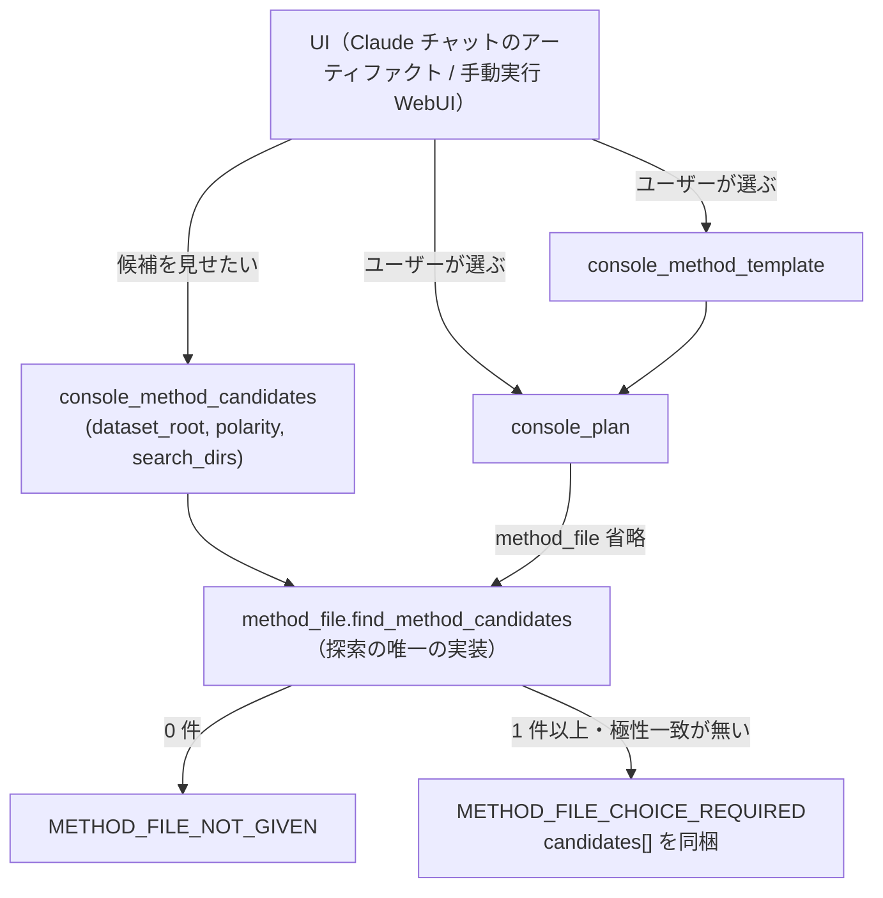

# メソッドファイル候補の提示とユーザー選択（Console 実行層）

作成日: 2026-09-05
状態: **設計。実装未着手。**
関連: [2026-09-03-end-to-end-pipeline-design.md](2026-09-03-end-to-end-pipeline-design.md) §2（上流 Console 実行層）

---

## §0 背景 — 何が起きたか

2026-09-04 の実走（`datasets/2_lipidome_lcms/POS`、`.wiff` 60 サンプル。HISTRY 2026-09-04(8)）で、
生データフォルダを渡しただけの `console_plan` が停止した。

```
{"error":{"code":"METHOD_FILE_NOT_GIVEN",
          "message":"method_file が省略され、データフォルダに使えるパラメータファイルも
                     見つかりませんでした（極性 positive）: ...\POS_wiff"}}
```

原因は単純で、`find_method_candidates` が `dataset_root` **直下しか見ない**こと。MS-DIAL GUI は
`<project>_param_<終了時刻>.txt` をプロジェクトフォルダへ自動保存するので、その極性で一度も
GUI 実行が無いフォルダには存在しない。このとき実際に使えるパラメータは**兄弟フォルダ
`NEG/Dataset_2026_05_15_10_12_46_param_202605151055.txt`** にあり、人がパスを調べて
`console_method_template(based_on=...)` に渡すまで先に進めなかった。

`console_method_template` の `based_on` 省略も同じ探索を使うため、同じ理由で失敗する。
**「別極性から作る」がこのツールの用途なのに、別極性のフォルダを見ていない。**

## §1 スコープ

やること:

- 候補探索の範囲を広げる（兄弟フォルダ・過去 run）
- 候補を**機械可読に列挙する専用ツール**を新設する（失敗前に呼べる）
- `console_plan` が候補を見つけたときの封筒を、選択を促す形に変える
- 候補どうしの差が読めるだけの情報（`key_params`）を載せる

やらないこと:

- **パラメータの個別上書き**（`console_plan(overrides={"Retention time begin": ...})` の類）。
  今回の「個別指定」は**候補から選ぶ**ことと確定した。上書きは別スコープ。
- **候補の自動採用**。§8 で理由を書く。
- UI そのものの実装。サーバは JSON を返すところまで（§5）。

## §2 全体図



探索の実装は `find_method_candidates` 1 か所に集約したまま広げる。`console_plan` と
`console_method_template` と新ツールが**同じ候補集合を見る**ことを崩さない（別々に探すと、
「候補ツールには出たのに plan では見つからない」という追えない食い違いが起きる）。

## §3 候補探索の範囲

優先順に:

1. `dataset_root` 直下（現行）
2. `dataset_root` の**兄弟フォルダ直下**（＝ `dataset_root.parent` の各サブフォルダ）
3. `dataset_root/runs/*/analysis-job.json` の `software.method_file`（過去 run が実際に使った
   メソッド。**ファイル名で拾わない** — `run_dir/effective-method.txt` は「LBM の解決元が
   メソッドファイル以外だったとき」だけ書かれるので、グロブでは取りこぼす。実走
   `job_20260904_172440_pos_h` では `console_method_template` が `Lbm file path` を埋めた結果
   `lbm.source == "method_file"` になり、`effective-method.txt` は書かれていない。
   `software.method_file` は両方の場合を正しく指す）
4. 引数 `search_dirs` で明示追加されたフォルダ

任意の深さの再帰はしない。遅いうえに、無関係なプロジェクトのパラメータを拾って候補一覧を
濁らせる。`POS` / `NEG` が並ぶ今回のレイアウトは 2 で解ける。

同一ファイルの重複は `Path.resolve()` で排除する（現行の `seen` を踏襲）。

## §4 候補レコードの型

`find_method_candidates` が返す `MethodCandidate` を拡張する。

| フィールド | 型 | 意味 |
|---|---|---|
| `path` | `str` | 絶対パス。そのまま `method_file` / `based_on` に渡せる |
| `origin` | `"same_dir" \| "sibling" \| "past_run" \| "given"` | どこで見つかったか。UI のグルーピングに使う |
| `ion_mode` | `str \| None` | メソッド宣言の `Ion mode` |
| `omics` | `str \| None` | `Target omics` |
| `usable` | `"direct" \| "needs_polarity_conversion"` | 求める極性と一致するか |
| `has_lbm` | `bool` | `Lbm file path` が埋まっているか（GUI 由来は構造的に必ず空） |
| `mtime` | `float` | 新しい順に並べるため（現行と同じ） |
| `key_params` | `dict[str, str] \| None` | 判断に効くキーだけ。§4.1 |

既存フィールド（`path` `ion_mode` `omics` `has_lbm` `mtime`）は名前を変えない。`origin` `usable`
`key_params` の追加。

### §4.1 `key_params`

候補が複数あるとき、人が選べるのは**パスではなく中身の差**による。とはいえ全キー（実測 287 行 /
11.7 KB）を候補ごとに返すと戻り値が肥大する（CLAUDE.md「戻り値を肥大させない」）。載せるのは
検出・アライメント条件のうち解析結果を変える少数に限る:

```
Ion mode / Target omics / Retention time begin / Retention time end /
Mass range begin / Mass range end / Centroid MS1 tolerance /
Retention time tolerance for alignment / Searched adduct ions
```

**候補が 10 件を超えるときは `key_params` を付けない**（`None`）。その規模なら UI は先に絞り込みを
出すべきで、比較表は絞ってから引き直す。

## §5 ツール契約

### §5.1 新設 `console_method_candidates`

```python
console_method_candidates(
    dataset_root: str,
    polarity: str | None = None,     # 省略時は極性で絞らない
    omics: str | None = "lipidomics",
    search_dirs: list[str] | None = None,
) -> str    # JSON
```

失敗前に候補を列挙するための入口。手動実行 WebUI の「メソッドを選ぶ」画面はこれを叩く。
戻り値:

```json
{"dataset_root": "...", "polarity": "positive",
 "searched": ["<same_dir>", "<sibling A>", "<sibling B>", "<runs>"],
 "n_candidates": 2,
 "candidates": [ {"path": "...", "origin": "sibling", "usable": "needs_polarity_conversion", ...} ],
 "next": "usable=direct なら console_plan(method_file=...)、needs_polarity_conversion なら
          console_method_template(based_on=..., polarity=...) を先に通す"}
```

`readOnlyHint=true`（ファイルを読むだけ）。`structured_output=False`（全ツール共通の規約）。

### §5.2 `console_plan` の封筒

`method_file` 省略時の分岐を 3 つにする。

| 状況 | code | 内容 |
|---|---|---|
| 極性一致の候補が 1 件以上 | —（成功） | 現行どおり最新を自動採用し、`method_source.discovered_from` に出所を書く |
| 候補はあるが極性一致が無い | `METHOD_FILE_CHOICE_REQUIRED` | `details.candidates` に §4 のレコード、`required_tools: ["console_method_template", "console_plan"]` |
| 候補が 0 件 | `METHOD_FILE_NOT_GIVEN` | 現行の文面（探した場所を `details.searched` に列挙して追加） |

**別極性の候補を自動採用しない。** 極性が違えば `Ion mode` と `Searched adduct ions` が違い、
そのまま走らせると別の解析になる。`console_method_template` を経由させて
「検出・アライメント条件は元のまま引き継いだ」caveat を必ず通す。

`METHOD_FILE_CHOICE_REQUIRED` は既存の `missing_state` / `console_error` と同じ形（`code` /
`message` / `details` / `required_tools`）に収める。**新しい封筒形式を作らない**。

### §5.3 `console_method_template` の `based_on` 省略

同じ探索を使うので、`dataset_root` を渡せば兄弟フォルダの別極性パラメータが候補に入る。
候補が複数あるときは自動で選ばず `METHOD_FILE_CHOICE_REQUIRED` を返す（`based_on` は
「何を土台にするか」という解析条件そのものの選択で、mtime 順の最新を黙って採る場所ではない）。

## §6 UI の役割分担

サーバは JSON を返すところまで。レンダリングと選択は各クライアントが持つ。

**Claude チャット（アーティファクト）** — 候補の**比較ビューア**として使う。`key_params` を候補ごとに
並べ、差のあるキーを強調する。**選択の確定は会話に戻る**。アーティファクトのページから
MCP セッションへ値を送り返す経路は無いため、ボタンが返せるのは「この呼び出しをする」という
文字列までで、実行するのは会話側になる。この非対称を UI 側で隠さない（隠すと、押したのに
何も起きないように見える）。

**手動実行 WebUI（Use-LLLM、将来）** — `console_method_candidates` を叩いてピッカーを描き、
選ばれた `path` をそのまま `console_plan` / `console_method_template` に渡す。こちらは
同一プロセスからツールを呼べるので往復が閉じる。

**MCP elicitation は今回採らない。** `mcp` 1.27.1 / `fastmcp` 3.3.0 に `Context.elicit` はあるが、
Claude Code と Use-LLLM の双方が対応していないと動かず、Use-LLLM 側は未実装。§5 の封筒が
あれば後から elicitation を上に載せられるので、対応が揃ったときの選択肢として残す。

## §7 触るファイルと波及

| ファイル | 変更 |
|---|---|
| `lipidmix/console/method_file.py` | `find_method_candidates` の探索範囲拡張、`MethodCandidate` に 3 フィールド追加、`key_params` 抽出 |
| `lipidmix/tools/console_tools.py` | `console_method_candidates` 新設、`console_plan` / `console_method_template` の分岐 |
| `USAGE.md` | 新ツールの行、見出しのツール件数、`console_plan` / `console_method_template` の記述更新 |
| `CLAUDE.md` | 冒頭の規模表記（ツール 54 → 55） |
| `docs/workflow/index.md` | Console 実行層 7 → 8、ツール名の列挙 |
| `docs/workflow/` の該当文書 | 新ツールの呼び出し連鎖（行番号は書かない） |

**腐敗防止テストが縛っている**ので、上 4 つは同じコミットで揃える:

- `tests/test_server_registration.py` の `EXPECTED_TOOLS`（数値リテラルは置かない規約）
- `tests/test_readme_links.py`（USAGE のツール集合・宣言件数・CLAUDE.md の規模表記）
- `tests/test_workflow_docs.py`（`docs/workflow/` のパス・関数名を AST 検証、対象ツール数の突合）

## §8 採らない判断

**候補の自動採用（`auto_method=True`）** — 「フォルダを渡すだけ」で通る代わりに、別データセットの
検出・アライメント条件が黙って適用される。実走で `console_method_template` が
「検出・アライメント条件は元ファイルのまま引き継いでいます。その極性に妥当かは実行前に
確認してください」という caveat を出しているのと正面から矛盾する。**沈黙して別解析になる**のが
このパイプラインで最も高くつく失敗の型（gap-fill を検出と数える、古いサーバで直った不具合を
再発と誤報告する、と同じ形）なので採らない。

**任意深さの再帰探索** — 兄弟までで今回のレイアウトは解ける。深く掘ると無関係なプロジェクトの
パラメータが候補に混ざり、`key_params` の比較表が意味を失う。

**パラメータの個別上書き** — 「個別指定＝候補から選ぶ」と確定したためスコープ外。やるなら
`write_effective_method_file` の `overrides` を公開面へ上げる話になり、**どのキーの上書きを
許すか**（検出条件を触れるかどうか）という別の設計判断が要る。

## §9 未解決

1. **過去 run を候補に混ぜる際の表示** — 過去 run のメソッドは `Lbm file path` が埋まっている
   （`has_lbm=true`）ことが多く、GUI 由来のものより「そのまま使える」ように見える。その run が
   どのデータセット・どの日時のものだったかを `origin="past_run"` だけで伝えられるか、
   `job_id` も要るか。加えて、過去 run のメソッドが**ユーザーのフォルダにある元ファイル**を
   指すこともある（実走がそうだった）ため、`same_dir` の候補と同じパスが二重に出うる。
   `Path.resolve()` の重複排除で潰れるが、そのとき `origin` をどちらにするかを決める必要がある
   （出所の情報量が多い `past_run` を優先し、`also_in` に残す案）。
2. **兄弟フォルダの探索コスト** — 兄弟が数十フォルダある配置での実測がまだない。
   各フォルダの `iterdir()` と先頭 `_MAX_METHOD_BYTES` の読み取りだけなので軽いはずだが、
   NAS 配置（`LIPIDMIX_*_DIR` を共有に向ける運用）では確認が要る。
3. **`key_params` のキー選定** — 上の 9 キーは実走で見た param ファイル 1 種類からの判断。
   他の装置・他のメソッドで名前が違うキーがないか、複数の param ファイルで突き合わせたい。
