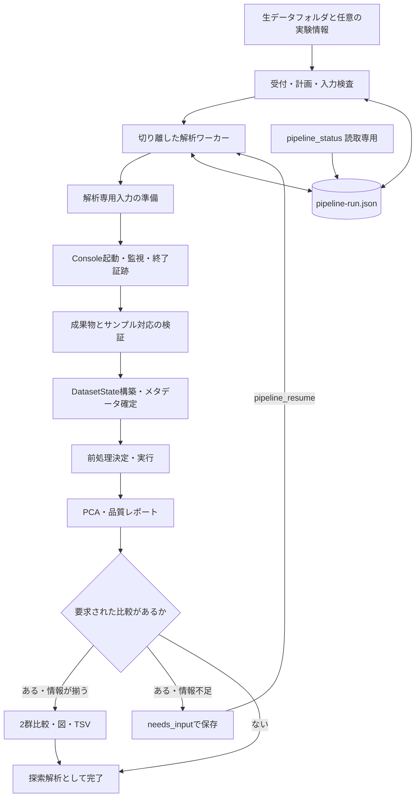
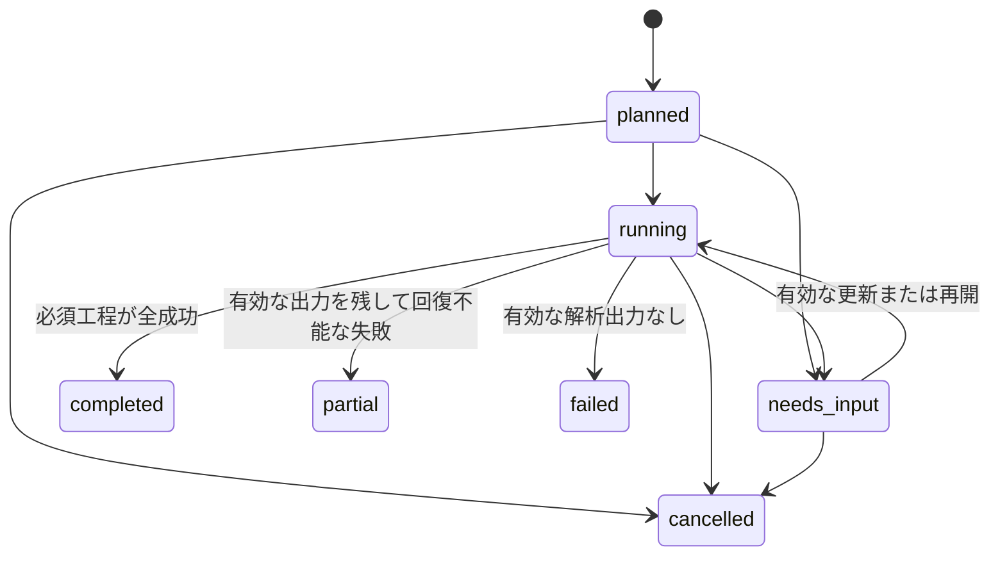

# 生データフォルダ起点の解析統括・結果整合性・実験情報入力の統合設計

- 作成日: 2026-09-05
- 状態: Draft（レビュー用設計。実装済みを意味しない）
- 対象: `C:\Users\yuu18\Lipidmix_with_LLM` のみ
- コード確認基準: `main` / `5b3b40b`
- 主目的: 生データフォルダを入口として、実行可能な工程を自動で進め、必要な情報だけを受け取り、結果の出所を保証して下流出力まで到達する。
- 今回の成果物: 本specのみ。実装計画の作成、コード変更、実MS-DIAL実行は別工程。

## 1. ユーザーが選んだ範囲

直前の現状調査における「開発順」1・3・4を、一つの実行契約として設計する。

| 選択項目 | 本specで扱う内容 |
|---|---|
| 1. 完了判定と結果の整合性 | Console終了証跡、成果物検証、タイムアウト、派生結果の無効化、描画・出力対象の明示 |
| 3. フォルダ受付から出力までの統括処理 | 入力準備、実行監視、下流処理、永続状態、再開、二重実行防止、MCP入口 |
| 4. 実験情報の入口と前処理方針 | サンプルシート、比較定義、役割・バッチ・注入順の上書き、自動前処理の決定と記録 |

「2. ラボ標準の解析条件を用意する」は含めない。既存メソッドのない環境で、装置や測定方式に適したメソッドをゼロから生成する機能は作らない。

このため、今回の完成条件は「どんな生データでもフォルダだけで完走」ではない。**利用可能な既存メソッドと実行環境があれば、フォルダだけで探索解析まで進む。比較定義もあれば差次的解析と出力まで進む。足りない情報は、必要になる工程と理由を明示して受け取る**ことを完成条件とする。

### 1.1 対象外

- 装置・DDA/DIA等の測定方式の生データからの自動同定、条件最適化、既定メソッド集。
- MS-DIAL本体の変更・配布・インストール、ConsoleでのArea出力制約の解除。
- POS/NEGの統合定量、多極性の自動連続実行、任意階層のデータセット探索。
- 新しい統計手法、多群ANOVA、共変量調整モデル、バッチ補正アルゴリズム。
- パスウェイ解析サービスの自動呼び出し、文献検索、RAG、外部データ送信。
- 新GUI、常駐サービスのOS登録、汎用ジョブスケジューラー。
- 既存ARF経路の廃止、既存差次的TSV契約の変更。

## 2. 既存設計との関係と確認済みの現状

参照する既存設計:

- [単一リポジトリ統合設計](2026-09-02-single-repo-msdial-omics-design.md)
- [既存の一気通貫経路](2026-09-03-end-to-end-pipeline-design.md)
- [メソッド候補選択](2026-09-05-console-method-candidate-selection-design.md)

本specは上記の実行監視・完了判定・自動進行・実験情報・結果選択を具体化し、重複箇所では本specの契約を優先する。mzTab-Mを主定量入力とすること、ConsoleのHeight制約、gap-fillを非ゼロ強度と区別すること、出力TSVの列契約は継承する。

| 現状の根拠 | 確認事項 | 設計上の対応 |
|---|---|---|
| `lipidmix/tools/console_tools.py::_finalize_detached_if_done` | 終了コードなしで、何らかの成果物があればcompleted | §5で監視ワーカーと検証ゲートを導入 |
| `lipidmix/console/runner.py::run_msdial_detached` | 切り離し実行には解析タイムアウトの適用がない | 同期・非同期を共通監視ロジックへ接続 |
| `lipidmix/tools/dataset_analysis_tools.py::dataset_preprocess` | 前処理更新時に古いPCA・差次的結果が残る | §6の結果IDと依存関係による無効化 |
| `lipidmix/tools/reports.py::_select_pca_plot / _select_differential` | ARF結果が常に優先される | 有効な結果の明示選択、曖昧時はエラー |
| `lipidmix/core/mcp_core.py::MCP_INSTRUCTIONS` | フォルダの入口が既存ARF用load_dataset | §10で生データと既存出力を分岐 |
| `lipidmix/analysis/dataset_analysis.py::build_dataset_pp_inputs` | roleは名前、batchはmzTabや日付、注入順はmzTabから取得 | §7の明示入力とフィールド別出所管理 |
| `lipidmix/handoff/schema.py::SampleManifest` | path/hash/statusの枠は存在する | 新しいシート契約への参照に利用 |

これらはコード調査で確認した事実である。過去のテスト件数や実走時間を、本spec完成の証拠には使用しない。

## 3. 採用する構成

比較した案:

| 案 | 特性 | 判断 |
|---|---|---|
| LLMが個別ツールを順番に呼ぶ | 追加実装は少ないが、切断・再開・順序管理がクライアントに依存する | 現状の手動経路として残す |
| MCPの1呼び出し内で全工程を待つ | 実装は単純だが、長時間実行と接続寿命が結び付く | 採用しない |
| 永続状態を持つローカルワーカーが進行する | 状態と結果IDを共有して、MCPの寿命から実行を分離できる | **採用** |



### 3.1 所有権と依存方向

| 層 | 所有するもの | 所有しないもの |
|---|---|---|
| `console/` | Consoleプロセス、終了証跡、上流ジョブ、上流成果物 | 実験群の意味、前処理レシピ、セッション |
| 新規`pipeline/` | 全体状態、工程の進行、再開、入力の固定、結果への参照 | 検定やパーサの数値実装 |
| `mztab/`・`analysis/` | DatasetState、実験情報の適用、純粋な解析計算、結果ID | プロセス起動、MCPへの依存 |
| `plots/`・出力サービス | 指定結果からの描画、TSV、決定的レポート | セッション間の暗黙の結果選択 |
| `tools/` | 引数検証、サービス呼び出し、コンパクトなMCP応答 | 長時間ループ、統計処理の複製 |

ワーカーから公開MCPツールを順に呼ばない。既存ツール内の処理を、明示的なDatasetStateを受け取る共通サービスへ必要な範囲だけ抽出し、ツールとワーカーが共有する。ワーカーは`session_state.session`を使用しない。別runが同時進行しても、行列・群・図の状態を共有しない。

## 4. 受付、実行範囲、入力の固定

### 4.1 フォルダとメソッド

初期版は1フォルダ直下の1極性・1形式・LC-MS lipidomics・peak_heightを処理単位とする。rawを持たず子フォルダだけを持つ場合は、候補フォルダを提示して`DATASET_SELECTION_REQUIRED`を返す。POS/NEGを黙ってまとめない。

既存のメソッド候補探索・LBM解決を利用するが、新しい統括経路は次を守る:

1. 探索元は常にユーザーが渡した元フォルダ。準備後の作業フォルダに置き換えない。
2. 明示メソッドを優先する。省略時は、要求極性があればその極性の候補を対象にする。
3. 同内容の候補はメソッドの内容ハッシュでまとめる。一意なら採用できるが、異なる内容が複数なら選択を求める。mtimeだけで解析条件を決めない。
4. 極性が省略され、一意に選べたメソッドが有効なIon modeを持つ場合は、その宣言を採る。これは生データからの極性検証ではないことを記録する。候補間で極性が違う・宣言がない場合は入力を待つ。
5. 別極性への変換は自動実行しない。元メソッドの指定・変換の選択は既存ツールで解決可能な入力要求として返す。
6. メソッドなし、LBMなし、実行体未設定は、対象を絞った`needs_input`にする。既定条件の新規生成はしない。

この採用規則は新規pipelineに適用する。既存`console_plan`の候補表示・呼び出し互換性は維持し、pipelineは選択済みメソッドを明示して渡す。完全なメソッドキーのスキーマ検証や装置適合性保証は今回の対象外であり、その未検証範囲を計画・レポートに残す。

### 4.2 入力の隔離

元のrawファイルを移動・上書き・削除しない。pipelineでは、混在の有無によらず解析専用入力を準備し、MS-DIALの中間ファイルを元rawと同じ階層に追加しない。

- ファイル形式は同一ボリュームのハードリンクを優先し、使えなければコピーする。リンクは書込隔離ではない。MS-DIALがrawを読取専用で扱う前提を運用検証する。
- ディレクトリ形式のrawは、内容を保ったコピーを用いる。ディレクトリへのハードリンクやジャンクションで隔離を装わない。空き容量不足は起動前に停止する。
- `.wiff`と`.wiff2`だけが混在し、同一stemの集合が1対1で一致するとき、既存規則に合わせてwiffを自動選択できる。選択と除外を記録する。それ以外の混在は形式指定を要求する。
- 随伴ファイルは形式ごとの明示的な規則で選ぶ。既存の解析出力を「同じstemだから」という理由で再取り込みしない。
- 新規run専用の空の配置先を使う。再開時の同名ファイルは元入力との対応とfingerprintを検証し、不一致を単にskipしない。
- 元入力を実行開始・上流終了時に再検査し、変化したら`INPUT_CHANGED`とする。サイズ・mtime・相対パスによるstat fingerprintと、SHA-256による内容検証を区別する。rawの全量ハッシュは初期版の必須条件にしない。

### 4.3 配置と固定する情報

既定のpipelineルートは`<source_root>/runs/pipeline_<UUID>/`。解析専用入力はその`input/`に作る。書込先は要求でリポジトリ外の別フォルダへ変更できる。

```text
pipeline_<UUID>/
  pipeline-run.json
  requests/revision-0001.json
  inputs/source-inventory.json
  inputs/sample-manifest.tsv
  inputs/sample-provenance.json
  inputs/effective-method.txt
  input/<rawと必要な随伴ファイル>
  input/runs/<console_job_id>/analysis-job.json
  input/runs/<console_job_id>/execution-result.json
  input/runs/<console_job_id>/msdial.log
  input/runs/<console_job_id>/msdial/<Consoleエクスポート>
  results/<result_id>/<結果・図・レポート>
  control/<排他・キャンセル要求・worker情報>
```

既存のConsole側の`dataset_root`は`input/`、`run_dir`は`input/runs/<console_job_id>/`となる。元フォルダはpipeline側の`source_root`で保持し、両者を混同しない。ARF等が`input/`に出る既存の二重ルート収集を継承する。

methodの原本ハッシュと実効コピー、LBMのパス・ハッシュ、実行体のパス・ハッシュ・取得できた版、コード版、実入力一覧、要求のrevisionを固定する。既知のファイル参照は移動前のメソッド基準で解決し、コピー後に相対参照の意味を変えない。解決を保証できない相対参照がある場合は`METHOD_REFERENCE_UNRESOLVED`で止め、元のまま実行しない。

メソッド・LBM・raw集合・実行条件を変える場合は新しいpipelineを作る。下流のメタデータ・比較・前処理だけの変更は、既存上流を参照する新しいrequest revisionとして扱う。

## 5. 上流実行の監視と完了条件

### 5.1 ワーカーと終了証跡

切り離す対象はConsoleだけではなく、Consoleを子として待つ監視ワーカーとする。MCPは起動受理後に戻り、監視ワーカーはMCP切断後もConsoleを監視して終了証跡を保存する。同期実行も同じ監視・検証ロジックを使用する。

`execution-result.json`の契約は`console-execution.v1`とし、少なくとも次を含む:

| フィールド | 型・規則 |
|---|---|
| `execution_id`, `job_id` | 空でない一意ID。jobと起動記録に一致する |
| `started_at`, `ended_at` | UTC日時。終了証跡では両方必須 |
| `pid`, `process_identity` | PIDに加え生成時刻等。PIDだけで同一プロセスと判定しない |
| `command_sha256`, `method_sha256`, `exe_sha256` | 起動時の固定情報 |
| `exit_code` | 実際に回収できた整数。回収不能ならnull。0を補わない |
| `termination` | `exited / timeout / cancelled / worker_lost / launch_failed` |
| `timeout_s` | 実際に適用した正の整数 |
| `collection`, `validation` | 各工程の成否・理由・検証記録への参照 |

制御ファイルは同じディレクトリの一時ファイルへ書き、flush・必要な同期後に置換する。中途半端なJSONを確定状態として読ませない。検証前の起動情報と終了証跡を区別する。

WindowsではConsoleとその子を管理できるJob Object等を使用し、タイムアウト・取消時に同一実行に属する子プロセス群を停止して終了を確認する。監視ワーカー自身はMCP親プロセスの終了に巻き込まれない起動方式を用いる。これを保証できない環境では切り離し成功と返さず、能力不足を返す。

プロセス終了後は成功・非ゼロ終了・タイムアウト・取消のいずれでも成果物を収集する。収集失敗時は終了証跡と再収集に必要なスナップショットを保持する。確定前に引き継ぎ情報を削除しない。

### 5.2 completedの必要条件

新しいConsole実行を`completed`とするには、以下をすべて満たす:

1. 当該executionに結び付いた終了証跡があり、`termination=exited`かつ`exit_code=0`。
2. 入力と実効メソッドの固定情報に実行中の変化がない。
3. 極性・measureに一致する主mzTab-Mが一意に選べる。
4. mzTab-Mの構造検証が成功し、定量行列に特徴量・サンプル・有限な定量値が存在する。
5. 予定入力と出力assayが1対1に対応し、欠落・重複・予期しない追加サンプルがない。
6. 正準選択・定量種別・極性の致命的矛盾がなく、成果物ハッシュと検証結果を保存できた。

拡張子が`.mzTab`であるだけ、exit codeが0であるだけ、PAI2が一つあるだけでは完了しない。`.pai2`・DCL・EIC・GUI projectの欠落は、標準の定量解析に必要な条件とは分け、利用可能な証拠経路として報告する。`save_project=True`でprojectが欠落した場合、Consoleの定量出力検証は成功し得るが、pipelineは要求成果物が未達のため最終状態をpartialにする。下流の定量解析まで捨てない。

非ゼロ終了・timeout・取消で有効な一部成果物が残っていればConsole jobは`partial`、なければ`failed`。既存JobStatusにはcancelledを追加せず、取消理由は終了証跡とpipeline側の`cancelled`に記録する。収集・検証に失敗したものはcompletedにしない。

### 5.3 旧ジョブと読込ゲート

- `analysis-job.v1/v2`の読込互換を維持し、新規書込も`analysis-job.v2`を維持する。新しい実行証跡とpipeline状態は別ファイルに置く。
- 旧ジョブのcompletedを、終了証跡ありの検証済み実行へ自動昇格しない。証跡のない過去結果は`legacy_unverified`と表示する。
- 新規pipelineは旧ジョブを暗黙に再利用しない。旧成果物は既存の直接読込経路で利用可能とする。
- `dataset_load(job_path=...)`の通常経路はpartial/failedを拒否する。調査目的には`allow_incomplete=True`を追加し、読込状態に`exploratory_only`を刻む。pipelineからは使用しない。
- `exploratory_only`では前処理・PCAまでを許可し、図に未完了の出所を表示する。正式な差次的解析・TSV出力は拒否する。パスを直接指定して読み直したものも`source_verification=direct_unverified`を保持し、証跡を捏造しない。

## 6. 下流結果の整合性と出力の選択

### 6.1 結果の依存関係

各結果に`result_id`、`kind`、`dataset_id`、`request_revision`、`input_fingerprint`、親result ID、生成コード版、実効パラメータ、警告を保持する。

- `dataset_id`: mzTab内容ハッシュ、定量種別、特徴・サンプル軸、検出マスクの根拠ハッシュから導出する。
- `metadata_revision`: 正規化したmanifestとフィールド別出所全体のハッシュ。履歴の追跡に用いる。
- `preprocess_metadata_hash`: sample対応、role、batch、injection_order、qc_pool、includeと、それらの出所のみのハッシュ。groupや表示ラベルだけの訂正を数値前処理の変更にしない。
- `preprocess_id`: dataset_id、preprocess_metadata_hash、policy版、実効レシピ、実際の適用・skip記録を含む。
- PCA数値はpreprocess_idとPCA設定、差次的結果はpreprocess_id、group割当、比較定義・検定設定に依存する。ラベル付きのPCA図はさらに表示用メタデータに依存する。
- 図・TSV・レポートは元result_idを参照し、出力時に「現在のセッション設定」を混ぜない。

同じ入力から同じ計算を行うためのfingerprintと、個々の生成物を指すresult_idは分ける。日時やランダムIDを計算fingerprintに混ぜない。

### 6.2 無効化とトランザクション

前処理・メタデータ変更は一時状態で検証・計算し、成功時にまとめて反映する。失敗した要求で以前の有効状態を半分だけ変更しない。

| 変更 | 無効化する現在結果 |
|---|---|
| 元DatasetStateまたは検出マスク | 前処理、PCA、差次的結果、図、TSV、レポート |
| role、batch、injection_order、qc_pool、include | 前処理以降すべて |
| group、比較定義のみ | 差次的結果とそれに依存する出力。PCA数値は再利用可能だがラベル描画は更新 |
| 前処理設定・policy | PCA、差次的結果とその出力 |
| PCA設定のみ | PCAとその図・レポートの該当部分 |
| 比較閾値・検定設定 | 当該比較とその出力 |

無効化した結果は現行セッションの`last_*`として使えない。保存済みの過去出力は削除せず、旧revisionの履歴として残す。新要求では新しい出力先を使う。

既存の`dataset_preprocess`にも、変更に応じた`last_pca / last_differential`の無効化を適用する。エクスポートは元差次的結果が保持する前処理情報を使用し、現在のpreprocess_idまたは比較の依存fingerprintと合わなければ`STALE_ANALYSIS_RESULT`を返す。

### 6.3 図保存とセッション互換

`save_pca_figure`と`save_volcano_figure`に`source="auto" | "arf" | "mztab"`、任意の`result_id`を追加する。source未指定の従来呼出しは、有効な候補が一つなら従来どおり動く。複数ある場合はARF優先を廃止し、`AMBIGUOUS_RESULT_SOURCE`で選択を求める。

pipelineは常にDatasetStateとresult_idを明示して描画する。セッションの`last_*`を探して選ばない。既存ARF側にも結果の所属データを識別できる最小限の来歴を付け、別データのresult_id指定を拒否する。

## 7. 実験情報の入力契約

### 7.1 任意ファイルと優先順位

元フォルダ直下の`analysis-request.json`と`sample-manifest.tsv`を既定名として探索する。明示パスがあればそちらを採用する。任意名のシートを複数見つけて最新を選ぶ動作は行わない。

要求値の優先順位は「MCPで明示した値 > analysis-request.json > 本specの既定」。**未指定とnullを区別**し、nullが無効化を意味する設定だけで許可する。未知キー、不正な型・数値、矛盾する指定を起動前に拒否する。

### 7.2 sample-manifest.v1

UTF-8のTSVとし、空欄を欠落値とする。文字列の`NaN`や`null`を数値に黙って変換しない。入力シートの先頭メタ行は`# schema = sample-manifest.v1`。raw測定単位ごとに1行を持つ。

| 列 | 型・意味 |
|---|---|
| `sample_id` | 必須、一意で空でない安定ID。比較定義はこのIDまたはgroupを使用 |
| `source_file` | 必須、元フォルダ基準のraw相対パス。ディレクトリrawも1行。随伴ファイルは書かない |
| `role` | `sample / qc / blank / unknown`。空欄は未指定として解決へ回す |
| `group` | 任意の群ラベル。生物学的意味をファイル名から確定しない |
| `batch` | 任意の実測バッチラベル。日付との同一視を強制しない |
| `injection_order` | 任意、正の整数。batch内で一意。数値文字列は整数文法のみ受ける |
| `qc_pool` | 任意、プールQCの同一性。異なるpoolを一つのQC参照にまとめない |
| `include` | `true / false`。空欄はtrue。falseは下流解析からの除外で、上流入力数の変更ではない |

```tsv
# schema = sample-manifest.v1
sample_id	source_file	role	group	batch	injection_order	qc_pool	include
qc01	QC_01.wiff	qc		B1	1	pool1	true
c01	Control_01.wiff	sample	control	B1	2		true
t01	Treated_01.wiff	sample	treated	B1	3		true
```

これは形式例であり、2群比較に必要な反復数を満たす解析例ではない。

重複ID、未知source_file、同一rawへの複数行、親パスへの脱出、role列挙違反、不正な注入順、batch内の注入順重複を拒否する。Windows上のパス照合は大文字小文字を正規化し、正規化後の衝突も拒否する。ファイル名の部分一致・編集距離でサンプルを結合しない。

ユーザーがシートを渡した場合は予定入力すべてへの行を要求し、欠落行を推測で埋めない。未指定セルだけは後述の補完規則を使える。シートがない場合は一覧から自動生成できる。`include=false`も出力assayとの対応検証には含める。

Console出力とは、元raw → 準備済みraw → mzTabのms_run/assay参照の対応表で結合する。表示名だけで曖昧になる場合、または1rawから複数assayが出る場合は初期版の契約外として停止し、明示的な対応表機能は次版へ分ける。

### 7.3 メタデータの出所と訂正

各フィールドは`value / source / confidence`を保持し、相反する候補はconflictsに残す。出所は`user_manifest / user_override / mztab / filename_token / filename_date / default`に限定する。

- role: 明示値が最優先。なければ既存のQC/blankトークン判定を利用し、それ以外はsample候補として記録する。判定が実験設計の確認済み情報ではないことを表示する。
- group: 明示入力のみが比較に使用できる。ファイル名からの候補提示はできるが、比較定義へ自動採用しない。
- batch: 明示値を優先。mzTab・日付由来の候補は残すが、日付を実バッチの確定値にしない。全件同じmzTab既定ラベルを実験設計の証拠とみなさない。
- injection_order: シート等の明示値を優先。mzTabのinjection sequenceは、Consoleの読込順由来か実注入順由来か確認できなければ`unverified`。自動ドリフト補正には使わない。
- qc_pool: 明示値のみをpool同一性の確定値として使う。欠落を「全QCは同じpool」に変換しない。

`dataset_set_sample_metadata(manifest_path)`を追加し、対話的なDatasetState経路にも同じ検証・出所・無効化規則を適用する。適用は全件検証後に一括反映し、一部だけ更新しない。pipelineでは同じ内部関数を使い、入力コピーとハッシュを保存する。

Console jobの既存`sample_manifest`は、上流受付時点のシートの固定コピーを参照する。pathはそのコピーの絶対パス、sha256は内容hash。利用者が明示して検証済みならapproved、自動生成ならauto_generated、未解決の計画だけpendingとする。approvedを付けるための追加承認操作は設けない。上流実行後の訂正はpipelineの新revisionに保存し、旧jobのシートを上書きしない。pipelineによる読込では当該revisionのメタデータを適用し、単体のjob読込が参照する受付時点のシートとの違いを来歴に残す。

### 7.4 比較定義

比較は`comparison_id / reference_group / test_group`で定義する。正のlog2FCはtest_groupが高い方向とする。双方の群が明示され、異なり、include=trueのsampleが各群2件以上必要。QC/blank/unknownを比較に混ぜない。

群が2種類あるだけでは、対照と処置の向きを決めない。差次的解析の自動実行には比較の向きを明示する。群・バッチの完全交絡を検出した場合、探索結果を残して`CONFOUNDED_COMPARISON`で入力を待つ。`allow_confounded=true`を明示した比較のみ、未調整であることを図・TSV付随メタ・レポートへ記録して継続できる。

## 8. 自動前処理の方針

### 8.1 conservative-v1

初期版の自動方針を`conservative-v1`と名付け、版を固定する。これは既存実装を条件付きで組み合わせる製品上の初期方針であり、全装置・全研究での科学的最適性を主張しない。数値閾値の変更はpolicy版を上げる。

単体の`dataset_preprocess`の既定引数は変更しない。pipelineのautoレシピ解決を別関数に置き、実効レシピを既存数値処理へ渡す。

| 処理 | autoで採用する条件と値 | 条件不足時 |
|---|---|---|
| 実検出率フィルタ | 既定は無効。明示した0〜1の閾値だけを適用 | 検出状態なしで明示要求されたら停止 |
| ブランク除去 | 明示またはトークン判定でblankとsampleが存在するときfold=3.0 | skipと根拠を記録 |
| 正規化 | include対象が一つの確認済みbatchに属し、同一の明示qc_poolに属する健全なQCが3件以上ならPQN | none。QC不足・pool不明・batch不明等の理由を表示 |
| ドリフト補正 | 上と同じ単一batch・pool、健全なQCが4件以上、全解析対象の実注入順が確認済みで、全sampleがQC区間内 | skip。読込順を代用しない |
| QC RSDフィルタ | 上と同じ単一batch・pool、健全なQCが3件以上なら0.30 | skip。異なるpoolや不明batchをまとめない |
| 欠損補完 | half_min。既存と同じNaN対象 | ゼロ・gap-fillを新たに欠測へ置換しない |

QCの健全性は既存の失敗QC検出を利用する。失敗疑いのQCがある場合、自動的にそのQCだけを除外して続行せず、QC依存のauto処理をskipし、対象sample_idを報告する。ユーザーはincludeやroleを訂正できる。

処理順は検出率フィルタ → 既存の前処理順（ブランク評価 → 正規化 → ドリフト補正 → RSD評価 → 特徴フィルタ反映 → 補完）→ blank等の解析行列からの除外とする。既存の数値演算順を黙って変更しない。include=falseの試料はこれらの評価前に除外する。

複数batchへの個別ドリフト補正やbatch間の統合補正は今回作らない。明示された複数batchでも自動QC処理を一律適用しない。median/TIC/PQN等の明示指定は可能だが、係数・適用範囲・poolの扱いを記録し、異poolを単一QC参照にする要求は拒否する。

### 8.2 明示要求と実効結果

前処理設定では各項目の`auto`と、明示的な値・無効化を区別する。autoの条件不足はskip可能だが、明示的に要求した処理を実施できなければ`needs_input`にする。既存数値関数のcaveatだけに任せず、実行前と実行後の両方で適用状況を照合する。

記録するのは`requested_recipe / resolved_recipe / applied_steps / skipped_steps / reasons / policy_version / assumptions`。NaN・InfinityをJSONへ出さず、非有限値にはnullと理由を記録する。

正規化係数が0・非有限の対象試料が出た場合、未正規化試料を混ぜたまま比較へ自動進行しない。候補出力を保持して`NORMALIZATION_DEGENERATE`とし、レシピ変更または試料除外を受け取る。特徴量ゼロ、PCAに必要な有効サンプル不足も入力要求として扱う。

autoでskipした処理があっても、計画上必須でない処理なら探索解析を完了できる。ただし「QC補正済み」等の誤った表現をしない。前処理の適用範囲と不足情報は品質レポートの冒頭に載せる。

## 9. pipeline状態と再開契約

### 9.1 永続形式

新規`pipeline-run.v1`を`pipeline-run.json`へ保存する。既存analysis-jobの意味を「下流までの完了」に拡張しない。

| フィールド | 必須内容 |
|---|---|
| identity | schema、pipeline_id、source_root、pipeline_root、created_at、updated_at |
| request | revision、request_id、内容hash、保存済み要求への参照、effective_target |
| status | planned / running / needs_input / completed / partial / failed / cancelled |
| stages | 工程ID、状態、attempt、input fingerprint、結果参照、時刻、error |
| upstream | console job path、execution_id、終了証跡・検証記録への参照 |
| inputs | 元raw inventory、method/LBM、manifest、各hash・出所 |
| results | result_id、kind、相対パス、hash、親ID、request revision |
| needs_input | code、対象工程、必要フィールド、理由、候補、許可する更新 |
| warnings | 機械可読code、対象工程、説明 |
| worker | identity（pidと生成時刻。owner lock取得直後に刻む）、started_at |

【2026-09-07追記・Task20文書整合】`worker`行は実装（Task16 `lipidmix/pipeline/store.py
create_run()`の`"worker": {"identity": None, "started_at": None}`初期値、`engine.py
_record_worker_identity()`が起動直後に書く値）に本specを追随させたもの。§9.3の
「ロックにはowner identityを記録し」「`same_process`でこのworkerがまだ生きているかを
判定する」はこの1行を前提にしており、Task16レビューが本行の欠落を指摘、Task20で
反映した。状態は引き続きDraftのまま——本追記は実装との不一致の是正であり、再承認を
経ていない。

stageの状態は`pending / running / succeeded / skipped / needs_input / failed / cancelled`。revision変更で再計算が必要な工程は新revisionにpendingとして作り、旧revisionの記録を書き換えない。



partial/failed/cancelledからの再開は、新しいattemptを追加してplannedへ戻す明示操作とする。既存失敗記録を消さない。completedに下流更新を与える場合も新revisionを作る。

### 9.2 目標と不足情報

- `target=auto`（既定）: 有効な比較定義があればdifferential、なければexploratoryを計画時に選び、effective_targetとして固定する。
- `target=exploratory`: 検証済み上流、前処理、PCA図、品質・条件レポートが必須。比較群を要求しない。
- `target=differential`: 上記に加えて要求された全比較、volcano図、現行契約のTSVが必須。群未指定なら上流・探索解析まで進み、比較前にneeds_inputにする。探索解析だけでcompletedへ下げない。

既知の不正入力（壊れたシート等）はConsole起動前に拒否する。単に下流情報が不足しているだけなら、それに依存しない上流工程は進められる。

InChIKeyが0件で必須TSVを作れない場合は`EXPORT_BACKGROUND_EMPTY`。有効な探索・比較結果を保持したpartialとし、有意差なし・解析完了とはしない。InChIKeyなしの行も内部の差次的結果からは削除しない。

### 9.3 排他・冪等性・クラッシュ

- pipeline_id・console job_idはUUID等で衝突を避ける。秒精度の時刻だけを一意性の根拠にしない。
- 同一pipelineの状態更新はOSの排他ロックで直列化する。ロックにはowner identityを記録し、PIDだけを根拠に他の実行を停止・引き継ぎしない。
- Console job単位の起動排他も共通サービスに置き、単体console_runとpipelineの双方が守る。pipelineが所有する活動中jobへの単体再実行・console_cleanupは拒否し、取消・再開は所有pipelineへ案内する。
- pipeline受付にはsource_root単位の短いロックを置き、同一入力fingerprint・同一要求の活動中runを検出して返す。成果物hashの一致する同一要求のcompleted runも再利用し、request_id未指定の応答再送が完了直後に到着しても別Consoleを起動しない。意図的な上流再実行はpipeline_resumeのrerun_upstreamで区別する。
- request_idの再送は同一内容なら同じ結果を返し、別内容なら`IDEMPOTENCY_CONFLICT`。既存の有効stageを再利用する条件は、依存fingerprintと成果物hashの一致。
- ワーカーが落ちたら再開時に終了証跡・プロセスidentity・出力の状態を照合する。Consoleの終了を確認できない場合は再起動せず`EXECUTION_UNRESOLVED`で待つ。
- Consoleが稼働中で、監視ワーカーを失った場合、終了コードを後から0として補完しない。生存確認・取消は可能だが、その実行をverified completedへ昇格しない。
- 自動再試行は行わない。利用者のresumeで、下流は最後に有効な上流から再計算できる。Consoleの再試行だけは`rerun_upstream=true`の明示を必要とし、新しいjob/attemptを作る。
- 下流の再開は、固定入力・メタデータ・レシピからDatasetStateと必要結果を再構築できることを必須とする。任意コードを含むpickleは使わない。初期版は行列キャッシュを必須にせず、保存済み数値結果はJSON/TSV、必要な配列保存には非pickle形式を使う。
- 取消は協調フラグを先に保存し、上流はプロセス群を停止、下流は工程境界で停止する。取消要求の受理と停止完了は別状態として返す。

`pipeline_status`は読取専用とし、監視・成果物確定をポーリング呼出しに依存させない。workerが消えて永続statusがrunningのままなら、`observed_health=worker_missing`と再開要求を返し、画面・応答では「中断・復旧が必要」と表示する。status自身はジョブを書き換えない。

## 10. MCPの公開面と利用者フロー

### 10.1 ツール案

| ツール | 主な引数 | 動作・副作用 |
|---|---|---|
| `pipeline_plan` | dataset_root, request?, request_id? | 入力検査、計画・不足情報・固定要求の保存。Consoleは起動しない |
| `pipeline_run` | dataset_root, request?, request_id? | 計画と起動を一括実行。フォルダだけの通常入口。短時間でpipeline_pathを返す |
| `pipeline_status` | pipeline_path, include_details=false | 状態・不足情報・成果物参照を読む。最終化や起動をしない |
| `pipeline_resume` | pipeline_path, updates?, request_id?, rerun_upstream=false | 入力訂正、下流revision作成、停止工程からの再開 |
| `pipeline_cancel` | pipeline_path | 取消要求を保存。二重取消は冪等 |
| `dataset_set_sample_metadata` | manifest_path | 対話セッションの実験情報を検証して一括適用 |

request/updatesは明示スキーマで検証する。トップレベルの受付項目はschema、target、method_file、lbm_file、polarity、measure、keep_extension、timeout_s、save_project、output_root、sample_manifest、preprocess、comparisons。初期版ではmeasureはpeak_heightだけ。resumeで変更可能なのはtarget、sample_manifest、preprocess、comparisonsに限定する。

| 未指定時の値 | 内容 |
|---|---|
| schema、target | pipeline-request.v1、auto |
| method_file、lbm_file、polarity、keep_extension | 未確定。§4の解決規則に従う。positiveやwiffを無条件に補わない |
| measure、timeout_s、save_project | peak_height、21600秒、true（既存Consoleの既定に合わせる） |
| output_root | source_root/runs。ここへpipeline固有ディレクトリを作る |
| sample_manifest | 既定名を探索。存在しなければ自動一覧生成 |
| preprocess | conservative-v1。表の各auto項目、half_min、min_detection_rate=0.0 |
| comparisons | 空配列。差次的解析の要求を捏造しない |

timeout_sはboolを除く正の整数、save_projectはbool、検出率は有限の0〜1、blank_min_foldは有限の正数、max_qc_rsdは有限の正数、q_thresholdは有限の0より大きく1以下、log2fc_thresholdは有限の0以上とする。normalizeはauto/none/tic/median/pqn、imputeはnone/half_min/knn/column_mean、drift_correctはautoまたはbool。blank_min_foldとmax_qc_rsdだけはnullで明示無効化でき、normalize=none、drift_correct=false、min_detection_rate=0.0も明示無効化としてautoと区別する。

preprocessのupdatesは指定キーのみを上書きし、未指定キーを保持する。comparisonsは配列全体を置換し、comparison_id重複を拒否する。sample_manifestのnullは明示シートを解除して自動一覧を再生成する要求としてのみ受け付ける。他の不許可なnullはエラーにする。

```json
{
  "schema": "pipeline-request.v1",
  "target": "differential",
  "polarity": "negative",
  "method_file": "C:/lab/methods/lipid_NEG.txt",
  "sample_manifest": "sample-manifest.tsv",
  "preprocess": {
    "policy": "conservative-v1",
    "normalize": "auto",
    "blank_min_fold": "auto",
    "drift_correct": "auto",
    "max_qc_rsd": "auto",
    "impute": "half_min",
    "min_detection_rate": 0.0
  },
  "comparisons": [
    {
      "comparison_id": "treated_vs_control",
      "reference_group": "control",
      "test_group": "treated",
      "q_threshold": 0.05,
      "log2fc_threshold": 1.0,
      "log_transform": true,
      "allow_confounded": false
    }
  ]
}
```

request内の相対パスはsource_root基準。comparison_idはパスとして利用できる安全なIDに検証し、パス脱出を許さない。PCAは既存dataset_pcaの既定設定を使用し、その値を計画に展開して記録する。PCA設定の新たな公開引数は初期版に追加しない。

MCP応答は`json_payload`、`structured_output=False`を継承する。基本はstatus、pipeline_id/path、現在工程、少数の要約、warnings、needs_input、出力参照を返し、行列や全特徴の結果を載せない。一覧は件数・上限・省略数を付け、詳細は保存先で確認できるようにする。

### 10.2 入口案内

サーバー共通指示を以下に更新する:

1. 生データ解析を要求された場合はpipeline_runを入口とする。
2. 既存MS-DIAL出力を読む要求はload_datasetまたはdataset_loadを使用する。
3. rawと既存出力が同居し意図が不明なら、実行済み結果を読むのか再解析するのかを確認する。フォルダの存在だけで重い再解析を起動しない。
4. pipelineがneeds_inputを返した場合、必要な項目だけをまとめて伝え、既に確定した情報を再質問しない。
5. Console実行の権限は従来どおりMCPクライアント設定とユーザーの依頼に従う。設計上の任意の追加承認ゲートは作らない。

「生データを解析して」という依頼に対するpipeline_runは、起動依頼そのものである。通常は計画確認の別呼出しを必須にしない。条件を確認したい利用者はpipeline_planを使える。

## 11. 出力、品質表示、互換性

探索レポートは決定的なテンプレートで生成し、LLM生成文に依存させない。入力・実効メソッド・終了証跡・サンプル一覧・前処理の適用/skip・PCA・検出状態・InChIKey被覆・不足情報を載せる。生物学的解釈やMS/MS確認を自動で済ませたとは書かない。

差次的出力は既存`export_contract.py`を唯一の正準とし、列数・列順・contract_version・log2FC方向を変えない。追加来歴は結果manifestと許可されたコメントメタに置く。有意行だけに絞って背景集合を失わない。

completedは「要求された必須工程と出力が、その契約を満たした」という意味に限定する。科学的妥当性の全面保証や、すべてのQC処理実施を意味しない。省略・未検証条件・明示overrideは完了レポートにも残す。

新しい成果物はpipelineルート内の相対パス＋内容hashで管理する。既存analysis-jobの絶対パス依存は今回全面改修しない。pipelineディレクトリの移動後再開は保証対象外と明示し、誤った位置を探索して代替成果物を採用しない。

## 12. 実装境界と導入順

これは作業手順の詳細ではなく、独立に検証できる導入単位である。後続の実装計画はこの順序を維持する。

| 段階 | 対象 | 終了条件 |
|---|---|---|
| A | Console監視・終了証跡・完了検証、単体ツールへの反映 | 偽completedとtimeout未適用がなく、失敗時も証跡が残る |
| B | DatasetState来歴・無効化・明示描画・不完全読込制限 | 古い結果と現在の条件が混ざらない |
| C | manifest・比較・metadata適用・autoレシピ | 厳密な入力検証と適用/skipの区別が両経路で一致 |
| D | pipeline状態・ワーカー・再開・取消・MCP入口 | 接続切断と再送で重複実行せず、必要情報だけを待てる |
| E | 図・TSV・レポート・文書・統合検証 | 目標別の必須出力と受入基準を満たす |

変更候補は`console/`、`handoff/schema.py`の保存方式、`analysis/`、`mztab/`、`plots/`、`tools/`、新規`pipeline/`、`server.py`の登録、対応テスト・ドキュメント。`console_tools.py`へ統括機能を追記し続けず、責務ごとに共通サービスを分ける。

新しい公開ツールの引数・エラー・状態をUSAGE、MCP指示、workflow、登録テストへ同時反映する。既存specの古い状態記述は実装時に本specへの参照へ整理する。README/CLAUDEへテスト件数の写しを追加しない。

## 13. 受入基準と検証

修正・機能追加は合成fixtureとfake Consoleを用いたTDDで進め、対応箇所の独立レビュー後に統合する。実rawや既存成果物を単体テストのfixtureにしない。質量データを使う検証はms-data-parser MCP経路を用いる。

| ID | 条件 | 必須結果 |
|---|---|---|
| A01 | 中間PAI2のみ残して異常終了 | completedにならず、exit codeと成果物が残る |
| A02 | exit 0だがmzTab不正・空・一意でない | 完了検証で停止 |
| A03 | 予定入力の一部が出力assayから欠落 | SAMPLE_MAPPING_MISSING、下流自動進行なし |
| A04 | 非同期でtimeout到達、子プロセスあり | 対象プロセス群が停止し、timeout証跡が残る |
| A05 | MCP接続を切断、statusを一度も呼ばない | workerが終了・成果物確定・下流進行を行う |
| A06 | workerが落ち、PIDが再利用される | 別プロセスを停止せず、完了も再起動も捏造しない |
| A07 | 成果物収集・原子的保存の失敗 | 証跡と再収集情報を保持し、復旧方法を返す |
| A08 | 旧completedまたはpartial jobを読む | 検証済みと区別。不完全データは正式な比較出力を拒否 |
| B01 | 差次的解析後に前処理を変更してexport | STALE_ANALYSIS_RESULTまたは必要な再解析要求 |
| B02 | 新前処理の検証・計算が失敗 | 旧状態への部分的書換えなし |
| B03 | 古いARFと新しいmzTab結果が共存 | pipelineは指定mzTab、曖昧な単体呼出しはエラー |
| B04 | groupだけ訂正 | 検定とラベルを更新、元PCA数値の再利用可否を依存関係で判定 |
| C01 | ID重複・行欠落・未知raw・不正role・非有限注入順 | 実行前に拒否、状態への部分反映なし |
| C02 | シートの順序とassayの順序が違う | 対応表により正しく並べ替える |
| C03 | mzTabの注入順が読込順か判定不能 | 自動ドリフト補正に使わない |
| C04 | QCなし、pool不明、複数batch、失敗QCあり | policy表どおりskipと理由。全QCを勝手にまとめない |
| C05 | 明示要求した補正を実施できない | needs_input。成功扱いでskipしない |
| C06 | 検出マスクなしで検出率閾値を明示 | 非ゼロ値で代用せず停止 |
| C07 | 正規化係数が退化 | 未正規化試料を混ぜて比較へ進めない |
| D01 | フォルダ・有効メソッドのみ、比較なし | 探索解析と品質レポートまで自動完了 |
| D02 | target=differentialで群情報なし | 探索まで進み、比較前でneeds_input |
| D03 | D02にmanifestと比較定義を追加 | Consoleを再実行せず比較・出力まで完了 |
| D04 | 同一request再送・同時resume | Consoleが1回だけ起動し、状態が競合しない |
| D10 | pipeline活動中jobに単体console_run/cleanup | 二重起動・成果物削除を拒否し、所有pipelineを示す |
| D05 | 入力やmethodの変更、下流結果の改変 | fingerprint/hash不一致を検出し無条件に再利用しない |
| D06 | 2つの異なるpipelineを並行実行 | サンプル、行列、比較、図が混在しない |
| D07 | 同内容のmethod複製と、異内容の複数method | 前者は集約、後者はmtime採用せず選択要求 |
| D08 | ファイルraw、ディレクトリraw、リンク不可、配置済み不一致 | 規定どおり準備または停止し、元データを変更しない |
| D09 | 取消後・timeout後のresume | 過去attemptを保持、上流再実行には明示指定が必要 |
| E01 | InChIKey 0件、TSV必須 | partialとEXPORT_BACKGROUND_EMPTY、完了へ格下げしない |
| E02 | export内容をパースして照合 | 全背景行、有限値/空欄、15列、方向、result_idの整合を確認 |
| E03 | PCA/volcano PNGを描画・確認 | 指定データ・群・出所・未検証表示が一致 |
| E04 | サーバー再起動後に結果・状態を読む | sessionなしでstatus取得・必要工程再構築ができる |

単体・fake統合の後、全テスト、登録/文書整合テスト、差分確認を行う。実環境での切断・timeout・取消・ディレクトリraw対応は、隔離した入力と明示的に許可された実行で検証する。実データを使う場合はMS-DIAL版、入力形式、サンプル数、出力数、比較・前処理条件、未検証範囲を記録し、ユニットテスト成功で実走検証を代替しない。

## 14. レビュー時に確認する設計判断

本specは次を初期版の提案として固定している。実装中に暗黙に変えず、変更する場合は本specを更新する。

1. フォルダのみの既定目標は探索解析。比較の方向は明示情報を必要とする。
2. 同一内容に集約できないメソッド候補は、latestでは決めない。標準プロファイル未導入に由来する停止は残る。
3. auto前処理は保守的にし、pool・実batch・実注入順が不明なQC処理を無理に適用しない。
4. 全体状態はpipeline-run.v1に分離し、既存analysis-job.v2と差次的TSV契約を維持する。
5. ワーカー消失時の終了コード不明を成果物の存在で補わず、再実行も自動で行わない。
6. 初期版は一つの取得系列・一つの極性を対象とし、多極性・多batch補正・上流標準条件生成を拡張境界として残す。

specのレビュー完了後に実装計画へ進む。本spec作成をもって、機能の実装・既存問題の修正・実環境での完走確認が済んだとは扱わない。
