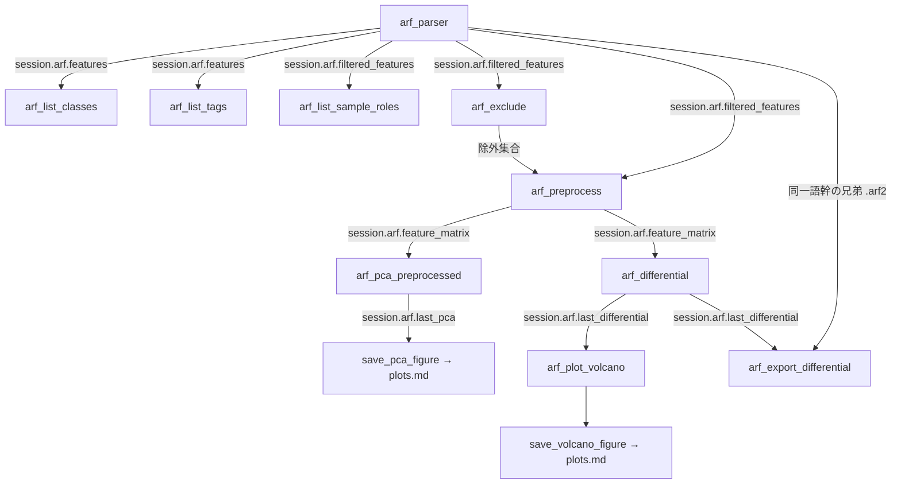

# ワークフロー: `.arf`（サンプル別ピーク）

`.arf` は 1 スポット = 全サンプル分の検出ピーク行を持つ、サンプル間比較の主データ源。
ARF 系ツールは `session.arf` を介して状態を受け渡す。生行列の PCA（`arf_parser`）と
前処理済み行列の PCA（`arf_pca_preprocessed`）は**独立した経路**で、混同しないこと。

## arf_parser

前提: なし（`file_path` 省略時は最新バッチの PeakProperties.arf を自動選択）
状態変更: `session.arf` に features / filtered_features / tag_index / class_index /
last_pca を格納。以降の ARF 系ツールの土台。

フィルタ条件を変えた再 PCA は本ツールを引数違いで再呼び出しする。ファイルは
セッションにキャッシュされるので再パースは走らない。手動除外（`arf_exclude`）は
PCA 直前に非破壊で適用される（手順 7）。

1. lipidmix/arf/tools.py  arf_parser()
2. └─ lipidmix/core/path_resolvers.py  resolve_arf_file_path()
3. └─ lipidmix/core/session_state.py  ArfState.load_data()
4. └─ lipidmix/msdial/tags.py  filter_arf_by_tags()
5. └─ lipidmix/msdial/classes.py  filter_arf_by_class_ids()
6. └─ lipidmix/core/path_resolvers.py  _filter_arf_spots()
7. └─ lipidmix/arf/exclusions.py  prune_spots()
8. └─ lipidmix/arf/reader.py  extract_peak_properties()
9. └─ lipidmix/arf/reader.py  build_pca_matrix()
10. └─ lipidmix/analysis/pca.py  run_pca()
11. └─ lipidmix/msdial/classes.py  assign_sample_groups()
12. └─ lipidmix/core/tool_helpers.py  _format_pca_plot_block()
13. └─ lipidmix/core/tool_helpers.py  _remember_arf_pca_plot()
14. └─ lipidmix/arf/reader.py  get_pca_loading_features()
15. └─ lipidmix/core/tool_helpers.py  _format_pca_loadings_md()
16. └─ lipidmix/core/session_state.py  AnalysisSession.maybe_prepend_caveat()

## arf_list_classes

前提: `arf_parser` または `load_dataset` 実行済み（未実行なら手順 2 で `MissingState`）
状態変更: なし

語彙は常に `session.arf.features`（データセット全体）から作る。直前の
`arf_parser(class_ids=...)` の絞り込みを引き継ぐと、「何で絞れるか」を尋ねる本ツールが
黙って痩せた語彙を返してしまうため。

1. lipidmix/arf/tools.py  arf_list_classes()
2. └─ lipidmix/core/mcp_errors.py  missing_state()
3. └─ lipidmix/msdial/sample_factors.py  arf_sample_names()
4. └─ lipidmix/msdial/sample_factors.py  build_sample_facets()
5. └─ lipidmix/core/tool_helpers.py  _class_factors_by_position()
6. └─ lipidmix/msdial/sample_factors.py  token_vocabulary()

## arf_list_tags

前提: `arf_parser` または `load_dataset` 実行済み（未実行なら手順 2 で `MissingState`）
状態変更: なし

`session.arf.tag_index` の `summary` をそのまま返すだけで、ヘルパは介さない。

1. lipidmix/arf/tools.py  arf_list_tags()
2. └─ lipidmix/core/mcp_errors.py  missing_state()

## arf_list_sample_roles

前提: `arf_parser` または `load_dataset` 実行済み（未実行なら手順 2 で `MissingState`）
状態変更: なし。前処理を**適用せず**に sample/qc/blank の分類だけを返す。

返り値は列名を 1 回だけ出す TSV 表（sample / role / group / batch / run_order /
excluded）。全行で同じ値になる `batch_source` はヘッダ行にまとめる。

1. lipidmix/arf/tools.py  arf_list_sample_roles()
2. └─ lipidmix/core/mcp_errors.py  missing_state()
3. └─ lipidmix/core/tool_helpers.py  _pp_build_matrix()
4. └─ lipidmix/core/session_state.py  _build_sample_meta()
5. └─ lipidmix/arf2/reader.py  format_spots_as_table()

## arf_exclude

前提: `arf_parser` または `load_dataset` 実行済み（未実行なら手順 2 で `MissingState`）
状態変更: `session.arf.excluded_samples` / `excluded_spots` を更新。`filtered_features`
自体は変えないので、`mode="remove"` / `"clear"` で元に戻せる（可逆・非破壊）。

手順 4 の解決は `mode="add"` / `"remove"` のときだけ走る。`mode="clear"` は集合を空にし、
`mode="list"` は何もせず現状を報告する。どの経路でも手順 5〜6 の再集計は必ず通り、
除外後の残サンプル数・残スポット数が返る。

1. lipidmix/arf/tools.py  arf_exclude()
2. └─ lipidmix/core/mcp_errors.py  missing_state()
3. └─ lipidmix/arf/exclusions.py  roster()
4. ├─ [mode=add/remove のみ] lipidmix/arf/tools.py  _resolve_exclude_specs()
5. │  └─ lipidmix/msdial/sample_factors.py  build_sample_facets()
6. │  └─ lipidmix/msdial/sample_factors.py  expand_sample_specs()
7. └─ lipidmix/arf/exclusions.py  prune_spots()
8. └─ lipidmix/arf/exclusions.py  roster()

## arf_preprocess

前提: `arf_parser` または `load_dataset` 実行済み（未実行なら手順 2 で `MissingState`）
状態変更: `session.arf.feature_matrix` / `pp_sample_names` / `pp_feature_names` /
`sample_meta` / `preprocessing_recipe` を格納。`arf_pca_preprocessed` と
`arf_differential` の前提になる。

ブランクは背景除去の参照に使い終えたあと、手順 7 で解析行列から外す（残すと桁違いに
低い総強度が PC1 を支配する）。QC は残す —— QC クラスタの締まり具合を PCA で見るため。
手動除外の状態は 0 件でも手順 8 で必ず開示する。

1. lipidmix/arf/tools.py  arf_preprocess()
2. └─ lipidmix/core/mcp_errors.py  missing_state()
3. └─ lipidmix/arf/exclusions.py  prune_spots()
4. └─ lipidmix/core/tool_helpers.py  _pp_build_matrix()
5. └─ lipidmix/core/session_state.py  _build_sample_meta()
6. └─ lipidmix/analysis/preprocessing.py  detect_qc_strata()
7. └─ lipidmix/analysis/preprocessing.py  preprocess()
8. └─ lipidmix/analysis/preprocessing.py  drop_samples_by_role()
9. └─ lipidmix/arf/tools.py  _manual_exclusion_caveat()

## arf_pca_preprocessed

前提: `arf_preprocess` 実行済み（未実行なら手順 3 で `MissingState`）
状態変更: `session.arf.last_pca` を更新。`save_pca_figure` の入力になる。

`arf_parser` の生行列 PCA とは**独立した経路**。同じ図に見えても前処理の有無が違う。
色分け（`group_levels` / `group_factors`）や log 変換だけを変えて再実行しても、
前処理はやり直さない。

1. lipidmix/arf/tools.py  arf_pca_preprocessed()
2. └─ lipidmix/core/tool_helpers.py  _pp_has_preprocessed()
3. └─ lipidmix/core/mcp_errors.py  missing_state()
4. └─ lipidmix/analysis/pca.py  run_pca()
5. └─ lipidmix/msdial/classes.py  assign_sample_groups()
6. └─ lipidmix/core/tool_helpers.py  _format_pca_plot_block()
7. └─ lipidmix/core/tool_helpers.py  _remember_arf_pca_plot()
8. └─ lipidmix/arf/reader.py  get_pca_loading_features()
9. └─ lipidmix/core/tool_helpers.py  _format_pca_loadings_md()

## arf_differential

前提: `arf_preprocess` 実行済み（未実行なら手順 2 で `MissingState`）。
`session.arf.feature_matrix` を直接見るため、`_pp_has_preprocessed()` は経由しない。
状態変更: `session.arf.last_differential` を更新。`arf_plot_volcano` の入力になる。

群⊥バッチ交絡・小 n・正規化状態の caveat は第一級の所見として必ず出力に出る。
QC / blank は群ラベルを `None` にして両群のどちらにも寄らせない（Class ID が
`group_a` のトークンを含む QC がプールに紛れ込むのを防ぐ）。多群 ANOVA は MCP 非公開で、
関心の 2 群を因子トークンで切り出す設計。`group_a` / `group_b` の片方でも欠けると
手順 4 以降には進まず error を返す。

手順 10〜12 は `_annotate_with_names()` の内側。ARF 側の代表 Name が Unknown の
スポットが残るときだけ、同一アラインメントの兄弟 `.arf2` を読んで橋渡しする。

1. lipidmix/arf/tools.py  arf_differential()
2. └─ lipidmix/core/mcp_errors.py  missing_state()
3. └─ lipidmix/arf/tools.py  _manual_exclusion_caveat()
4. └─ lipidmix/arf/tools.py  _pool_group_labels()
5. └─ lipidmix/analysis/differential.py  check_confounding()
6. └─ lipidmix/analysis/differential.py  two_group_test()
7. └─ lipidmix/analysis/differential.py  add_fdr()
8. └─ lipidmix/analysis/differential.py  summarize_two_group()
9. └─ lipidmix/arf/tools.py  _annotate_with_names()
10. │  └─ lipidmix/arf/tools.py  _spot_id_of()
11. │  └─ lipidmix/arf/tools.py  _sibling_arf2_path()
12. │  └─ lipidmix/arf2/reader.py  load_catalog()
13. └─ lipidmix/analysis/differential.py  volcano_data()

## arf_export_differential

前提: `arf_differential`（2群）実行済み、かつ読み込み中の `.arf` と同一語幹の
兄弟 `.arf2` が存在すること。どちらかが無ければ `MissingState` を返し、ファイルは
書かない。差次的結果の契約版・符号が現行値と違う場合も再実行を要求する。
状態変更: なし。指定された `output_path` へ契約 TSV を上書きする。

`session.arf.last_differential` の全特徴を、`.arf2` の `MasterAlignmentID` で
InChIKey・Ontology・m/z・RT と結合する。InChIKey が無い特徴は本文から除外するが、
`n_unannotated` に件数を残す。有意行だけに絞らないため、下流の濃縮解析は検出化合物を
背景として使える。NaN / inf の数値セルは文字列化せず空欄にし、下流の契約リーダが
欠測として扱える形にする。InChIKey 付き行が 0 件なら、本文 0 行の不適合ファイルを
残さずエラーにする。`msi_level` は `arf2_annotate_identities` と同じ保守的な
クラス上限であり、MS/MS 取得有無を表さない。

列の組み立ては `lipidmix/analysis/export_contract.py` に閉じている（mzTab-M 経路の
`dataset_export_differential` と同一の関数。[dataset_analysis.md](dataset_analysis.md) 参照）。
15 列目 `significant` の判定も `is_significant()` に一本化してあり、ここには無い
——ARF 側は `q_value`、DatasetState 側は `q` というキーで同じ量を持つため、
判定を各経路に置くと 2 実装に分裂する（実際に分裂していた）。

1. lipidmix/arf/tools.py  arf_export_differential()
2. ├─ lipidmix/core/mcp_errors.py  missing_state()
3. ├─ lipidmix/arf/tools.py  _sibling_arf2_path()
4. ├─ lipidmix/arf2/reader.py  load_catalog()
5. ├─ lipidmix/arf/identity_join.py  join_identity()
6. ├─ lipidmix/analysis/export_contract.py  build_meta()
7. ├─ lipidmix/analysis/export_contract.py  is_significant()
8. └─ lipidmix/analysis/export_contract.py  format_row()
9.    └─ lipidmix/analysis/export_contract.py  format_number()

`lipidmix/arf/tools.py` の `_format_export_number` は `export_contract.format_number`
への別名で、**どこからも呼ばれていない**（後方互換のため意図的に残置）。連鎖に
現れないのが正しい。

## arf_plot_volcano

前提: `arf_differential` 実行済み（未実行なら手順 2 で `MissingState`）
状態変更: なし。ファイルは書かない。

**既定は画像**（`output="image"`）。サーバ側で描いた PNG を、件数を書いた 1 行の
キャプションと一緒に返す。座標点列（`lipidmix.volcano.v1`）が要るクライアントは
`output="payload"` か env `LIPIDMIX_PLOT_OUTPUT=payload`。payload モードでは
`up` / `down` の点は全件残し、`ns` の点だけ `max_points` に収まるよう間引く。

画像は間引かず全特徴を描く（間引きは payload のトークン対策であって図には不要）。
キャプションに up / down / ns / 検定不能の件数を書くのは、件数を図から読み取らせない
ため。PNG をファイルに保存したいときは `save_volcano_figure`（[plots.md](plots.md)）。

1. lipidmix/arf/tools.py  arf_plot_volcano()
2. └─ lipidmix/core/mcp_errors.py  missing_state()
3. └─ lipidmix/plots/render.py  resolve_plot_output()
4. ├─ [output=payload] lipidmix/plots/volcano.py  build_volcano_plot_payload()
5. └─ [output=image] lipidmix/arf/tools.py  _volcano_counts()
6.    └─ lipidmix/plots/volcano.py  render_volcano_plot()
7.    └─ lipidmix/plots/render.py  figure_to_png()
