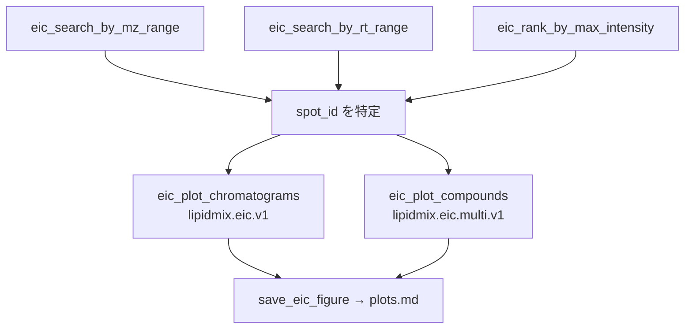

# ワークフロー: `.EIC.aef`（抽出イオンクロマトグラム）

描画系 2 ツールは**画像を作らない**。レンダラ中立の構造化 payload を返すだけで、
描画方法はクライアント（Use-LLLM は Plotly、Claude Desktop は各 UI の方式）に委ねる。
PNG が要るときだけ `save_eic_figure`（[plots.md](plots.md)）を明示的に呼ぶ。

`peak_top` は座標であって強度ではない。混同しないこと。

`eic_parser` と検索系 3 ツールは `EicState.load_data()` を通るため、どれから呼んでも
未ロードなら読み込まれる（`MissingState` にはならない）。描画系 2 ツールは
`session.eic` を経由せず、必要なスポットだけをファイルから直接読む。

## eic_parser

前提: なし
状態変更: `session.eic` に EIC スポットを格納。

1. lipidmix/eic/tools.py  eic_parser()
2. └─ lipidmix/core/path_resolvers.py  resolve_eicaef_file_path()
3. └─ lipidmix/core/session_state.py  EicState.load_data()
4. └─ lipidmix/eic/reader.py  summarize_eic_data()
5. └─ lipidmix/core/session_state.py  AnalysisSession.maybe_prepend_caveat()

## eic_search_by_mz_range

前提: なし
状態変更: `session.eic` に EIC スポットを格納（未ロードなら読み込む）。

1. lipidmix/eic/tools.py  eic_search_by_mz_range()
2. └─ lipidmix/core/path_resolvers.py  resolve_eicaef_file_path()
3. └─ lipidmix/core/session_state.py  EicState.load_data()
4. └─ lipidmix/eic/reader.py  search_eic_by_mz_range()

## eic_search_by_rt_range

前提: なし
状態変更: `session.eic` に EIC スポットを格納（未ロードなら読み込む）。

1. lipidmix/eic/tools.py  eic_search_by_rt_range()
2. └─ lipidmix/core/path_resolvers.py  resolve_eicaef_file_path()
3. └─ lipidmix/core/session_state.py  EicState.load_data()
4. └─ lipidmix/eic/reader.py  search_eic_by_rt_range()

## eic_rank_by_max_intensity

前提: なし
状態変更: `session.eic` に EIC スポットを格納（未ロードなら読み込む）。

各試料のクロマトグラム最大強度の、そのまた最大値で降順に並べる。RT 座標順ではない。

1. lipidmix/eic/tools.py  eic_rank_by_max_intensity()
2. └─ lipidmix/core/path_resolvers.py  resolve_eicaef_file_path()
3. └─ lipidmix/core/session_state.py  EicState.load_data()
4. └─ lipidmix/eic/reader.py  top_eic_spots_by_max_intensity()

## eic_plot_chromatograms

前提: 描画対象の `spot_id`（検索系ツールで特定する）
状態変更: `session` に `lipidmix.eic.v1` payload を記録。画像は作らない。

`file_ids` で最大 12 試料まで選べる。1 スポット分だけを CSS1 から直接読むので、
`session.eic` の全件ロードは経由しない。座標は 4 桁に丸めて返す（RT 0.0001 分・
m/z 4 桁で図にも解釈にも足り、float の既定 repr の 17 桁は空白同然のため）。

1. lipidmix/eic/tools.py  eic_plot_chromatograms()
2. └─ lipidmix/core/path_resolvers.py  resolve_eicaef_file_path()
3. └─ lipidmix/eic/reader.py  read_eic_spot_css1()
4. └─ lipidmix/plots/eic.py  build_eic_plot_payload()

## eic_plot_compounds

前提: 描画対象の脂質名/オントロジーと `file_id`（**1 試料分だけ**を重ねる）
状態変更: `session` に `lipidmix.eic.multi.v1` payload を記録。ファイルは書かない。

**既定は画像**（`output="image"`）。サーバ側で描いた PNG を、何を描き何を落としたかを
書いた 1 行のキャプションと一緒に返す。点列が要るクライアントは `output="payload"` か
env `LIPIDMIX_PLOT_OUTPUT=payload`（[plots.md](plots.md) 参照）。重ねる本数の既定は
8 本 —— それ以上は 1 枚の図として判読できず、payload も比例して膨らむ。

ARF2 の同定候補を rt/mz で照合し、外れた物質は `selection.dropped` に理由付きで残る。
照合（手順 10）は候補選抜の中ではなく payload 組み立ての中で走る —— 実際に読み出した
EIC スポットと突き合わせないと検証にならないため。

1. lipidmix/eic/tools.py  eic_plot_compounds()
2. └─ lipidmix/plots/render.py  resolve_plot_output()
3. └─ lipidmix/core/path_resolvers.py  resolve_eicaef_file_path()
4. └─ lipidmix/core/path_resolvers.py  resolve_arf2_file_path()
5. └─ lipidmix/eic/identity_map.py  load_arf2_records()
6. │  └─ lipidmix/arf2/reader.py  load_catalog()
7. └─ lipidmix/eic/identity_map.py  select_identity_candidates()
8. └─ lipidmix/eic/reader.py  read_eic_spots_css1()
9. └─ lipidmix/plots/eic.py  build_multi_compound_plot_payload()
10. │  └─ lipidmix/eic/identity_map.py  verify_spot_match()
