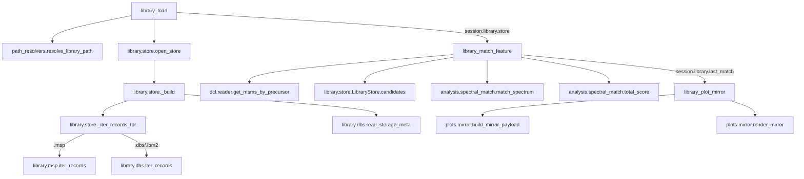

# ワークフロー: 参照ライブラリ（MS/MS スペクトル照合）

`.dcl` の測定 MS/MS を参照ライブラリ（`*_Loaded.msp2.dbs` 優先、無ければ `*.msp`）と
突き合わせ、MS-DIAL の個別スコア定義を移植して採点し、対向プロットで確認する経路。
前提状態の連鎖は 1 本道: `library_load` → `library_match_feature` →
`library_plot_mirror`。どちらも未実行なら `missing_state` 封筒が前段のツール名を指す。

`session.library`（他スロットとは独立）に `store`（開いたままの `LibraryStore`）と
`last_match`（直近の照合結果。座標を含む）を持つ。値の**意味**は
[library.md（output_format）](../output_format/library.md) を見ること。ここは
呼び出し連鎖だけを記録する。

## library_load

前提: なし（`file_path` 省略時はデータディレクトリから自動解決。探索順は
`*_Loaded.msp2.dbs` → `*.msp`）
状態変更: `session.library.store` / `source_path` を格納。`last_match` は
`None` にリセットする（別ライブラリへの切り替えで、古い照合結果を新ライブラリの
ものと取り違えないため）。

構築は元ファイルの sha256 をキーにした SQLite キャッシュへの初回変換で、
2 回目以降（同一ファイル）は再構築しない。`rebuild=True` で強制再構築する。

1. lipidmix/library/tools.py  library_load()
2. └─ lipidmix/core/path_resolvers.py  resolve_library_path()
3. └─ lipidmix/library/store.py  open_store()
4. │  └─ lipidmix/library/store.py  source_sha256()
5. │  └─ lipidmix/library/store.py  _build()  [未キャッシュ時、または rebuild=True]
6. │     ├─ lipidmix/library/store.py  _iter_records_for()
7. │     │  ├─ [.msp] lipidmix/library/msp.py  iter_records()
8. │     │  └─ [.dbs/.lbm2] lipidmix/library/dbs.py  iter_records()
9. │     └─ lipidmix/library/dbs.py  read_storage_meta()
10. └─ lipidmix/library/store.py  LibraryStore.summary()
11. └─ lipidmix/library/store.py  LibraryStore.compound_class_counts()

## library_match_feature

前提: `library_load` 実行済み（未実行なら手順 1 で `MissingState`。
`session.library.store` が `None` のときに返す）
状態変更: `session.library.last_match` を更新（測定スペクトル・候補ごとの参照
スペクトルと alignment を保持。**戻り値には座標を含めない**）。

許容幅（`mz_tol` / `ms2_tol` / `rt_tol`）は明示指定 > store の `search_params`
（`.dbs` 由来のときだけ実値がある） > 既定値、の順で決める（`pick_tol()`、
`lipidmix/library/defaults.py`）。**これはライブラリ候補検索（`store.candidates()`）
にだけ効く**——`.dcl` から測定 MS/MS を引く窓（`_measured_spectrum`）はこれらを
受け取らず、常に `dcl/reader.py` と同じ固定既定（`mz_tol=0.01`/`rt_tol=0.2`）を
使う（Task 11 最終レビュー Important 7: ライブラリ用の広い許容幅——`.dbs` の
`RtTolerance` 既定 100.0 など——を `.dcl` 側に流用すると、precursor m/z が近い
別ピークの測定スペクトルを黙って拾ってしまうため分離した）。`.dcl` に MS/MS が
無ければ `status="not_found"` を返し、候補が 0 件なら `status="no_candidates"` を
返す——どちらも例外にはしない。

1. lipidmix/library/tools.py  library_match_feature()
2. └─ lipidmix/library/defaults.py  pick_tol()
3. └─ lipidmix/library/tools.py  _measured_spectrum()
4. │  └─ lipidmix/core/path_resolvers.py  resolve_dcl_file_path()
5. │  └─ lipidmix/dcl/reader.py  deserialize_dcl()
6. │  └─ lipidmix/dcl/reader.py  get_msms_by_precursor()
7. └─ lipidmix/library/store.py  LibraryStore.candidates()
8. └─ lipidmix/analysis/spectral_match.py  match_spectrum()
9. │  └─ lipidmix/analysis/spectral_match.py  normalize_measured()
10. │  └─ lipidmix/analysis/spectral_match.py  simple_dot_product()
11. │  └─ lipidmix/analysis/spectral_match.py  weighted_dot_product()
12. │  └─ lipidmix/analysis/spectral_match.py  reverse_dot_product()
13. │  └─ lipidmix/analysis/spectral_match.py  matched_peaks_scores()
14. │  └─ lipidmix/analysis/spectral_match.py  spectral_entropy_similarity()
15. └─ lipidmix/analysis/spectral_match.py  total_score()
16. │  └─ lipidmix/analysis/spectral_match.py  gaussian_similarity()
17. │  └─ lipidmix/analysis/spectral_match.py  fix_mass_tolerance()
18. └─ lipidmix/arf2/reader.py  format_spots_as_table()

候補は `total_score` の降順（`_RANK_KEY`）＝ MS-DIAL の総合スコア。RT 項を足すか
どうかは store の `search_params["use_time_for_annotation_scoring"]`（`.dbs` の
`Key(16)`。`.msp` には無いので上流既定の `False`）で決まり、戻り値の `scoring` が
その判断を明示する。TSV の列組み立てに `arf2/reader.py` の
`format_spots_as_table()` を借用している（`.arf2` 専用ではなく汎用の TSV 整形ヘルパ）。

## library_plot_mirror

前提: `library_match_feature` の直近結果があること（未実行、または候補 0 件なら
手順 1 で `MissingState`）
状態変更: なし

`ms2_tol` は `library_match_feature` が使った値（`last_match` に保持済み）を自動で
引き継ぐ。既定は画像（PNG）、`output="payload"` で座標 JSON
（`lipidmix.mirror.v1`）を返す。`scale`（`"relative"` / `"sqrt"` / `"log10"`）は
縦軸の写し方で、`render_mirror()` の中で `scale_intensity()` が各点に掛ける
（`output="payload"` の座標は正規化前の生値なので `scale` の影響を受けない）。
`label_policy`（`"auto"` / `"msdial"`）は m/z ラベルの衝突回避の方式で、
`_draw_labels()` が**スペクトル全点**を強度降順に走査して重ならないものだけ描く
（ピクセル座標が要るので描画時にしかできない——`payload["labels"]` は
自前で描くクライアント向けの要約で、画像はこれを使わない）。

1. lipidmix/library/tools.py  library_plot_mirror()
2. └─ lipidmix/plots/render.py  resolve_plot_output()
3. └─ lipidmix/plots/mirror.py  build_mirror_payload()
4. └─ [output=image] lipidmix/plots/mirror.py  render_mirror()
5.    └─ lipidmix/plots/mirror.py  scale_intensity()
6.    └─ lipidmix/plots/mirror.py  _draw_labels()
7.    │  └─ lipidmix/plots/mirror.py  _text_extent()
8.    │  └─ lipidmix/plots/mirror.py  _is_overlap()
9.    └─ lipidmix/plots/render.py  figure_to_png()

## `verify_peak_annotation` との関係

`library_load` 済み（`session.library.store` あり）のときだけ、
`pai2_parser` → `verify_peak_annotation` の `analytical_checks.msms` が
`band == "PASS"` の内側に `spectral_match` ブロックを追加で載せる
（[pai2.md](pai2.md) の `verify_peak_annotation` 節、および
[output_format/library.md](../output_format/library.md) §14.8）。この呼び出し連鎖
自体は `lipidmix/msdial/peak_verification.py` の内部（`_spectral_match_for_feature`）
に閉じており、`library_match_feature` とは独立した実装（候補一覧を持たず最良候補
だけを返す）。ただし**「最良」の基準は共有する**——どちらも
`spectral_match.total_score()` の降順で選ぶ。食い違わせると、同じ feature について
検証ドシエと候補一覧が別の候補を名指しすることになる。
